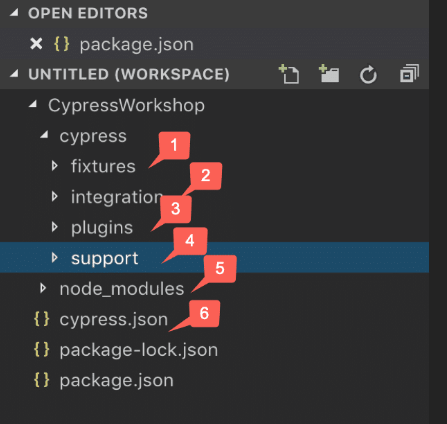

# e2e-tests-cypress

## Setup
1. Proceed to `e2e-tests-cypress` and run 
`npm install`

2. Configure the following properties in `cypress.env.json`

```text
username
password
devportalLoginURL
devportalIdpUsername
devportalIdpPassword
```
## Folder structure

<p align="center">
   
</p>

1. **Fixtures** are external pieces of static data that can be used by your tests. We should not hard code data in the test case. It should drive from an external source like CSV, HTML, or JSON. They will be majorly used with the cy.fixture() command when you need to stub the network calls.

2. **Integration** folder provides a place that writes out test cases. It also provides an “examples” directory, which contains the default test cases provided by Cypress and can be used to add new test cases also. We can also create our folder under the integration directory and add out test cases under that.

3. **Plugins** contain the plugins or listeners. By default, Cypress will automatically include the plugins file “cypress/plugins/index.js” before every test it runs. You can programmatically alter the resolved configuration and environment variables using plugins, Eg. If we have to inject customized options to browsers like accepting the certificate, or do any activity on test case pass or fail or to handle any other events like handling screenshots. They enable you to extend or modify the existing behavior of Cypress.

4. **Support** writes customized commands or reusable methods that are available for usage in all of your spec/test files. This file runs before every single spec file. That’s why you don’t have to import this file in every single one of your spec files.  The “support” file is a great place to put reusable behavior such as Custom Commands or global overrides that you want to be applied and available to all of your spec files.

5. **Node_Modules** in the default project structure is the heart of the cypress project. All the node packages will be installed in the node_modules directory and will be available in all the test files. So, in a nutshell, this is the folder where NPM installs all the project dependencies.

6. **Cypress.json** is used to store different configurations. E.g., timeout, base URL, test files, or any other configuration that we want to override for tweaking the behavior of Cypress. We can also manage the customized folder structure because it is part of by default Cypress Configurations.

## Test execution

### Interactive mode
1. Run the following command to open the Cypress app
`npx cypress open`

<p align="center">
   
</p>

2. In the Cypress app all the spec files can be found. Click on a spec file to run it. This will open the cypress runner that allows you to see commands as they execute while also viewing the application under test.

<p align="center">
   
</p>

### Headless mode
1. Use below commands to run tests in headless mode

	* Run all the spec files in the project
	> `npm run test`

	* Run one spec file
	> `npx cypress run --spec "cypress/e2e/<path/to/spec/file>"`

		ex: `npx cypress run --spec "cypress/e2e/console/clean/clean-this-run.ts"`

	* Run multiple spec files
	> `npx cypress run --spec "cypress/e2e/<path/to/spec/file1>,cypress/e2e/<path/to/spec/file2>"`

		ex: `npx cypress run --spec "cypress/e2e/console/clean/clean-this-run.ts,cypress/e2e/console/integrations/clone-and-edit-flow.ts"`

	* Run all spec files in a folder
	> `npx cypress run --spec "cypress/e2e/<path/to/folder>/**/*"`

		ex: `npx cypress run --spec "cypress/e2e/console/integrations/**/*"`

3. After running the tests in headless mode, following artifacts can be found

- videos - for each spec file, a seperate video will be created
	- Location: `cypress/videos`
- screenshots - screenshot will be captured when a failure happens during a test run
	- Location: `cypress/screenshots`
- reports - reports will be generated only if the `npm run test` is used
	- Location: `cypress/reports`