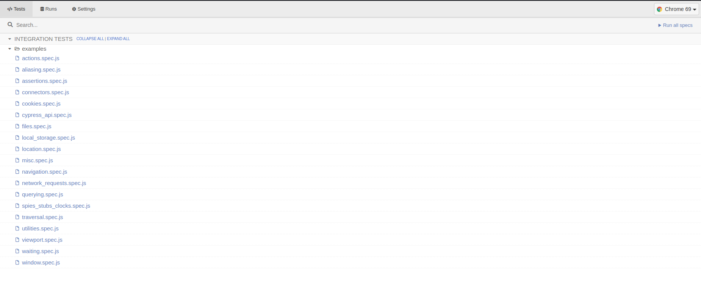
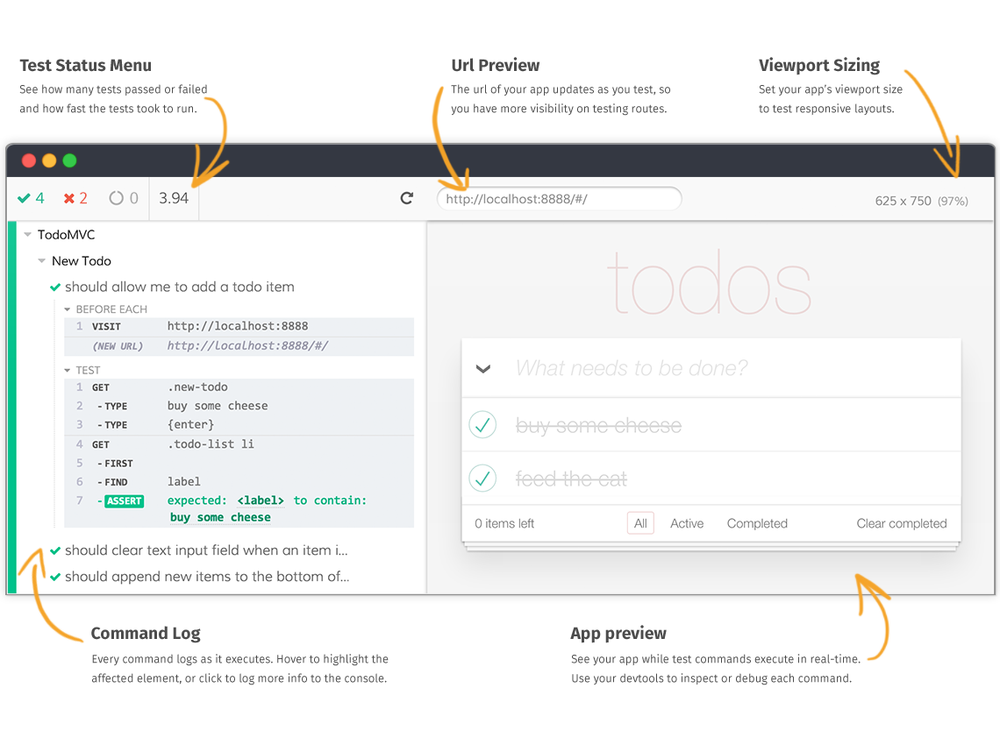

# e2e-tests-cypress

## Adding a New Config

This section describes what you should do after adding a config to the [cypress.env.json](cypress.env.json) file.

Once you added the config to the [cypress.env.json](cypress.env.json) you have to make sure that you adhere to the below
steps, in order to make that added config available for overriding in upper environments. How we override those configs
in higher environment is that, we override the [cypress.env.json](cypress.env.json) file using a `jq` command in
the [pipeline manifest](../.azure/templates/run-tests.yaml).

For example, if the cypress.env.json looks like below,

```json
{
  "loginURL": "https://consolev2.preview-dv.choreo.dev/login?fidp=choreoe2etest"
}
```

we override that value using a parameter in the above-mentioned pipeline as below (this template contains values for dev
in the relevant parameter).

```yaml
parameters:
  - name: LOGIN_URL
    type: string
    default: 'https://consolev2.preview-dv.choreo.dev/login?fidp=choreoe2etest'
  ## Config Files
  - name: CYPRESS_ENV_CONFIG
    type: string
    default: 'cypress.env.json'
  ## Others
  - name: TEST_SPEC_DIR
    type: string
    default: 'e2e-tests-cypress'

  - script: |
      cd ${{ parameters.TEST_SPEC_DIR }}
      jq '.loginURL = $LOGIN_URL' \
        --arg LOGIN_URL "${{ parameters.LOGIN_URL }}" \
        ${{ parameters.CYPRESS_ENV_CONFIG }} > tmp.$$.json && mv tmp.$$.json ${{ parameters.CYPRESS_ENV_CONFIG }}
```

If you have more than one config, you can combine those using pipes in `jq` as shown below (only the script is shown).

```shell
jq '.loginURL = $LOGIN_URL | .asgardeoTokenURL = $ASGARDEO_TOKEN_URL' \
        --arg LOGIN_URL "${{ parameters.LOGIN_URL }}" \
        --arg ASGARDEO_TOKEN_URL "${{ parameters.ASGARDEO_TOKEN_URL }}" \
        ${{ parameters.CYPRESS_ENV_CONFIG }} > tmp.$$.json && mv tmp.$$.json ${{ parameters.CYPRESS_ENV_CONFIG }}
```

You need to do this for each config you add in [cypress.env.json](cypress.env.json).

### Case 1: Added config is a secret (passwords etc.)

Imagine you are adding a config to the [cypress.env.json](cypress.env.json) as follows.

```json
.
.
.
"enterpriseIDPPassword": ""
}
```

Since this is a secret, you can't commit the value to the Github. Therefore, you have to update the `jq` command in
the [pipeline manifest](../.azure/templates/run-tests.yaml) as follows. Update the `jq` command inside
the `steps.script` where `displayName: 'Run E2E tests'` as below

```shell
  - script: |
      cd ${{ parameters.TEST_SPEC_DIR }}
      jq '.asgardeoDomain = $ASGARDEO_DOMAIN | .asgardeoTokenURL = $ASGARDEO_TOKEN_URL
        | .enterpriseIDPPassword = $ENTERPRISE_IDP_PASSWORD' \
        --arg ASGARDEO_DOMAIN "${{ parameters.ASGARDEO_DOMAIN }}" \
        --arg ASGARDEO_TOKEN_URL "${{ parameters.ASGARDEO_TOKEN_URL }}" \
        --arg ENTERPRISE_IDP_PASSWORD "$(enterprise_idp_password)" \
        .
        .
        .
    displayName: 'Run E2E tests'
```

In the above snippet `$(enterprise_idp_password)` is important!. It tells the pipeline to obtain the variable from the
pipeline variable group. Once you do so, please provide the dev, stage and prod values for that secret along with its
identifier (i.e; enterprise_idp_password) to a Platform Engineer.

### Case 2: Added config is not a secret

Imagine you are adding a config to the [cypress.env.json](cypress.env.json) as follows.

```json
.
.
.
"devPortalLoginURL": "https://devportal.preview-dv.choreo.dev"
}
```

Then follow these steps in the [pipeline manifest](../.azure/templates/run-tests.yaml).

1. In the top there is a section called `## cypress.env.json` under `parameters`. Add your config in camel case using
   underscores to separate words. (Important!: Add the `dev` value in the `default` field.)

```yaml
parameters:
  ## cypress.env.json
    .
    .
    .
    - name: 'DEVPORTAL_LOGIN_URL'
    type: string
    default: 'https://devportal.preview-dv.choreo.dev'
    .
    .
    .
```

2. Update the `jq` command inside the `steps.script` where `displayName: 'Run E2E tests'` as below. (Important: you have
   to use "${{ parameters.XXXXX }}" syntax for this)

```yaml
  - script: |
      cd ${{ parameters.TEST_SPEC_DIR }}
      jq '.asgardeoDomain = $ASGARDEO_DOMAIN | .asgardeoTokenURL = $ASGARDEO_TOKEN_URL
        | .devPortalLoginURL = $DEVPORTAL_LOGIN_URL' \
        --arg ASGARDEO_DOMAIN "${{ parameters.ASGARDEO_DOMAIN }}" \
        --arg ASGARDEO_TOKEN_URL "${{ parameters.ASGARDEO_TOKEN_URL }}" \
        --arg DEVPORTAL_LOGIN_URL "${{ parameters.DEVPORTAL_LOGIN_URL }}" \
        .
        .
        .
    displayName: 'Run E2E tests'
```

## Quick Start

- ### Setup & Run

    1. Navigate to the `e2e-tests-cypress` directory
    2. Run `npm install` - only for first time
    3. Change the following in `cypress.env.json` if you are working on front-end local dev server
        - The following URLs should be updated to include `https://localhost:3000` - your front-end serving url
            - `loginURL: "https://localhost:3000/login?fidp=choreoe2etest"`
            - `appSvcURL: "https://localhost:3000"`
			- `newAppSvcURL: "https://localhost:3000"`
            - `baseUrl: "https://localhost:3000"`
            - `apimSvcURL: "https://localhost:3000"`

    4. Ensure that you have the following environment variables set(refer to [Getting idpUsername and idpPassword](#getting-idpusername-and-idppassword) section for more details)
		- `choreoIDPUsername` - Your IDP username
		- `choreoIDPUsername` - Your IDP password
		- `choreoOrgHandle` - Your organization handle

    5. Run `npm run e2etest:headless` to run test cases in [headless mode](#headless-mode)

- ### Getting idpUsername and idpPassword

    1. Logout of Choreo dev and goto `https://consolev2.preview-dv.choreo.dev`
    2. Open browser dev tools and open network tab (and tick "Preserve log" checkbox)
    3. Login to Choreo
    4. Observe network tab in dev tools and locate first `token` response(The token returned by Asgardeo or the relevant IDP)
    5. Copy `access_token` value (the JWT) from `preview` section
    6. Do a curl using the JWT as Authorization header
       ```
       curl --header "Authorization: <JWT>" -L app.preview-dv.choreo.dev/internaltools/resetIdpPassword
       ```
	7. Copy the `idpUsername` and `idpPassword` from the response and export them as the following environment variables
	   ```
	   export choreoIDPUsername=<Your idpUsername>
	   export choreoIDPUsername=<Your idpPassword>
	   ```
	8. Find the specific Organization Handle of the Organizations you are a member of, that you wish to execute tests
	   against. You can find this by navigating to the `https://consolev2.preview-dv.choreo.dev` and selecting the
	   organization from the drop down. The organization handle will be the last part of the URL. For example, if the
	   URL is `https://consolev2.preview-dv.choreo.dev/organizations/abc`, the organization handle will be `abc`.
	   Export the organization handle as an environment variable as follows.
	   ```
	   export choreoOrgHandle=<Your Organization Handle>
	   ```

- ### Debugging

    - You can find screen shot of failured test cases in `e2e-tests-cypress/screenshots` directory

    - There are videos created for all the success and failed test cases in `e2e-tests-cypress/videos` directory.

    - You can check a error is already reported or not by filtering issues contains `Type/e2eTestFailure` lable on
      github.

    - You can check identified errors in [interactive mode](#interactive-mode) to get more idea on visualized manner.

## Setup

1. Proceed to `e2e-tests-cypress` and run
   `npm install`

2. [Optional] Configure the following properties in `cypress.env.json`, only if you need to
   execute `cypress/e2e/console/login-logout-flow.ts`.

```text
username
password
```

3. [Optional] If the `Choreo console` is running locally, update the following properties in `cypress.env.json`.

```text
loginURL
baseUrl
apimBasePath: "/apimanagement"
```

## Folder structure

The organization of the folder structure is based on the recommendations found
at https://docs.cypress.io/guides/core-concepts/writing-and-organizing-tests

```
e2e-tests-cypress
|	cypress.env.json [1]
|	cypress.json [2]
|
└───cypress
	└───e2e [3]
	└───fixtures [4]
	└───plugins [5]
	└───support [6]
```

1. **cypress.env.json** is used to define variables that are accessible via `Cypress.env` in e2e
   tests(https://docs.cypress.io/guides/guides/environment-variables#Option-2-cypress-env-json).

2. **cypress.json** is used to store Cypress runtime
   configurations(https://docs.cypress.io/guides/references/configuration#cypress-json) for tweaking the behavior of
   Cypress. The custom test folder structure is defined here enabling Cypress to execute the tests.

3. **e2e** Contains the End to End test cases. New test cases must be added to this directory and can be further
   organized into subdirectories for better organization.

4. **fixtures** are external static data that can be used by your tests. We should not hard code data in the test case.
   It should drive from an external source like CSV, HTML or JSON(https://docs.cypress.io/api/commands/fixture).

5. **plugins** contain the plugins or listeners. By default, Cypress will automatically include the plugins file
   “cypress/plugins/index.js” before every test it runs. You can programmatically alter the resolved configuration and
   environment variables using plugins, Eg. If we have to inject customized options to browsers like accepting the
   certificate, or do any activity on test case pass or fail or to handle any other events like handling screenshots.
   They enable you to extend or modify the existing behavior of
   Cypress(https://docs.cypress.io/guides/tooling/plugins-guide).

6. **support** writes customized commands or reusable methods that are available for usage in all of your spec/test
   files. This file runs before every single spec file. That’s why you don’t have to import this file in every single
   one of your spec files. The “support” file is a great place to put reusable behavior such as Custom Commands or
   global overrides that you want to be applied and available to all of your spec files.

## Test execution

### Interactive mode

1. Run the following command to open the Cypress app
   `npx cypress open`

<p align="center">
   
</p>

2. In the Cypress app all the spec files can be found. Click on a spec file to run it. This will open the cypress runner
   that allows you to see commands as they execute while also viewing the application under test.

<p align="center">
   
</p>

### Headless mode

1. Use below commands to run tests in headless mode

    - Run all the spec files in the project

      > `npm run local`

    - Run one spec file

      > `npx cypress run --spec "cypress/e2e/<path/to/spec/file>"`

          ex: `npx cypress run --spec "cypress/e2e/console/clean/clean-this-run.ts"`

    - Run multiple spec files

      > `npx cypress run --spec "cypress/e2e/<path/to/spec/file1>,cypress/e2e/<path/to/spec/file2>"`

          ex: `npx cypress run --spec "cypress/e2e/console/clean/clean-this-run.ts,cypress/e2e/console/integrations/clone-and-edit-flow.ts"`

    - Run all spec files in a folder

      > `npx cypress run --spec "cypress/e2e/<path/to/folder>/**/*"`

          ex: `npx cypress run --spec "cypress/e2e/console/integrations/**/*"`

2. After running the tests in headless mode, following artifacts can be found

- videos - for each spec file, a separate video will be created
    - Location: `cypress/videos`
- screenshots - screenshot will be captured when a failure happens during a test run
    - Location: `cypress/screenshots`
- reports - reports will be generated only if the `npm run test` is used
    - Location: `cypress/reports`

## Scenarios

Scenarios covered by the End to End tests.

<table>
	<thead>
		<tr>
			<th align="left">Scenario</th>
			<th align="left">Work flow</th>
			<th align="left">Cypress Spec Name</th>
		</tr>
	</thead>
	<tbody>
		<tr>
			<td>1. Login & logout Choreo</td>
			<td>
				1) Login to Choreo with valid credential (gmail) <br/>
				2) Logout <br/>
			</td>
			<td>login-logout-flow.ts</td>
		</tr>
		<tr>
			<td>2. Service from scratch</td>
			<td>
				1) Create a service "hello world" <br/>
				2) Run & Test
				3) Deploy <br/>
				4) Back to list <br/>
				5) Delete (Cannot delete active app) <br/>
				6) Go to app again (develop view) <br/>
				7) Go to deploy view <br/>
				8) Stop deploy (from UI) <br/>
				9) Back to list <br/>
				10) Delete (from UI) <br/>
			</td>
			<td>service-deploy-from-scratch.ts</td>
		</tr>
		<tr>
			<td>3. Service from sample</td>
			<td>
				1) Create from sample (Echo service) <br/>
				2) Run & Test <br/>
				3) Back to list <br/>
				4) Delete(from API call) <br/>
			</td>
			<td>service-deploy-sample.ts</td>
		</tr>
		<tr>
			<td>4. Integration from scratch</td>
			<td>
				1) Create an integration "Send a message in gmail when an issue in github is commented" <br/>
				2) Run & Test <br/>
				3) Deploy <br/>
				4) Back to list <br/>
				5) Delete (Cannot delete active app) <br/>
				6) Go to app again (develop view) <br/>
				7) Go to deploy view <br/>
				8) Stop deploy (from UI) <br/>
				9) Back to list <br/>
				10) Delete (from UI) <br/>
			</td>
			<td>integration-deploy-from-scratch.ts</td>
		</tr>
		<tr>
			<td>5. Integration from sample</td>
			<td>
				1) Create from sample "G calender event to twilio SMS" <br/>
				2) Run & Test <br/>
				3) Back to list <br/>
				4) Delete(from API call) <br/>
			</td>
			<td>integration-run-sample.ts</td>
		</tr>
		<tr>
			<td>6. Trigger (Schedule)</td>
			<td>
				1) Create a schedule trigger that runs every minute <br/>
				2) Add a hello world log <br/>
				3) Check expression editor diagnostics <br/>
				4) Run the app and check whether the log prints <br/>
				5) Deploy the app and check whether the log prints once	<br/>
				6) Stop deploy <br/>
				7) Delete App <br/>
			</td>
			<td>schedule-trigger-flow.ts</td>
		</tr>
		<tr>
			<td>7. Dev portal - API comments</td>
			<td>
				1) Visit API Overview <br/>
				2) Add comment <br/>
				3) Delete comment <br/>
			</td>
			<td>api-comment-flow.ts</td>
		</tr>
		<tr>
			<td>8. Dev Portal - API ratings</td>
			<td>
				1) Visit API Overview <br/>
				2) Add rating <br/>
				3) Update rating <br/>
			</td>
			<td>api-rating-flow.ts</td>
		</tr>
		<tr>
			<td>9. Devportal - Credentials and Try out</td>
			<td>
				1) Visit API Overview <br/>
				2) Visit API Credentials <br/>
				3) Select contract <br/>
				4) Generate Credentials <br/>
				5) Visit TryOut	<br/>
				6) Click "Get Test Key" <br/>
				7) Try out API <br/>
				8) Visit Credentials <br/>
				9) Remove credentials <br/>
			</td>
			<td>credentials-try-out-flow.ts</td>
		</tr>
		<tr>
			<td>10. Devportal - Applications, Subscriptions and Try out</td>
			<td>
				1) Visit Application	<br/>
				2) Create application <br/>
				3) Generate OAuth2 token <br/>
				4) Generate API Key <br/>
				5) Add a subscription to API <br/>
				6) Visit API TryOut	<br/>
				7) Select Application <br/>
				8) Click "Get Test Key" <br/>
				9) Try out API <br/>
			</td>
			<td>application-try-out-flow.ts</td>
		</tr>
		<tr>
			<td>11. Delete Apps and APIs that are old or created by this run</td>
			<td>Cleanup all the apps that are created before 7 days or created in the current test run <br/>
			</td>
			<td>clean-this-run.ts</td>
		</tr>
		<tr>
			<td>12. API from Service</td>
			<td>
				1) Create an API from service(sample app) <br/>
				2) Verify Overview page <br/>
				3) Change & update runtime configs <br/>
				4) Try test console <br/>
				5) Delete using REST API <br/>
			</td>
			<td>api-from-choreo-service.ts</td>
		</tr>
		<tr>
			<td>13. API from REST endpoint</td>
			<td>
				1) Create an API by providing a REST endpoint <br/>
				2) Verify Overview page <br/>
				3) Change Resources <br/>
				4) Quick deploy and revision <br/>
				5) Publish <br/>
				6) Try test console <br/>
				7) Delete API from overview <br/>
			</td>
			<td>api-from-rest-endpoint-flow.ts</td>
		</tr>
		<tr>
			<td>14. API from OAS</td>
			<td>
				1) Create & publish API from OAS <br/>
				2) Verify Overview page	<br/>
				3) Change endpoint <br/>
				4) Change subscriptions <br/>
				5) Create revision from + button and deploy <br/>
				6) Try  test console <br/>
				7) Delete API from overview <br/>
			</td>
			<td>api-from-oas-flow.ts </td>
		</tr>
		<tr>
			<td>
				15. Observability overview ( Throughput/Latency graphs and tracing a request/log view)</td>
			<td>
				1) Create a service <br/>
				2) Navigate to Observability view <br/>
				3) Access the sample service <br/>
				4) Verify the Throughput / Latency graphs. <br/>
				5) Trace a single request and verify the status code, avg Latency. <br/>
				6) Assert available logs, test log searching and logs download <br/>
				7) Delete(from API call) <br/>
			</td>
			<td>observability-test-flow.ts</td>
		</tr>
		<tr>
			<td> 16. Low code form AI suggestions, Test run hello world service, Test postman view </td>
			<td>
				1) Create a service <br/>
				2) Create variable property <br/>
				3) Add HTTP connector with AI suggestion of previous variable <br/>
				4) Assert the code to check if AI suggestion is added to low code form  <br/>
				5) Create a respond to the service <br/>
				6) Click Test & run button <br/>
				7) Assert the test URL <br/>
				8) Navigate to test view <br/>
				9) Access the postman view <br/>
				10) Insert an invalid API key <br/>
				11) Assert for the API key error <br/>
				12) Delete (from API call) <br/>
			</td>
			<td>service-deploy-from-scratch.ts</td>
		</tr>
		<tr>
			<td>18. Invite members</td>
			<td>
				1) Go to settings <br/>
				2) Go to Invite members <br/>
				3) Add developer group and add email -> Invite <br/>
				4) Check pending invitations <br/>
			</td>
			<td>invite-members.ts</td>
		</tr>
		<tr>
			<td>19. Create a group, add member to group and delete member from group, delete group</td>
			<td>
				1) Go to settings. <br/>
				2) Go to Organization->Groups tab <br/>
				3) Click "Add group" button and add a group giving the details <br/>
				4) Search the group from search field <br/>
				5) Click the group and type a existing member name in the search field <br/>
				6) Add the member <br/>
				7) Remove the added member <br/>
				8) Go back to groups <br/>
				9) Delete the new group <br/>
			</td>
			<td>group-list-views.ts</td>
		</tr>
		<tr>
			<td>20. Test Anonymous app linking (via "Add to Choreo")</td>
			<td>
				1) Navigate to Home page after Login <br/>
				2) Run a Ballerina project in the background with Choreo enabled <br/>
				3) capture and navigate to ObsURL <br/>
				4) Add to Choreo with creation of a new app <br/>
				5) Copy the linking command <br/>
				6) Run the linking command in background <br/>
				7) Check for successful linking <br/>
				8) Clean up the created app	<br/>
			</td>
			<td>anonymous-app-linking.ts</td>
		</tr>
		<tr>
			<td>21. Generate on-prem key</td>
			<td>
				1) Go to settings <br/>
				2) Go to on-prem keys tab <br/>
				3) Generate key <br/>
				4) Edit the key name <br/>
				5) Regenerate key <br/>
				6) Delete the key <br/>
			</td>
			<td>generate-onprem-key-flow.ts</td>
		</tr>
		<tr>
			<td>22. Clone and edit integrations</td>
			<td>
				1) Go to integrations <br/>
				2) Go to "Use Prebuilt" <br/>
				3) Select "Google calendar to twilio msg" sample <br/>
				4) Clone and Edit <br/>
				5) Fill calender and Twilio configs <br/>
				6) Click Test & run button <br/>
				7) Assert the test URL <br/>
			</td>
			<td>integration-run-sample.ts</td>
		</tr>

    </tbody>

</table>
