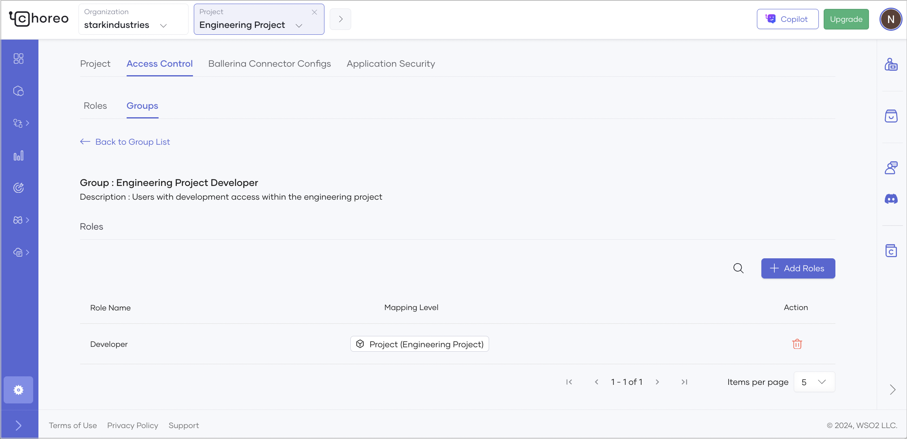

# Control Access in the Choreo Console

In Choreo, administrators can control user access to different projects and environments within the organization. 
At the finest granularity level, an administrator can restrict a user to perform a specific action on a specific project and a specific environment.

## Access Control (Authorization) Concepts

To understand how to configure access control in Choreo, it is important to understand how access control is modelled in Choreo.

### Fundamental Question in Access Control

Access control of any system boils down to answering the following question.

> *Can this **user** perform this **action** on this **resource**?*

???+ example
    Can Harry view logs of development environment of engineering project? 
    
    - `Harry` is the **user**  
    - `view logs` is the **action**  
    - `development environment of engineering project` is the **resource**   

### Permission

In Choreo access control model, a permission is the right to perform a specific action. 

???+ example
    A user can configure a custom domain only if the user has `choreo:domain_manage` permission.

#### Environment Specific Permissions

In Choreo, a subset of actions such as `deploy component`, `promote component`, `create configuration groups`, and `view logs` are always performed within the context of an environment. The permissions which give the right to perform such actions are categorized as **Environment Specific** permissions.

!!! note
    For the actions which are tied to an environment, in some cases, it makes sense to allow a user to perform the action on some environments but not on other environments. For example, a developer should be allowed to view logs of the develoment environment. But the same developer should not be allowed to view logs of the production environment.

### Role

In practice, assigning permissions individually to each user is a time consuming and error prone task. Moreover, 
users with similar job responsibilities often need the same set of permissions. Roles are collections of such permissions. They are designed to match real-world job responsibilities.   

Roles simplify assigning permissions to users. Instead of assigning 50 developers 20 permissions each (1000 assignments), you just assign the 20 permissions to the `Developer` role and assign the `Developer` role to each developer (20 + 50 assignments).  

!!! info
    Each organization in Choreo has a predefined set of roles with permissions assigned to them by default. Organization adminstratrators can further customize the existing roles and and create new roles as required. [Learn more](../choreo-concepts/organization.md#roles)

### Group 

A group is a collection of users. Grouping is often done based on teams or departments within the organization. 

Instead of assigning a role to a user, the role is assigned to a group. Each user in the group inherits the permissions of the group. This is specially useful when role to user assignments need to be updated. Instead of removing 50 role to user assignments and creating 50 new ones, you just remove 1 role to group assignment and create 1 new assignment. 

!!! info
    Each organization in Choreo has a predefined set of groups. By default, a role with the same name is mapped to each group. Organization adminstratrators can further customize the existing groups and and create new groups as required. [Learn more](../choreo-concepts/organization.md#groups)

### Permission to Role Assignment

All permission to role assignments (mappings) in Choreo are organization wide assignments. Resource specific restrictions **cannot** be imposed on permission to role assignments. For example, you **cannot** configure Choreo to assign `choreo:component_manage` permission to `Developer` role only for Development environment of the Engineering project.

### Role to Group Assignment

The true power of Choreo Access Control comes from role to group assignments (mappings). Resource specific restrictions **can** be imposed on role to group assignments. For example, you **can** configure Choreo to assign `Developer` role to `Engineering Project Developer` group but only for Development environment of the Engineering project. 

Each role to group assignment has 2 attributes.

1. **Mapping Level** : determines whether the assignment is valid for the entire `Organization` or only for a specific `Project`.
2. **Applicable Environment** : determines whther the assignment is valid for `All` environments or only for a specific `Environment`.

Based on the combination of the above attributes, there are four possible assignment types.

|Assignment Type|Mapping Level|Appicable Environment|
|-|-|-|
|`Organization Scoped`|Organization|All|
|`Project Scoped`|Project|All|
|`Environement Scoped`|Organization|Environment|
|`Project-Environment Scoped`|Project|Environment|

!!! warning "Important"
    Avoid assigning multiple roles to a single group across different projects or mapping levels (organization and project). Such assignments can grant users unintended permission to some projects, allowing them to perform tasks they shouldn't have access to. Therefore, it is recommended to assign only one role to a group across projects or mapping levels to ensure proper access control.

### Extent of Access granted through different Role to Group assignment types

Recall the [Fundamental Question in Access Control](#fundamental-question-in-access-control). 

> *Can this **user** perform this **action** on this **resource**?*

Based on this question, extent of access has two parts.

1. allowed **actions**

2. allowed **resources** (resources on which the actions are allowed to be performed on)

Lets go through each role to group assignment type to understand the extent of access granted by them. We will look at the extent of access in terms of allowed **actions** and allowed **resources**. 

#### Organization Scoped Assignments

- Actions permitted by the role are allowed on resources within the organization. 
- Other actions are not allowed.

!!! note
    Actions permitted by the role are the actions linked to the permissions assigned to the role.

#### Project Scoped Assignments

- Actions permitted by the role are allowed on resources within the specific project. 
- Other actions are not allowed.

#### Environement Scoped Assignments

- Environment specific actions permitted by the role are allowed on resources within the specific environment of the organization.
- Other actions permitted by the role are allowed on resources within the organization.
- Other actions are not allowed.

!!! note
    **Environment specific actions** permitted by the role are the actions linked to the [**environment specific permissions**](#permission) assigned to the role.

For environement scoped assignments, allowing **non environment specific** actions on resources within the organization is a deliberate decision to align with real world Access Control use cases. 

!!! example
    Consider assigning the Developer role to Engineering Developer group but only for Development environment of the Engineering project. The usual intention of this assignment is **not** to retrict the Developers from performing actions such as `build component` which do not happen within an environment context. Instead, the intention is to restrict Developers from performing actions such as `promote component` on unauthorized environments (such as Production environment).

!!! warning "Important"
    Exercise caution when creating environment scoped role to group assignments. Only the environment specific actions will be restricted to the environment. Other actions will be allowed on resources of the organization.

#### Project-Environment Scoped Assignments

- Environment Specific actions permitted by the role are allowed on resources within the specific Environment of the specific Project.
- Other actions permitted by the role are allowed on resources within the specific Project.
- Other actions are not allowed.

Similar to previous case, allowing other permissions on resources within the Project is a deliberate decision to align with real world Access Control use cases.

!!! warning "Important"
    Exercise caution when creating project-environment scoped role to group assignments. Only the environment specific actions will be restricted to the environment. Other actions will be allowed on resources of the project.

## Configure Access Control in Choreo

Now that you understand the basic concepts of access control within Choreo, let’s walk through a sample scenario where we need to configure access to a specific environment of a specific project.

Assume you are overseeing the Engineering Project within your organization and you need to grant development access to specific users solely within this project. As they are developers, you further need to restrict their access to the Development environment of the project. Here's a step-by-step guide on how to achieve this:

### Step 1: Create a project

Follow the steps given below to create a project:

1. Go to [https://console.choreo.dev/](https://console.choreo.dev/) and sign in. This opens the organization home page.
2. On the organization home page, click **+ Create Project**.
3. Enter a display name, unique name, and description for the project. You can enter the values given below:
    
    !!! info
         In the **Name** field, you must specify a name to uniquely identify your project in various contexts. The value is editable only at the time you create the project. You cannot change the name after you create the project.

    | **Field**                | **Value**                          |
    |--------------------------|------------------------------------|
    | **Project Display Name** | `Engineering Project`              |
    | **Name**                 | `engineering-project`              |
    | **Project Description**  | `My sample project`                |

4. Click **Create**. This creates the project and takes you to the project home page.

### Step 2: Create a new group

Follow the steps given below to create a group with the name `Engineering Project Developer`:

1. In the Choreo Console, go to the top navigation menu, click the **Organization** list, and select the organization where you created your project.
2. In the left navigation menu, click **Settings**.
3. Click the **Access Control** tab and then click the **Groups** tab.
4. Click **+ Create Group**.
5. Enter a group name and group description. You can enter the values given below:

    | **Field**                | **Value**                          |
    |--------------------------|------------------------------------|
    | **Group Name**           | `Engineering Project Developer`    |
    | **Group Description**    | `Users with development access within the engineering project`|

6. Click **Create**.

### Step 3: Assign roles to the group

Follow the steps given below to assign the **Developer** role to the **Engineering Project Developer** group that you created:

1. In the Choreo Console, go to the top navigation menu, click the **Project** list, and select the **Engineering Project** that you created.
2. In the left navigation menu, click **Settings**.
3. Click the **Access Control** tab and then click the **Groups** tab.
4. On the **Groups** tab, search for the **Engineering Project Developer** group and click the corresponding edit icon.
5. Click **+Assign Roles**. 
6. In the **Assign Roles to Group in Project** dialog that opens, click the **Roles** list and select **Developer**.
7. Click **Selected Environments** radio button under **Applicable Environments**
8. Select **Development** environment from the environment selecction dropdown 
7. Click **Assign**. This assigns the **Developer** role to the group. You should see the mapping level as **Project (Engineering Project)** and Applicable Environment as **Development** indicating the type of the asssignment:

    <!--  -->

   This means that you have granted developer access to users in the Engineering Project Developer group in the scope of the Development environment of the Engineering Project.

Now that you have set up access control, you can proceed to add users to the new group.

### Step 4: Add users to the group

There are two approaches you can follow to add users to the group.

#### Add a new user as a project developer 

Follow the steps given below to add a new user as a project developer:

1. In the Choreo Console, go to the top navigation menu, click the **Organization** list, and select the organization where you created your project.
2. In the left navigation menu, click **Settings**.
3. Click the **Access Control** tab and then click the **Users** tab.
4. Click **+Invite Users**.
5. In the **Invite Users** dialog,
   1. Specify the email addresses of the users in the **Emails** field.
   2. Click the **Groups** list and select **Engineering Project Developer**.
6. Click **Invite**.

#### Add an existing user as a project developer 

Follow the steps given below to add an existing user as a project developer:

1. In the Choreo Console, go to the top navigation menu, click the **Organization** list, and select the organization where you created your project.
2. In the left navigation menu, click **Settings**.
3. Click the **Access Control** tab and then click the **Users** tab.
4. Search for the existing user you want to add to the **Engineering Project Developer** group.
5. Click the edit icon corresponding to the user.
6. Click **+Assign Groups**.
7. In the **Add Groups to User** dialog, click the **Groups** list and select **Engineering Project Developer**.
8. Click **Add**.

!!! tip
     Make sure to remove the user from any other groups to avoid granting organization-level access unintentionally.

!!! note
     - Existing groups are already mapped to similar roles at the organization level. Therefore, adding users to those groups or keeping users in them, will give organization-level access to the users.
     - When users are added to the **Engineering Project Developer** group, they will only have developer access to the **Engineering Project**.
     - You can invite new users or add existing users to new groups within the Engineering Project, and based on their requirements, assign roles like Developer, API Publisher, etc.

Now you have successfully set up access control within your project.
