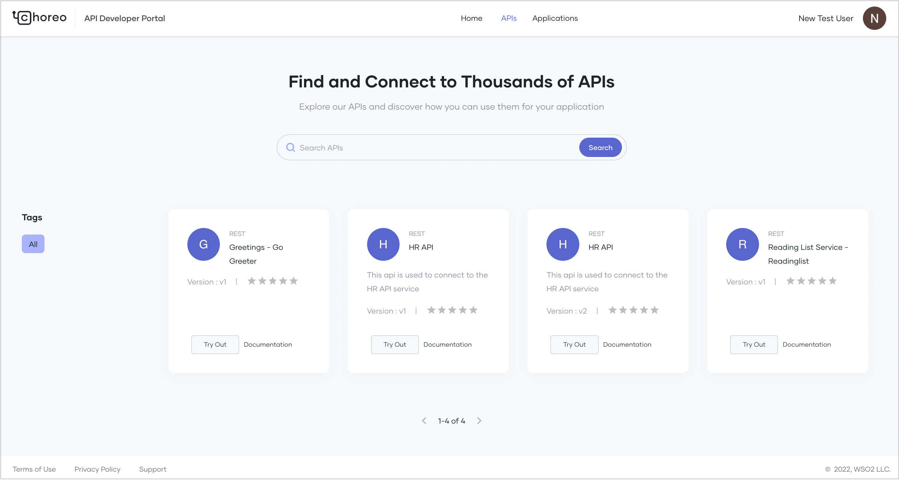
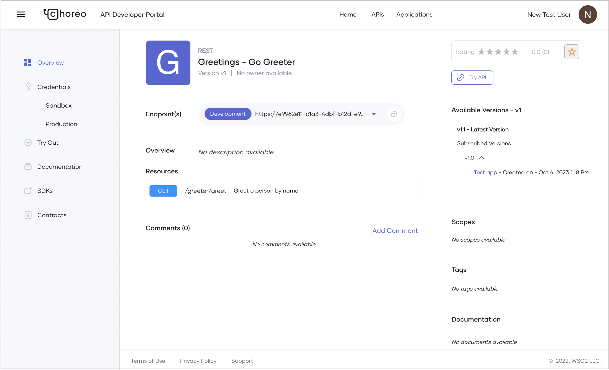

# Consume a Service

Choreo is a platform that allows you to create, deploy, and consume services seamlessly. The Choreo Developer Portal simplifies the process of discovering and using APIs for developers. 

This guide is designed for application developers (internal or external to your organization) who want to consume APIs published in the Developer Portal to build their applications. You will learn how to:

- Discover APIs
- Create an application and generate credentials
- Subscribe to an API
- Consume a published REST API via a web application

## Prerequisites

If you don’t already have a published service to consume, follow the [Develop a Service](../develop-components/develop-services/develop-a-service.md) documentation to publish and deploy a sample REST API.

## Discover APIs

In the Choreo Developer Portal, developers can search for APIs by name. APIs and services created and published through the Choreo Console are visible in the Developer Portal based on their visibility settings:

- **Public**: The API is visible to everyone in the Developer Portal.
- **Private**: The API is visible only to users who sign in to the Developer Portal.
- **Restricted**: The API is visible only to users with specific roles. This allows for fine-grained access control.

To learn more about API visibility, see [Control API Visibility](../api-management/control-api-visibility.md).

The Developer Portal lists APIs by their major version.



The API overview page displays subscribed versions of the API along with subscription details such as the application name and creation date.



!!! tip
    To use an API, it’s recommended to use the latest version. Copy the **Endpoint(s)** value from the API overview page and use it in your client application. This ensures your application always invokes the latest API version.

## Create an application



## Subscribe to an API



## Consume an API

You can generate a token to invoke the API.

1. If the API is secured by [OAuth2](https://wso2.com/choreo/docs/consuming-services/generate-an-access-token).
2. If the API is secured by [API key](https://wso2.com/choreo/docs/consuming-services/manage-api-keys)

You can use the generated token to invoke the API

=== "Access OAuth2 secured API"

    Use the access token as the Bearer token in the Authorization header.

    Example:
    ```bash
    curl -H "Authorization: Bearer <YOUR_ACCESS_TOKEN>" -X GET "https://my-sample-api.choreoapis.dev/greet"  
    ```


=== "Access API key secured API"

    Use the API key as the api-key header value in the request.

    Example:
    ```bash
    curl -H "api-key: <YOUR_API_KEY>" -X GET "https://my-sample-api.choreoapis.dev/greet"
    ```
