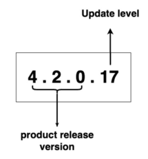

# Manage the Micro Integrator Runtime Version in Your Integration Project

{{ product_name }} lets you pick a specific WSO2 Micro Integrator (MI) runtime version for your integration project. This helps you control how your integrations run, ensuring they work correctly with your Synapse configurations and giving you access to the latest features or security updates.

{{ product_name }} currently supports MI versions 4.1.0, 4.2.0, 4.3.0, and 4.4.0.

## Understand the version string

WSO2 MI uses a standard semantic three-digit version such as `4.1.0` or `4.2.0`. In {{ product_name }}, the MI runtime version is shown as a four-digit number, for example, `4.1.0.14` or `4.2.0.17`.

The first three digits are the main product version. The fourth digit shows the specific update level for that version, which includes bug fixes and security updates.
!!! info "Important"
    When you specify the MI version, you can either use the full four-digit number (e.g., `4.1.0.14`) or just the first three digits (e.g., `4.1.0`). If you only provide the first three digits, {{ product_name }} will automatically use the latest available update for that main product version.

## Version management in MI extension for VS Code 

If you are using the [Micro Integrator extension for VS Code](https://mi.docs.wso2.com/en/latest/develop/mi-for-vscode/install-wso2-mi-for-vscode/) to develop WSO2 MI integration projects, you can specify the runtime version when you create a project. In the project creation form, specify the runtime version in the **Micro Integrator runtime version** field.

An integration project is structured as a Maven project with multiple sub-modules. The root `pom.xml` file holds the runtime version you configure when you create a new project. The version information is stored in the `<project.runtime.version>` element under the `<properties>` section in the `pom.xml` file. If there is a need to update the runtime version, you should modify the value in the `<project.runtime.version>` element to a valid runtime version.

!!! info "Note"
    If you have a valid WSO2 subscription, you can also access and download updates to set up an updated MI server locally. Use [WSO2 Update Tool](https://mi.docs.wso2.com/en/latest/install-and-setup/setup/updating-mi/) to get the latest updates that are available for a particular product release. 

## Troubleshoot errors

The following error codes can help you troubleshoot errors that occur during the integration component build:

| **Error code** | **Description**            |
|----------------|----------------------------|
| 110 - 119      | Internal server error.     |
| 121            | Malformed runtime version. |
| 122            | The specified runtime version is not available. Either the product or update level is not available.    |
| 123            | Trivy security vulnerabilities found in the `libs` directory. |
| 124            | Trivy security vulnerabilities found in the `dropins` directory. |
| 125            | Trivy security vulnerabilities found in the `libs` or `dropins` directory. |
| 126            | Error building integration project. |
