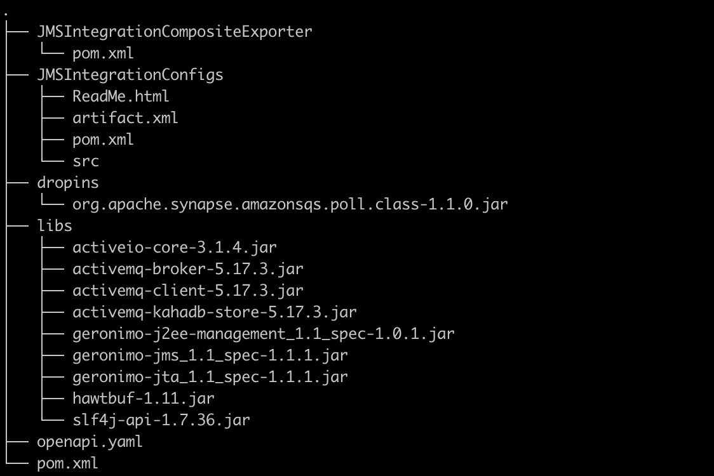
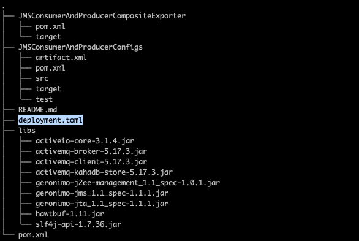

# Work with the Micro Integrator Runtime in Choreo

[WSO2 Micro Integrator (WSO2 MI)](https://mi.docs.wso2.com/en/latest/) is a lightweight, high-performance integration runtime. It allows you to run integrations developed with WSO2 Synapse.

The topics on this page walk you through the key aspects you need to understand to use the WSO2 MI runtime effectively in Choreo.

## Integration types

Choreo supports creating the following component types using WSO2 MI integrations that cater to different use cases and requirements. Each integration type serves a specific purpose. Therefore, it is essential to understand their differences to easily choose the most appropriate integration for your use case.

- **Service**: Exposes an integration as an API via HTTP, making it possible to create a RESTful interface for your integration service such as [data services](https://mi.docs.wso2.com/en/latest/develop/creating-artifacts/data-services/creating-data-services/). This type is ideal for scenarios where you need to provide an API for external systems or clients to interact with your integration.
- **Event Handler**: Triggers an integration based on external events such as messages arriving on a queue or updates in a database. This type is well-suited for implementing event-driven architectures or responding to changes in your system's environment.
- **Scheduled Task**: Runs an integration automatically at predefined time intervals, ensuring that specific integration tasks occur at regular intervals. This type is ideal for batch processing, data synchronization, or periodic maintenance tasks.
- **Manual Task**: Initiates an integration via user action, giving you full control over when the integration executes. This type is useful for on-demand tasks, testing, or debugging purposes.

## Develop integrations with the WSO2 Micro Integrator VS Code extension

We recommend using the [WSO2 Micro Integrator VS Code Extension](https://mi.docs.wso2.com/en/latest/develop/mi-for-vscode/mi-for-vscode-overview/) for developing your integration projects. This powerful extension offers an AI-powered, low-code development experience right within your familiar VS Code environment, significantly reducing setup time, boosting productivity, and enhancing your overall development workflow.

Install the extension and start developing: [Install WSO2 MI for VS Code](https://mi.docs.wso2.com/en/latest/develop/mi-for-vscode/install-wso2-mi-for-vscode/)

### Key benefits of developing with the VS Code extension:
- Familiar VS Code Ecosystem: Develop integrations in an environment you are already familiar with, reducing your learning curve.
- AI-Powered Copilot: Leverage AI assistance to generate configurations and project structures by simply describing your integration needs.
- AI-Powered Data Mapping: Transform data effortlessly between various formats using an intuitive, AI-driven visual mapper.
- Seamless Visual Editor: Design your integration flows with ease using a smooth, drag-and-drop graphical interface.

## OpenAPI support

For **Service** component types, Choreo automatically generates an OpenAPI definition based on your integration project. If you prefer to use your own OpenAPI file, you can do so by configuring Endpoints. For more information, see the [Configure Endpoints](../develop-components/configure-endpoints.md) section. 

Either way, Choreo uses this OpenAPI specification to provide an integrated OpenAPI Console for testing REST endpoints of Service components. For more information on testing, see [Test REST Endpoints via the OpenAPI Console](../testing/test-rest-endpoints-via-the-openapi-console.md).

## Third-party libraries

The use of third-party libraries in your Micro Integrator project can offer several advantages, such as enhanced functionality, improved integration capabilities, and reduced development time.

### For Standard JAR Libraries (.jar)
To include standard `.jar` libraries:

1. Create a new directory named `libs` at the root of your project.

2. Add your required `.jar` files into this `libs` directory.

The Micro Integrator runtime will automatically include these libraries when your component is deployed, making sure all necessary dependencies are available at runtime.

### For OSGi Bundle JARs (.jar)
If your project requires OSGi bundle JARs:

1. Create another new directory named `dropins` at the root of your project.

2. Add your OSGi bundle `.jar` files into this `dropins` directory.

The OSGi runtime will automatically pick up these bundles during deployment, enabling their functionality within your Micro Integrator project.

!!! warning "Note"
    If your project's root directory is different from your GitHub repository's root, make sure to place both the `libs` and `dropins` directories in your project's root.



## Importing custom certificates to MI

This feature allows you to import custom certificates into the Micro Integrator (MI) runtime. This is essential when your MI component needs to connect to servers or services that use SSL/TLS encryption with self-signed certificates or certificates issued by private certificate authorities (CAs) that are not automatically trusted. By importing these certificates, MI clients can establish secure connections without SSL/TLS errors.

First, obtain the certificate file. It can be in either PEM or DER format. You can usually get the certificate from the server/service provider or by exporting it from a web browser.

Choreo expects certificate files to be mounted into the `/wso2mi/certs/` directory within the MI runtime. Choreo will then automatically import certificate files in this directory into the MI's `client-truststore.jks`.

Follow these steps to mount your certificate to the `/wso2mi/certs/` directory:

1. In the Choreo console, select the component you wish to add a certificate to.
2. From the left navigation click **DevOps**.
3. Click on the **Configs and Secrets** tab.
4. Click **Create**.
5. Select **File Mount** as the **Mount Type**.
6. Check **Mark as a Secret**.
7. Specify the following values as mount configurations:

    | **Field**       | **Value**                                              |                                    
    |-----------------|--------------------------------------------------------|
    | **Display Name** | An appropriate name for the certificate.             |
    | **Mount path**  | `/wso2mi/certs/<filename>`. For example, `/wso2mi/certs/certificate.crt` |

8. Click **Upload File** and attach the certificate.
9. Click **Create**.

## Working with sensitive data using MI Secure Vault

[MI Secure Vault](https://mi.docs.wso2.com/en/latest/install-and-setup/setup/security/encrypting-plain-text/) is a feature that allows users to securely access sensitive data, such as passwords and tokens in MI integrations. When you add secrets within Choreo, they are made available to the Secure Vault for your integration to consume.

To add a secret to your MI component, follow these steps:

1. Select the MI component from the Choreo Console.
2. From the left navigation, click **Deploy**.
3. Click on **Configure and Deploy**.
4. In the **Configuration** step, click **+ Add** in the **Environment Configurations** section.
5. Specify the following values as configurations:

    | **Field**       | **Value**                                 |                                    
    |-------------------------------------------|--------------------------------------------------------|
    | **Name** | An appropriate name for the secret/alias. For example, `user_pass`|
    | **Value**       | Value for the secret                      |

6. Check **Mark as a Secret**.
7. Click **Add**.
8. Click **Next**.
9. In the **Endpoint Details** step, click **Deploy**.
10. Once the secret has been created, you can access it in your integration code using the following syntax:

```xml
<property name="secret_value_1" expression="wso2:vault-lookup('user_pass')" scope="default" type="STRING"/>
```
This code retrieves the secret named `user_pass` from the MI Secure Vault and stores it in the property named `secret_value_1`. You can then use this property in your integration code to access the secret value.

For more information on these features, see the [Accessing secrets](https://mi.docs.wso2.com/en/latest/install-and-setup/setup/security/encrypting-plain-text/#step-3-accessing-secrets) section of the MI Secure Vault documentation.

## Environment variables

When managing environment-specific configurations across multiple deployment environments (like development, staging, and production), the recommended approach is to use environment variables. 

To add environment variables to your MI component, follow these steps:

1. Select the MI component from the Choreo Console.
2. From the left navigation, click **Deploy**.
3. Click on **Configure and Deploy**.
4. In the **Configuration** step, click **+ Add** in the **Environment Configurations** section.
5. Specify the following values as configurations:

    | **Field**       | **Value**                                 |                                    
    |-------------------------------------------|--------------------------------------------------------|
    | **Name** | An appropriate name for the environment variable. For example, `DB_HOST`|
    | **Value**       | Value for the environment variable                      |

6. Click **Add**.
7. Click **Next**.
8. In the **Endpoint Details** step, click **Deploy**.
9. Once the environment variable has been created, you can access it in your integration code using the following syntax:

```xml
<property expression="get-property('env', 'DB_HOST')" name="db-host" scope="default" type="STRING"/>
```

!!! info "Note"
    You can add as many configurations as you want.

## Scan third-party libraries to identify security vulnerabilities

Scanning third-party libraries for security vulnerabilities is crucial for identifying potential weaknesses that attackers could exploit. This proactive approach helps detect and fix risks before they lead to data breaches or system compromises.

Choreo includes a security vulnerability scan during deployment, using Trivy to detect critical vulnerabilities in any third-party libraries you've added to your `libs` and `dropins` directories.

If the scan finds critical vulnerabilities, Choreo will stop the build process. You can view the Trivy scan status and any security failures in the **Library (Trivy) vulnerability scan** and **Dropins (Trivy) vulnerability scan** steps within the **Build Details** pane. Once you've fixed the vulnerability, you can redeploy your component.

## Customize WSO2 Micro Integrator pre-configured settings

WSO2 Micro Integrator (MI) comes with general pre-configured settings, but your organization may need to customize them for advanced use cases.

To customize the pre-configured settings of WSO2 MI instances running on Choreo, create a `deployment.toml` file in the GitHub repository subpath of your Micro Integrator project:



!!! warning "Important"
    If you change critical configuration parameters such as port offset and hostname, it can break internal communication.
    Therefore, the recommended approach is to update only the necessary configuration parameters.

Given below is a sample `deployment.toml` file that can be used to configure the JMS transport. For more information on WSO2 MI
configuration parameters, see the [MI Configuration Catalog](https://mi.docs.wso2.com/en/latest/reference/config-catalog-mi/).

```
[[transport.jms.sender]]
name = "myQueueSender"
parameter.initial_naming_factory = "org.apache.activemq.jndi.ActiveMQInitialContextFactory"
parameter.provider_url = "$env{JMS_PROVIDER_URL}"
parameter.connection_factory_name = "QueueConnectionFactory"
parameter.connection_factory_type = "queue"
parameter.cache_level = "producer"

[[transport.jms.listener]]
name = "myQueueListener"
parameter.initial_naming_factory = "org.apache.activemq.jndi.ActiveMQInitialContextFactory"
parameter.provider_url = "$env{JMS_PROVIDER_URL}"
parameter.connection_factory_name = "QueueConnectionFactory"
parameter.connection_factory_type = "queue"
parameter.cache_level = "consumer"
```

## Customize Logging for Micro Integrator in Choreo

Logging is essential for monitoring and troubleshooting your Micro Integrator components in Choreo. You can configure and customize logging according to your requirements. Logging configurations can be added to each Choreo environment, allowing you to fine-tune logging depending on the specific environment or deployment scenario.

To customize logging in MI instances, follow the steps given below: 

1. Start the variable name with `logging_level_` followed by the package or class name.
2. Replace the dot (`.`) characters in the package or class name with underscores(`_`).
3. Set the variable value to the required logging level for the corresponding package or class.


For example, to enable wire logs, change the logging level of the `org.apache.synapse.transport.http.wire` package to `debug`, set the environment variable as follows:

1. Select the MI component from the Choreo Console.
2. From the left navigation, click **Deploy**.
3. Click on **Configure and Deploy**.
4. In the **Configuration** step, click **+ Add** in the **Environment Configurations** section.
5. Specify the following values as configurations:

    | **Field**       | **Value**                                              |                                    
    |-----------------|--------------------------------------------------------|
    | **Name**        | `logging_level_org_apache_synapse_transport_http_wire` |
    | **Value**       | `debug`                                                |

6. Click **Add**.
7. Click **Next**.
8. In the **Endpoint Details** step, click **Deploy**.

Once the environment variable is set, the logging level for the specified package or class will be updated accordingly. You can add as many logging configurations as you need by following the same steps.

## Connectors

WSO2 Micro Integrator (MI) Connectors are prebuilt extensions that simplify integrating MI with various external systems. They enable seamless connections to databases, message brokers, REST APIs, and more, allowing you to perform actions such as sending messages, executing queries, or retrieving data within your integration flows.

These versatile connectors are easy to use and can be incorporated into diverse integration scenarios, including data, service-oriented architecture (SOA), and event-driven architecture (EDA) integrations.

You can design and implement integration flows using these connectors within the WSO2 MI VS Code Extension. This environment allows you to build flows using either WSO2 MI's prebuilt connectors or custom connectors developed with the Connector Development Toolkit. The VS Code Extension provides a graphical user interface that simplifies the process of building and testing these integration flows.

For more information, see the following topics in the WSO2 Micro Integrator documentation.

- [Connectors Overview](https://mi.docs.wso2.com/en/latest/reference/connectors/connectors-overview/)
- [Adding Connectors](https://mi.docs.wso2.com/en/latest/develop/creating-artifacts/adding-connectors/)

## Deploying integrations in Choreo 

WSO2 MI build presets is where you can deploy integrations developed with WSO2 Micro Integrator as an API. In this preset, you have three different ways to define endpoints. Choreo gives priority to the definition of endpoints in the below-mentioned order. 

1. **Using component.yaml file**
This is the most flexible method to define endpoints. You can configure the endpoint details with the `component.yaml` configuration file. Place this file in the `.choreo` directory in the project path of the component. 
If the Micro Integrator project has inbound endpoints, you can expose them via different endpoints using the `component.yaml`file.

    To learn about the `component.yaml` file, see [Overview of the component.yaml file](../develop-components/manage-component-source-configurations.md#overview-of-the-componentyaml-file).

2. **Auto generating endpoints**
If `component.yaml` is not provided and if the source Micro Integrator project has APIs, Choreo scans the project and generates the API endpoints. If the project has a few APIs, an endpoint will be generated for each API. The visibility of this auto-generated endpoint is set to `Public` by default. You can change the visibility in the deployment flow.

3. **Provide default endpoints**
If `component.yaml` is not provided and if the source Micro Integrator project doesn't have APIs, Choreo generates a default endpoint which will expose the default micro integrator port (8290) with `Public` visibility and wildcard context.

!!! note
    If you are currently using `component-config.yaml` or `endpoints.yaml` configuration files, see the respective [migration guide](../develop-components/manage-component-source-configurations.md#migration-guide) for instructions on migrating to the recommended `component.yaml` configuration file.

## Explore Choreo examples on GitHub

For a hands-on experience with MI-based integrations in Choreo, we recommend exploring our [Choreo Samples](../choreo-samples/samples-overview.md). You can filter out the samples based on the build presets `WSO2 MI`.