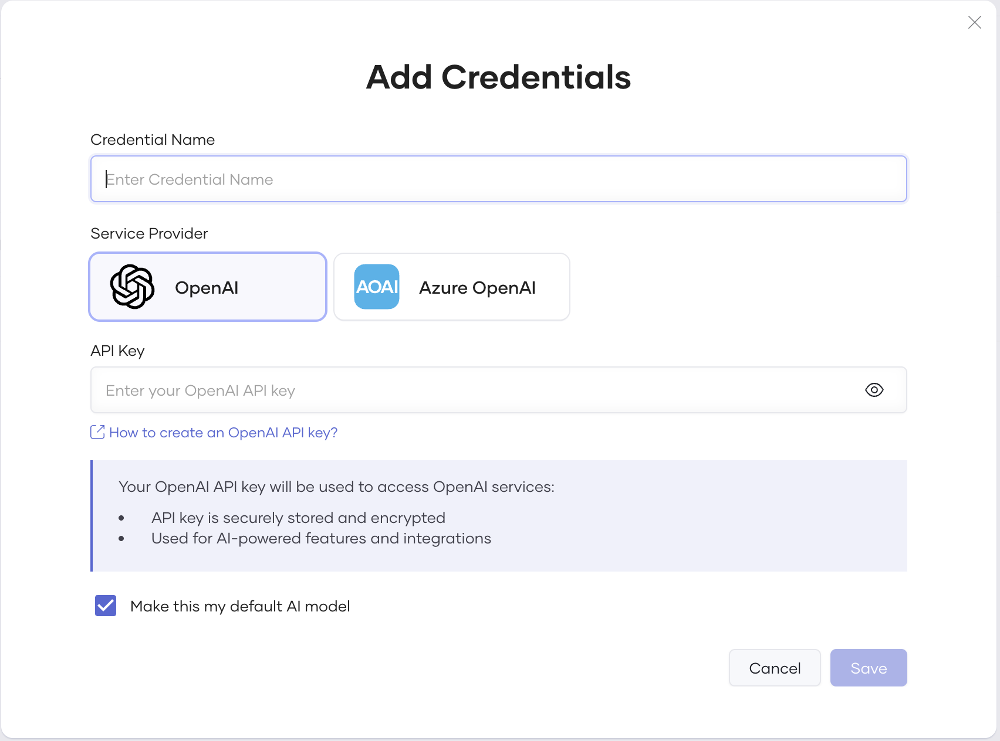
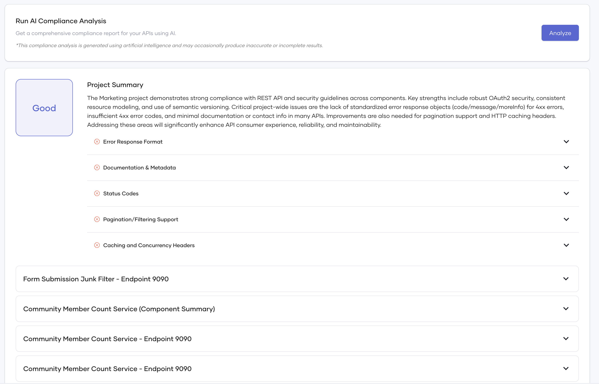
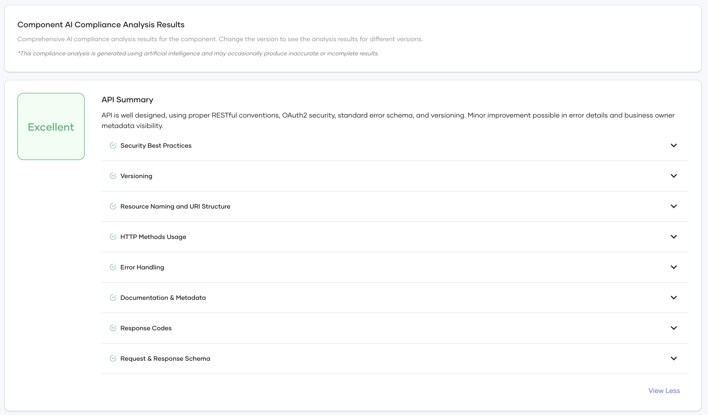

# Choreo Architect Agent (API Compliance)

## Overview

The **Choreo Architect Agent** is an AI-powered assistant that evaluates your APIs against industry standards and guidlines provided by the user. It acts as an **AI consultant for API design and compliance**, providing deep insights into API structure, design conventions, and security best practices.

When triggered, the Architect Agent automatically analyzes all published API specifications in your project and generates structured output with compliance scores, rule violations, and improvement suggestions.  

It helps ensure **consistency, security, and quality** in every API that your teams build on Choreo.

> **Note:**  
> This feature has been verified to work optimally with the **GPT-4.1** model, which delivers the most accurate and detailed API design analyses.  
> To run unlimited analyses and achieve the highest-quality results, configure your LLM credentials under  
> **Settings → Credentials → AI Configuration**.

---

## Setup and Configuration

### Step 1: Access the Architect Agent

You can access the Architect Agent under your project’s **Insights → Compliance** section in the Choreo Console.

### Step 2: Trigger an Analysis

To start a compliance check:

1. Navigate to **Insights → Compliance**.  
2. Click **Trigger Analysis**.  
3. The Architect Agent will automatically fetch your organization’s APIs and analyze their OpenAPI specifications.

Once complete, console will display compliance results at the Project, and Component levels.

### Step 3 (Optional): Add Your LLM Model Configuration

If you want to run more analyses without monthly limits, connect your own LLM credentials:

1. Go to **Settings → Credentials → AI Configuration**.  
2. Choose your provider (**OpenAI** or **Azure OpenAI**).  
3. Set it as the **default AI model** for all analyses.  
4. Enter your API key and save.

Adding your API key removes analysis limits and ensures the agent uses **GPT-4.1**, which provides the most reliable and semantically accurate compliance evaluations.

---
## Project Level

At the **Project level**, the Architect Agent generates a summarized compliance report for all APIs defined within the project as part of the project-level analysis. This report provides an aggregated view of design and security compliance across your APIs and highlights areas that need improvement.

Each project-level report includes the following information:

- **Overall Project Compliance Rating** – The compliance rating from all APIs in the project, representing their adherence to the defined guidelines.  
- **Project Ananlysis Summary** - A summary of the key findings from the project-level analysis.
- **Area Analysis** – A breakdown of the most common areas, including guideline categories with both compliant and violated rules (e.g., Status codes, Pagination, Error responses).
- **Individual API Scores** – A list of APIs and their respective analysis, allowing you to identify which APIs require the most attention.

This report helps teams quickly understand how well their APIs align with organizational design standards and where corrective action is required.

---

## Component Level

At the **Component level**, the Architect Agent provides a detailed compliance report for the 
This report represents the most granular level of analysis and includes all findings and recommendations for that API’s OpenAPI specification.

At the **Component level**, the Architect Agent provides a detailed compliance report for each individual API. This report represents the most granular level of analysis and includes all findings and recommendations based on that API

Each component-level report includes:

- **Overall API Compliance Rating** – Indicates how well the API adheres to the defined design and security guidelines. 
- **Guideline Category Breakdown** – Compliance categories such as *Security*, *Conventions*, *Best Practices*, and *Warnings*.  
  - **Detailed Violations** -  Descriptions of violated guidelines, the nature of each issue, and AI-generated suggestions or practical examples for improvement.
  - **Compliant categories** – Sections where the API meets the expected standards, demonstrating adherence to best practices and design conventions.

The Architect Agent always displays the **most recent report**, ensuring that teams act on up-to-date findings and recommendations.

## Conclusion

The **Choreo Architect Agent** empowers your teams to deliver **consistent, secure, and well-designed APIs** across your organization.  
With real-time AI-driven compliance checks, semantic recommendations, and multi-level dashboards, you can:

- Detect design and security violations.  
- Standardize API design practices across teams.  
- Continuously improve API quality through measurable scores.  
- Integrate guideline compliance into your development lifecycle.  

---

