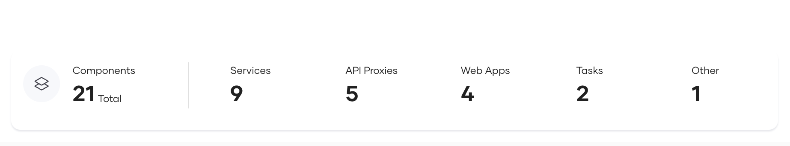

# Operational Insights

The Operational Insights dashboard provides a centralized view for monitoring and analyzing the health and resource usage of your organization and its projects. It enables users to:

- View the number of components, services, API proxies, web apps, and other resources at both the organization and project levels.
- Track CPU and memory utilization for these resources over time, helping to identify trends, bottlenecks, and potential issues.
- Gain insights into deployment activity and API response patterns, supporting operational decision-making and troubleshooting.

This dashboard is essential for maintaining visibility into your cloud resources, ensuring optimal performance, and proactively managing your infrastructure.

You can view the Operational Insights dashboard at either the organization level or the project level. Users can select the desired environment to view insights, and filter the data by time range—choosing from the last day, last week, last two weeks, or last month—to analyze trends and performance over different periods.

---

## Overview

The top section displays key metrics about your environment:

- **Contributors**: Indicates how many users have contributed in the selected project or organization.
- **Projects**: Number of projects within the organization. Projects are visible only at the organizational level.

- **Components**: Total number of components available in the selected project or organization.
- **Services**: Total number of services deployed.
- **API Proxies**: Total number of API proxies deployed.
- **Web Apps**: Total number of web applications deployed.
- **Tasks**: Total number of tasks deployed.
- **Other**: Any other deployed components that do not fall into the above categories.

---

## CPU Usage Metrics

- **Description**: This line chart visualizes CPU usage over time. CPU values are aggregated for all the components in the selected project, or for all components if the organization level is selected. Minimum allocation represents the CPU requested resources, while the maximum allocation is the CPU maximum value configured. The usage line shows the actual CPU usage, which can be lower than the minimum allocation if some components are not in a running state.
- **Legend**:

      - **Usage**: Actual CPU usage.
      - **Min Allocated**: Minimum CPU resources allocated.
      - **Max Allocated**: Maximum CPU resources allocated.

- **Purpose**: Helps identify trends, spikes, or resource constraints in CPU usage.

---

## Memory Usage Metrics

- **Description**: This line chart shows memory usage over time. Memory values are aggregated for all the components in the selected project, or for all components if the organization level is selected. Minimum allocation represents the memory requested resources, while the maximum allocation is the memory maximum value configured. The usage line shows the actual memory usage, which can be lower than the minimum allocation if some components are not in a running state.
- **Legend**:

      - **Usage**: Actual memory usage.
      - **Min Allocated**: Minimum memory allocated.
      - **Max Allocated**: Maximum memory allocated.

- **Purpose**: Useful for monitoring memory consumption and ensuring resources are sufficient for workloads.

---

## Deployments

This chart indicates the number of deployments to the selected environments within the time period shown on the X-axis. It helps you track deployment frequency and status for the chosen timeframe.

---

## API Response Summary

This chart shows the number of API requests associated with the specified response codes in the selected environments. It helps assess how the resources in those environments are functioning, providing insights into overall health and identifying any fault scenarios.

---
