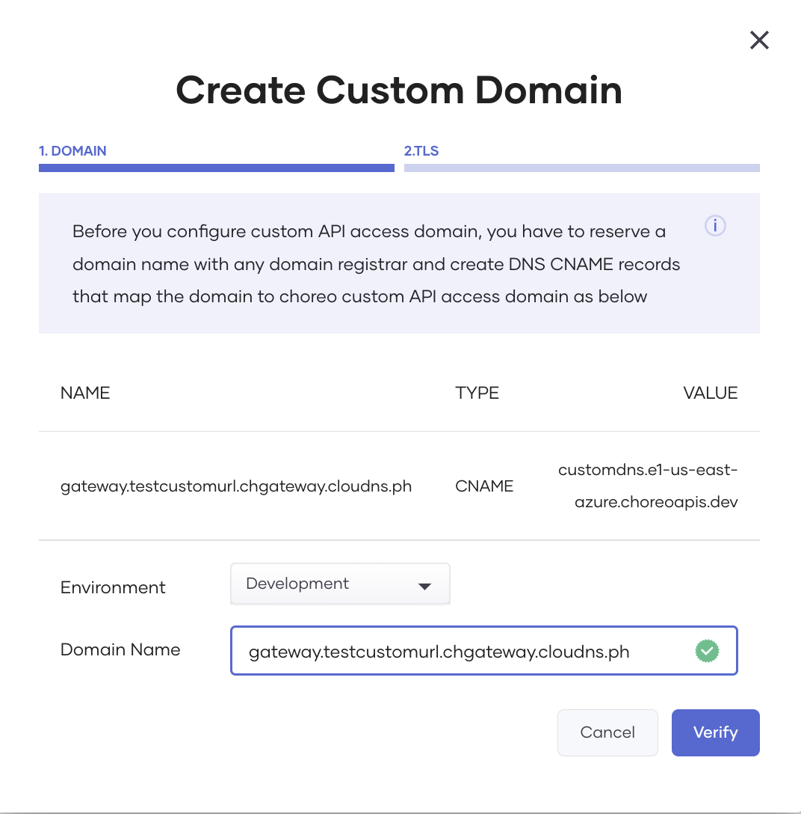
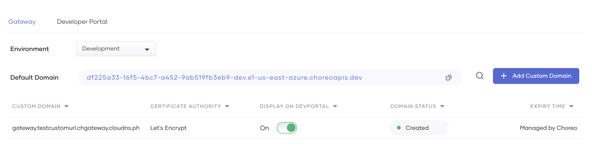
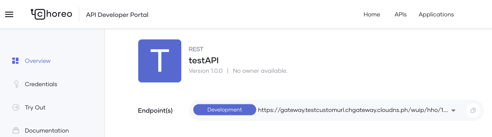

# Configure a Custom Domain for APIs

A custom domain for your site is essential for effective branding, discoverability, and credibility. Choreo allows you to configure a custom domain for the APIs you deploy in it.

To understand how to configure a custom domain for your APIs, see the following sections:

## Prerequisite

To configure a custom domain for your APIs, you must first register a custom domain with a domain registrar service as follows:

1. Sign in to the Choreo Console at [https://console.choreo.dev/](https://console.choreo.dev/) using a Google, GitHub, or Microsoft account.

2. If you are a new user, create an organization. Enter a unique organization name. For example, `Stark Industries Ltd`.

    {.cInlineImage-small}

3. To expose the custom domain to which your APIs need to be exposed, register it with a domain registrar service (for example, [ClouDNS](https://www.cloudns.net/)).

    To register the custom domain, you need to create a DNS record of the `CNAME` type via the domain registrar service, associating it with the Choreo gateway access domain (i.e., `customdns.e1-us-east-azure.choreoapis.dev`).

4. Optionally, create TLS certificates and keys to enable TLS for the custom domain. You can also use the `let's encrypt` option. This option allows Choreo to create and manage the certificates on your behalf.

## Configure a custom domain for your APIs

To configure a custom domain for your APIs, follow the steps given below:

1. In the left navigation menu, click **Settings**.

2. Click the **Domains** tab and in the **Gateway** sub-tab, click **+ Add Custom Domain**.

3. Enter your domain name and click **Verify**. 

    {.cInlineImage-half}

4. Once Choreo verifies the custom domain successfully, click **Next**.

5. You can add the TLS certificates you created for the custom domain. Alternatively, you can click the **Let's Encrypt** option to let Choreo generate and manage the certificates for you. For this scenario, let's click the **Let's Encrypt** option.

6. Click **Add** to save the custom domain.

    The **Settings** page displays the custom domain in the **Domains**/**Gateway** sub-tab.

    {.cInlineImage-threeQuarters}

That's it! You have successfully configured a custom domain for your API Gateway. The API endpoint of the APIs you create will now include the custom domain as shown in the image below:

{.cInlineImage-threeQuarters}

