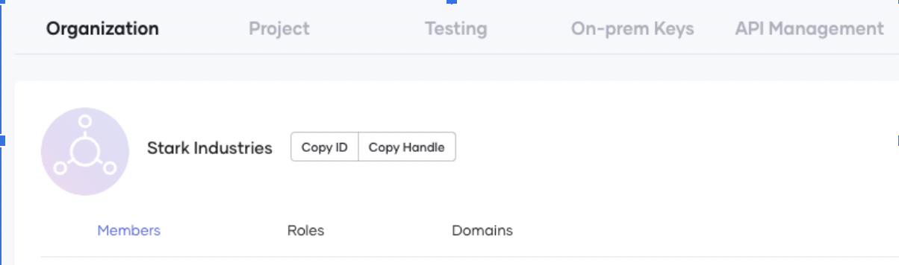
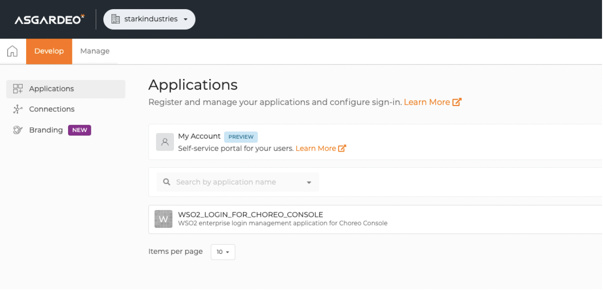
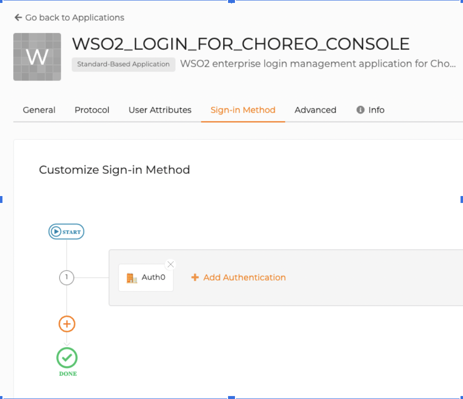
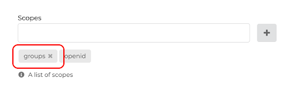
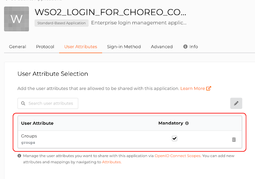
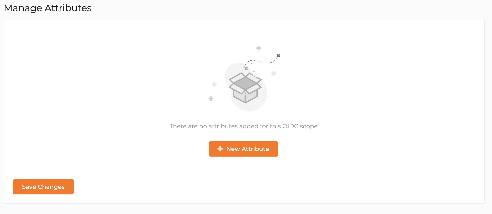
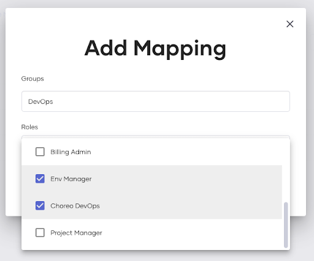

# Configure Enterprise Login

Choreo's Enterprise Login feature allows your users residing in an external IdP (Identity Provider) to login into Choreo seamlessly without changing their credentials.

This guide takes you through the steps you need to follow to configure an enterprise login for your organization in Choreo. 

## Prerequisites 
Make sure you have a valid email domain. 

## Step 1: Create an organization in Choreo

To create an organization in Choreo, follow the steps below:

1. Sign in to the Choreo Console at <a>https://console.choreo.dev/</a> using a Google/ GitHub/ Microsoft account.
  
2. Create an organization as follows:
 
    - **If you are a new user**: enter a unique organization name and create an organization. For example, "Stark Industries".
    
        {.cInlineImage-small}
 
    - **If you are a returning user**: expand the drop-down for your profile and click **Settings**. Under **Organizations**, you can view the organization you created at sign-up. 
 
## Step 2: Configure enterprise login for your Choreo organization

To configure enterprise login for your Choreo organization, follow the steps below:

1. Expand the drop-down for your profile and click **Settings**.
2. Click **Copy Handle** to copy the organization handle to the clipboard.

    {.cInlineImage-half}

3. When you add a Choreo organization, Choreo reserves the organization name for your user account. Therefore, you need to create an organization of the same name on the Choreo IdP (i.e., Asgardeo).
   
    To create your organization on the Choreo IdP, follow these steps:
    
    1. Sign up to [Asgardeo](https://asgardeo.io/signup?utm_source=console) with the same credentials you used to create your Choreo account.
    
    2. Paste the value copied in step 2 as the organization name in Asgardeo and click **Create**. 

         {.cInlineImage-half}

4.  To enable enterprise login for your organization, send us an email as follows:

    - **If you already have a support account with us**, send us the organization name/handle and the email domains specific to your organization through our support portal. 

    - **If you do not have a support account with us yet**, send an email to `choreo-help@wso2.com` requesting to enable enterprise login to your organization. 
     
        Mention the following information in the request:

        - Organization name or handle. For example, “Stark Industries” or “starkindustries”
        - Email domains specific to your organization. For example, “@stark.com”, “@starkindustries.com”, and “@stark.eu.

        !!!info "Sample Email"

                    Subject : [Stark Industries] Configure enterprise login
                    
                    Content:
                        
                        Hi CS team,
                        Configure enterprise login to my organization and please find the relevant information below.
                        Organization name/handle: “Stark Industries”/“starkindustries”

                        Email domains specific to my organization: “@stark.com”, “@starkindustries.com”, and “@stark.eu”

                        Thank you!

5. To configure your enterprise login, our support team will send you an email with a verification code. Login to your domain host account and configure the DNS record for your email domain with the following values:

    | **Field**                          | **Value**             |
    |------------------------------------|-----------------------|
    | **Name/Host/Alias**                | `@` or leave blank         |
    | **Time to Live (TTL)**             | Leave default value or use `86400` |
    |**Value/Answer/Destination**        | wso2-domain-verification:<`verification_code`>|

**What's next?**

Next, you can create a connection to the federated identity provider (For example, Auth0, ADFS, Keycloak, etc.), following the steps below:

## Step 3: Bring your own identity

Bring your own identity to Choreo by configuring a federated enterprise IdP on Asgardeo to your organization. Now that you have created an organization in Asgardeo with the same name as your Choreo organization in [Step 2](#step-2-configure-enterprise-login-for-your-choreo-organization), Choreo can authenticate users signing in to that organization. Follow the steps below to configure the federated IdP:

1. Sign in to Asgardeo at <a>https://asgardeo.io/signup?utm_source=console</a>.

2.  To configure a federated enterprise identity provider to your Asgardeo organization, follow the steps in [Asgardeo documentation - Add Standard-Based Login](https://wso2.com/asgardeo/docs/guides/authentication/enterprise-login/).

3. Next, navigate to **Develop** and select **Applications** from the left navigation. You will see an application prefixed “WSO2_LOGIN”. 
   
    {.cInlineImage-half}

4. Click on the application and select the **Sign-in Method** tab. You can observe the connection you configured in step 2 of this section.

    {.cInlineImage-half}

You are all set! Your users in the enterprise IdP can now log into the Choreo Console using their user credentials.

## Role-based access control for Enterprise login

Choreo allows you to configure your users residing in an external IDP (Identity Provider) to log in to Choreo with appropriate permissions seamlessly based on their role.

Follow the steps below to configure role-based access control to an enterprise login in Choreo:

### Prerequisites

1. Configure [Enterprise Login for your organization](https://wso2.com/choreo/docs/administration/configure-enterprise-login/).
2. Be sure your Enterprise IDP includes the groups/roles attributes in the tokens it sends to Asgardeo in the respective protocol.
3. Be sure you have admin privileges in Choreo.

### Step1: Configure Asgardeo

1. [Configure your IDP as an External IDP in Asgardeo](https://wso2.com/asgardeo/docs/guides/authentication/enterprise-login/). Depending on your IDP, you may select OpenID Connect or SAML as the protocol between Asgardeo and your IDP.

    !!! note
        If you are using OpenID Connect, configure the requested scopes accordingly for Asgardeo to get the relevant group/role details from the external IDP.
        
        {.cInlineImage-half}

2. Configure the application as follows:
    1. Go to the Asgardeo Console. Click **Develop** -> **Applications** -> **WSO2_LOGIN_FOR_CHOREO_CONSOLE** and then select **Sign-in Method**. 
    2. Depending on the protocol you selected above, configure your login to use the above IDP. 
        - For OpenID Connect, follow: [https://wso2.com/asgardeo/docs/guides/authentication/enterprise-login/add-oidc-idp-login/#enable-the-oidc-idp-for-login](https://wso2.com/asgardeo/docs/guides/authentication/enterprise-login/add-oidc-idp-login/#enable-the-oidc-idp-for-login)
        - For SAML, follow: [https://wso2.com/asgardeo/docs/guides/authentication/enterprise-login/add-saml-idp-login/#enable-the-saml-idp-for-login](https://wso2.com/asgardeo/docs/guides/authentication/enterprise-login/add-saml-idp-login/#enable-the-saml-idp-for-login)
            
    3. Go to **User Attributes**  and add the groups attribute to the user attribute list and mark it mandatory.

        {.cInlineImage-half}

3. Configure the attribute/scope settings.
    1. Go to the Asgardeo Console. Click **Manage** -> **Scopes** -> **Open ID**.
    2. Click **New Attribute** and add the **Groups** attribute to the list.

         {.cInlineImage-half}

### Step 2: Map Asgardeo groups to Choreo Roles in the Choreo Console 

!!! note
    1. This configuration can be done only by the **organization Admin**.
    2. The Choreo organization admin should add the group role mapping entry for the Admin role to enable the external enterprise organization Admin to access this page.

1. Log in to the Choreo console.
2. From the left navigation menu, click **Settings**.
3. Click **Organization** -> **Role Mapping** 
4. To add a new group role mapping, click **Add Mapping**. 

    {.cInlineImage-half}

 5. Enter the exact `Groups` name configured at the Enterprise IdP and map the list of Choreo roles by selecting the checkbox(s) from the list.
 6. Click **Save**. 
 
!!! note
    1. You can assign one or more roles to each group.
    2. You can only update the role name. The group name is not editable.
    3. If a change in the group role mapping occurs, it will take effect from the next login session onwards. 
    4. If there are no mappings, all the enterprise users will be applied with the default developer role.

