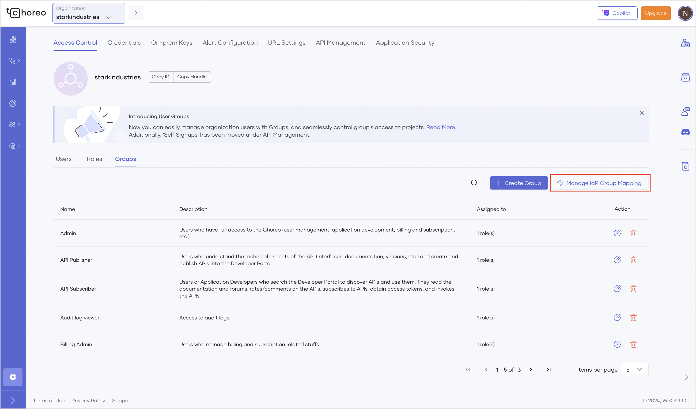

# Configure Enterprise Login

With Choreo, you can configure enterprise login to allow users from an external identity provider (IdP) to sign in to Choreo seamlessly without changing their credentials.

This guide walks you through the steps to configure enterprise login for your organization in Choreo. 

## Prerequisites 

Before you proceed with the configuration, set up the following:

- A valid email domain for your organization.
- Access the Choreo Console at https://console.choreo.dev/ via your Google, GitHub, or Microsoft account. If you are a new user, create an organization with a unique organization name. For example, "Stark Industries". 

## Configure enterprise login for your Choreo organization

To configure enterprise login for your Choreo organization, follow the steps given below:

 - **If you already have a support account with us**, send us your organization name/handle and the email domains specific to your organization through our support portal. 

 - **If you do not have a support account with us yet**, send an email to `choreo-help@wso2.com` requesting to enable enterprise login for your organization. 
      
    !!! tip
        Ensure you include the following information in the request:

         - Organization name or handle. For example, “Stark Industries” or “starkindustries”.
         - Email domains specific to your organization. For example, “@stark.com”, “@starkindustries.com”, and “@stark.eu.

    !!! note "Sample email"
        Subject : [Stark Industries] Configure enterprise login
        
        Hi CS team,

        I need to configure enterprise login for my organization. Can you please do the necessary configurations to proceed?

        My organization details are as follows: 

          - Organization name: Stark Industries
          - Organization handle:  starkindustries
          - Email domains specific to my organization: “@stark.com”, “@starkindustries.com”, and “@stark.eu”

        Thank you.

    The Choreo support team will perform the necessary configurations and respond to you with a verification code. You must sign in to your domain host account and configure the DNS record for your email domain with the following values:

    | **Field**                          | **Value**                                      |
    |------------------------------------|------------------------------------------------|
    | **Name/Host/Alias**                | Specify `@` or leave it blank                  |
    | **Time to Live (TTL)**             | Keep the default value or use `86400`          |
    | **Value/Answer/Destination**       | wso2-domain-verification:<`verification_code`> |

Now, you are ready to bring your own identity to Choreo.

## Bring your own identity to Choreo

When you create an organization in Choreo, an organization with the same name is provisioned for you in Asgardeo. To bring your own identity to Choreo, you must configure a federated enterprise IdP on Asgardeo in the organization that is provisioned for you.

Follow the steps given below to configure the federated IdP:

1. Sign in to [Asgardeo](https://asgardeo.io/).
2. To configure a federated enterprise identity provider for your Asgardeo organization, follow the steps in [Asgardeo documentation - Add Standard-Based Login](https://wso2.com/asgardeo/docs/guides/authentication/enterprise-login/).
3. In the Asgardeo Console left navigation menu, click **Applications**. You will see an application named **WSO2_LOGIN_FOR_CHOREO_CONSOLE**.
4. Click on the application to edit it.
5. Click the **Sign-in Method** tab. You can observe the configured connection.

Now, users in your enterprise IdP can sign in to the Choreo Console using their enterprise IDs.

## Configure role-based access control for enterprise login

To streamline the enterprise login process and grant appropriate permission, Choreo provides the flexibility to configure role-based access control for users who reside in an external IdP. 

To set up role-based access control for enterprise login within Choreo, follow the steps given below:

### Prerequisites

Before you proceed with the configuration, make sure you complete the following:

1. Configure enterprise login for your organization. For instructions, see [Configure enterprise login for your Choreo organization](#configure-enterprise-login-for-your-choreo-organization). 
2. Ensure your enterprise identity provider includes the group/role attributes in tokens it sends to Asgardeo via the respective protocol.
3. Be sure you have administrator privileges in Choreo.

### Step 1: Configure Asgardeo

1. Sign in to [Asgardeo](https://asgardeo.io/).
2. [Configure your IdP as an external IdP in Asgardeo](https://wso2.com/asgardeo/docs/guides/authentication/enterprise-login/). Depending on your IdP, you can select OpenID Connect or SAML as the protocol between Asgardeo and your IdP.

    !!! note
        If you are using OpenID Connect, configure the requested scopes accordingly for Asgardeo to get the relevant group/role details from the external IdP.

3. To configure the application, follow the steps given below:
    1. In the Asgardeo Console left navigation menu, click **Applications**. You will see an application named **WSO2_LOGIN_FOR_CHOREO_CONSOLE**.
    2. Click on the application to edit it.
    3. Click the **Sign-in Method** tab.
    4. Configure the IdP for login depending on the protocol you selected:
        - For OpenID Connect, follow the instructions in [Enable the OIDC IdP for login](https://wso2.com/asgardeo/docs/guides/authentication/enterprise-login/add-oidc-idp-login/#enable-the-oidc-idp-for-login).
        - For SAML, follow the instructions in [Enable the SAML IdP for login](https://wso2.com/asgardeo/docs/guides/authentication/enterprise-login/add-saml-idp-login/#enable-the-saml-idp-for-login).
            
    5. Click the **User Attributes** tab.
    6. Select the **Groups** attribute and click the arrow to expand the section. Then, select the **Requested** checkbox.
    7. Click **Update**.

4. To add the user attributes as OpenID Connect scopes, follow the steps given below:
    1. In the Asgardeo Console left navigation menu, click **Scopes**.
    2. In the **OpenID Connect Scopes** pane, click **OpenID** to edit it.
    3. Click **New Attribute** and select the **Groups** attribute.
    4. Click **Save** and then click **Save Changes**.

### Step 2: Map Choreo groups to enterprise IdP groups via the Choreo Console 

!!! note
    
    Before you map Choreo groups to enterprise IdP groups, ensure you meet the following criteria:

    - Asgardeo is your key manager.
    - You have permission to perform actions of the organization administrator role.

1. Sign in to the [Choreo Console](https://console.choreo.dev/).
2. In the Choreo Console, go to the top navigation menu and click **Organization**. This takes you to the organization's home page.
3. In the left navigation menu, click **Settings**. This opens the organization-level settings page. 
4. In the **Access Control** tab, click **Groups**. 
5. Click **Manage IdP Group Mapping**.
    

6. Click the edit icon corresponding to the Choreo group you want to map to the enterprise IdP group.
7. In the **IdP Group Name** field, specify the exact name you configured in the enterprise IdP and enter to add it.
   
    !!! tip
        If there is a change to the IdP group mapping, it takes effect from the next login session onwards. 

8. Click **Save**. 

By following these steps, you have successfully configured role-based access control for enterprise login in Choreo, allowing users from the external IdP to have the appropriate permission.
