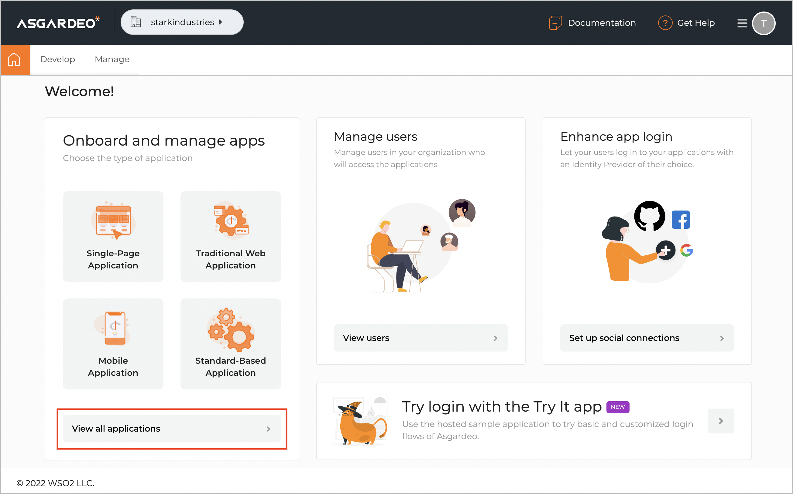
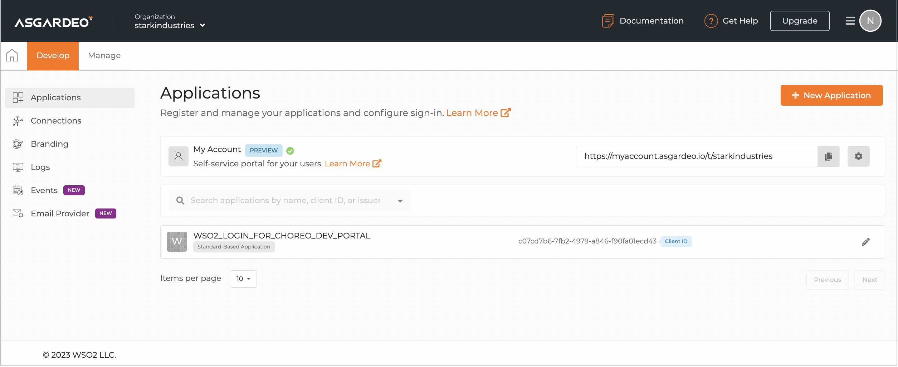
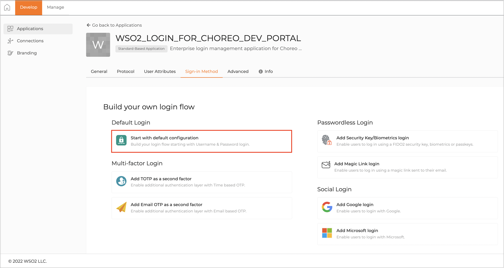
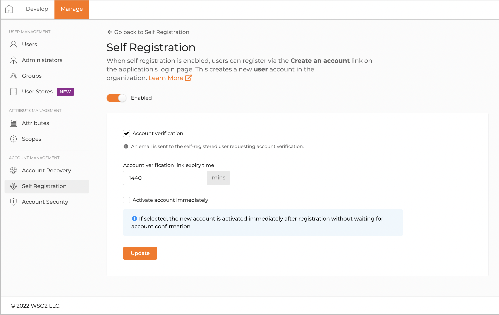
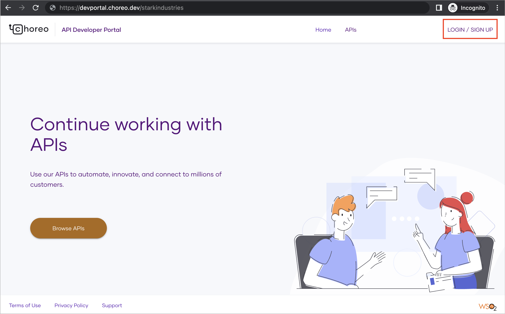
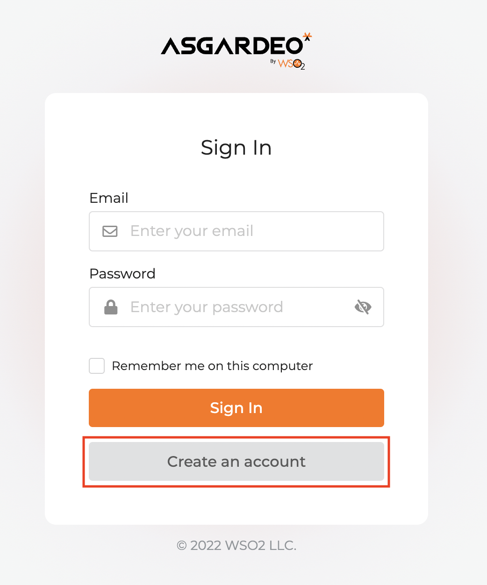

# Configure Self-Sign-Up

With Choreo, you can set up a self-sign-up page for your Developer Portal. The self-sign-up page allows users to easily access your Developer Portal and subscribe to APIs. When you configure self-sign-up, users can create their accounts and access your Developer Portal without any manual intervention from you.

This page walks you through the steps to configure self-sign-up for your Developer Portal.

## Prerequisites

1. Sign in to the Choreo Console at [https://console.choreo.dev/](https://console.choreo.dev/) using your Google, GitHub, or Microsoft account.
2. If you are a new user, create an organization with a unique organization name. For example, "Stark Industries".

## Configure Developer Portal self-sign-up

To configure self-sign-up, follow the steps given below:

1. Send an email to <choreo-help@wso2.com> requesting to configure enterprise IdP for the Developer Portal of your organization. 

    !!! tip
        Ensure you include the organization name or handle in the request.

    !!! note "Sample email"
        Subject : [Stark Industries] Configure enterprise IdP for Developer Portal
        
        Hi CS team,

        I need to configure enterprise IdP for my organization’s Developer Portal to enable self-sign-up. Can you please do the necessary configurations to proceed?

        My organization details are as follows: 

          - Organization name: Stark Industries
          - Organization handle:  starkindustries

        Thank you

    The Choreo support team will perform the necessary configurations and respond to your request.

2. When you receive a response, sign in to [Asgardeo](https://console.asgardeo.io/) using the same credentials that you used to sign in to Choreo.
3. In the Asgardeo Console, click **View all applications**.

    

    You will see an application named **WSO2_LOGIN_FOR_CHOREO_DEV_PORTAL**. 

    

4. Click on the application to edit it and enter your organization’s Developer Portal URL as the **Access URL** of the application. For example, `https://devportal.choreo.dev/starkindustries`.
5. Click **Update**.
6. To add user attributes, follow these steps:

    !!! info "Note"
          If you have enabled enterprise login and you want to add the **Groups** attribute during self-sign-up configuration, avoid making it mandatory. This ensures proper access control and prevents unauthorized privileges. If you make the **Groups** attribute mandatory, it allows self-signed-up users to specify a group and assume roles associated with it.

    1. Click the **User Attributes** tab.
    2. To add the email as a mandatory user attribute, select **Email** and click the arrow to expand the section. Then, select the **Requested** and **Mandatory** checkboxes.

        

    3. To add the first name and last name as optional attributes, select **Profile** and click the arrow to expand the section. Then, select the **Requested** checkbox for the **First Name** and the **Last Name** attributes.

        

    4. Click **Update**.

7. To add the user attributes as OpenID Connect scopes, follow these steps:

    1. In the Asgardeo Console left navigation menu, click **Scopes**.
    2. In the **OpenID Connect Scopes** pane, click **OpenID** to edit it.
    3. Click **+ New Attribute**.
    4. Select **Email**, **First Name**, and **Last Name** as the attributes to associate with the OpenID scope.
    5. Click **Save** and then click **Save Changes**.

        

8. To configure basic authentication as the sign-in method, follow these steps:

    1. In the Asgardeo Console left navigation menu, click **Applications**.
    2. In the **Applications** pane, click the **WSO2_LOGIN_FOR_CHOREO_DEV_PORTAL** application to edit it.
    3. Click the **Sign-in Method** tab and then click **Start with default configuration**.

        

    4. Click **Update**.

9.  To configure self-registration, follow these steps:

    1. In the Asgardeo Console left navigation menu, click **Self Registration**.
    2. In the **Self Registration** pane, click **Configure**.
    3. To enable self-registration, turn on the toggle.
    4. Select **Account verification**. This displays a confirmation message to enable account verification. 
    5. Click **Continue**.
    6. Specify an appropriate value in the **Account verification link expiry time** field.
    7. Click **Update**. 
     
        

Once you complete these steps, you will see a sign up link similar to the following in your Developer Portal:

{.cInlineImage-half}
 
Users can click **LOGIN/SIGN UP** and then click **Create an account** to sign up to access your Developer Portal.

## Manage new users

To manage users who want to access your Developer Portal via self-sign-up, you have two possible approaches:

- Enable auto-approval for new user registrations: This approach automates the user approval process.  When you enable auto-approval, each user who creates an account and signs up to your Developer Portal can access it by default.
- Manually approve or reject user accounts: This allows you to review the list of user registrations and manually approve or reject each registration as needed.

### Enable auto-approval for new user registrations

To automatically approve each new user account registered on your Developer Portal, follow the steps given below:

1. In the [Choreo Console](https://console.choreo.dev/), click your username in the top right corner.
2. In the drop-down menu, click **Settings**. This opens the **Organization** pane, where you can make necessary changes to organization settings.
3. In the **Organization** pane, click **Self Signups**.
4. To enable auto-approval, turn on the toggle.

Once you enable auto-approval, users can sign in to your Developer Portal and view your APIs and applications immediately after creating an account.

### Manually approve or reject user accounts

If you have not enabled auto-approval, you can manually approve or reject new user registrations. Once a user creates an account, Choreo sends an email to ask the user to confirm the account. To manually approve or reject user accounts, follow the steps given below:

1. In the [Choreo Console](https://console.choreo.dev/), click your username in the top right corner.
2. In the drop-down menu, click **Settings**. This opens the **Organization** pane, where you can make necessary changes to organization settings.
3. In the **Organization** pane, click **Self Signups**. You will see the user accounts listed for approval.
4. To approve a user account, click **Approve**. To reject an account, click **Reject**.

    - If you approve an account, the user will receive an email confirming the approval.
    - If you reject an account, the user will receive an email mentioning that their account is rejected. 

        !!! info "Note"
               A rejected user cannot sign up to your Developer Portal using the same account again.
