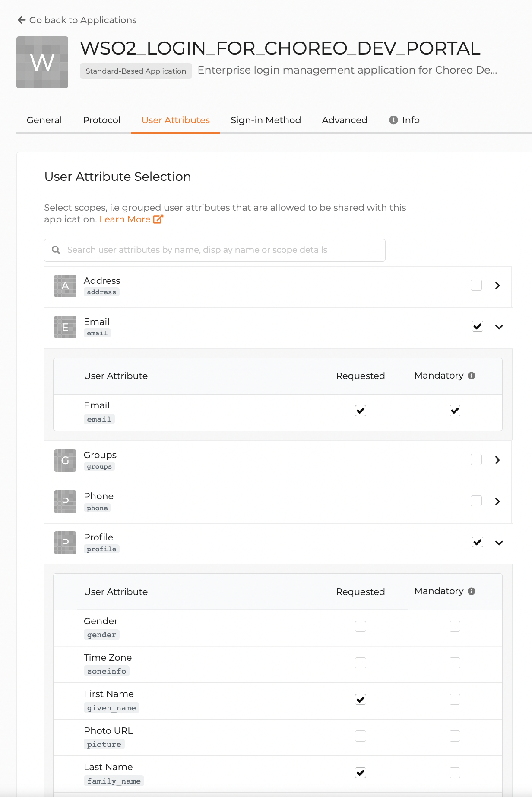

# Configure Self-Sign-Up

Choreo allows you to configure self-sign-up to enable users to access your Developer Portal via a self-sign-up page. 

This page walks you through the steps to configure self-sign-up to the Developer Portal.

## Prerequisites

1. Sign in to the Choreo Console at [https://console.choreo.dev/](https://console.choreo.dev/) using your Google, GitHub, or Microsoft account.
2. If you are a new user, create an organization with a unique organization name. For example, "Stark Industries".

    {.cInlineImage-small}

## Configure self-sign-up

1. Click **Settings** in the left navigation menu of the Choreo Console.
2. Click **Copy Handle** to copy the organization handle to the clipboard.
3. Go to the [Asgardeo sign-up page](https://asgardeo.io/signup?utm_source=console) and register using the same email address/user account you used to sign up with Choreo.

    !!! tip
        You must sign up to Asgardeo with the same email address/user account you used to sign in to Choreo because the organization name is reserved for that user account.
    
4. In the **Organization Name** field, paste the organization handle that you copied from the **Settings** page in Choreo.

    {.cInlineImage-half}

5. Click **Create**. This creates a new organization so that you can proceed to access your workspace. 
6. Send an email similar to the following to choreo-help@wso2.com requesting to configure enterprise IdP for the Developer Portal of your organization. 

    !!! tip
        Be sure you mention the organization name or handle in the request.

    !!! note "Sample email"
        Subject : [Stark Industries] Configure enterprise IdP for Developer Portal
        
        Hi CS team,

        I need to configure enterprise IdP for my organization’s Developer Portal to enable self-sign-up. Can you please do the necessary configurations to proceed?
        My organization details are as follows: 
        - Organization name: Stark Industries
        - Organization handle:  starkindustries

        Thank you

    The Choreo support team will perform the necessary configurations and respond to you.

7. On receiving the response, sign in to your Asgardeo account and click **View all applications**.

    {.cInlineImage-full}

    You will see an application named **WSO2_LOGIN_FOR_CHOREO_DEV_PORTAL**. 

    {.cInlineImage-full}

8. Click on the application to edit it and enter your organization’s Developer Portal URL as the **Access URL** of the application. For example, `https://devportal.choreo.dev/starkindustries`.
9. Click **Update**.
10. To add user attributes, follow these steps:

    1. Click the **User Attributes** tab.
    2. Select user attributes as follows:

        {.cInlineImage-half}

        1. To add the email as a mandatory user attribute, expand **Email** and select the **Mandatory** checkbox for it.
        2. To add the first name and the last name as optional, expand **Profile** and select the **Requested** checkbox for the **First Name** and the **Last Name** fields.

    3. Click **Update**.

11. To add the user attributes as OpenID Connect scopes, follow these steps:

    1. In the top navigation menu, click **Manage** and then click **Scopes** in the left navigation menu.
    2. Click **OpenID** and then click **+ New Attribute**.
    3. Select **Email**, **First Name**, and **Last Name** as the attributes to associate with the OpenID scope.
    4. Click **Save** and then click **Save Changes**.

        {.cInlineImage-full}

12. To configure basic authentication as the sign-in method, follow these steps:

    1. In the top navigation menu, click **Develop** and then click **WSO2_LOGIN_FOR_CHOREO_DEV_PORTAL** to edit the application details.
    2. Click the **Sign-in Method** tab and then click **Start with default configuration**.

        {.cInlineImage-full}

    3. Click **Update**.

13. To configure self-registration, follow these steps:

    1. In the top navigation menu, click **Manage** and then click **Self Registration** in the left navigation menu.
    2. To enable self-registration, turn on the toggle.
    3. Select **Account verification**.
    4. Update the value of the **Account verification link expiry time** depending on your requirement.
    5. Click **Update**. 
     
        {.cInlineImage-full}

Once you complete these steps, the Choreo support team will perform the final self-sign-up configuration, and you will see a sign-up link similar to the following in your Developer Portal:

{.cInlineImage-half}
 
Users can click **LOGIN/SIGN UP** and then click **Create an account** to sign up to your Developer Portal without having to send you a request to register them.

{.cInlineImage-small} 

## Approve or reject new users

To manage the users who try to access your Developer Portal via self-sign-up, you can follow either of the following approaches:

- **Enable auto-approval**: This involves automating the user approval process.  When you enable auto-approval, you allow each user who signs up to access your Developer Portal by default.
- **Manually approve/reject**: This allows you to view all the user registrations in a list and approve/reject each registration as required.

### Enable auto-approval for new user registrations

To enable auto-approval and automatically approve each new user account registered to your Developer Portal, follow the steps given below:

1. Click **Settings** in the left navigation menu of the Choreo Console.

2. Click **Self Signups**. 

3. Toggle the **Auto-approval** switch.

Once you enable auto-approval, the users can sign in to your Developer Portal and view your APIs and applications soon after they create an account.

### Manually approve or reject user accounts

If you have not enabled auto-approval, you can manually approve/reject the new user registrations. Once a user creates an account, Choreo sends an email to ask the user to confirm the account. To manually approve/reject user accounts that were confirmed by users, follow the steps given below:

1. Click **Settings** in the left navigation menu of the Choreo Console.

2. Click **Self Signups**. You will see the user accounts listed for approval.

3. If you want to approve a user account, click **Approve** for it. If not, click **Reject**.

    If you approve, the user will receive an email confirming that the user account is approved. 

    If you reject the user account, Choreo sends an email to inform the user that the user account is rejected. Once you reject a user account, that user cannot sign up to your Developer Portal via that account again.
