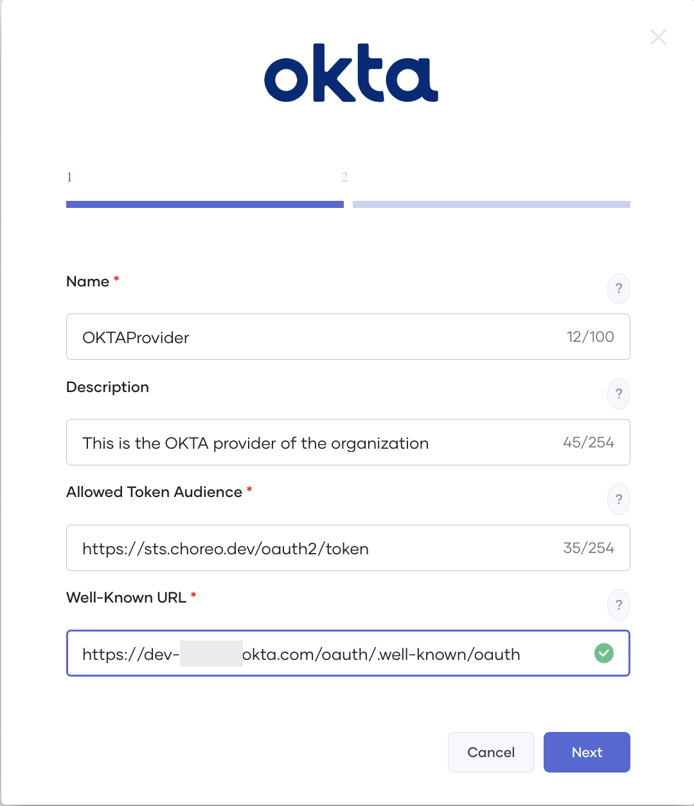

# Connect to an External Identity Provider

Choreo uses an in-built Identity Provider (IdP) by default to manage OAuth 2.0 clients and generate tokens required to authenticate Choreo APIs. Choreo also allows users with administrator privileges to configure an external authorization server as an IdP via the Choreo Console (for example, Okta). As an administrator, you can add one or more external identity providers to your Choreo organization and obtain a JSON Web Token (JWT) from the identity provider to exchange for a Choreo access token to invoke APIs. This capability allows you to expose your APIs to users who reside in an external user store.

## Token exchange

Choreo supports the token exchange grant type. This grant type allows the client to obtain a Choreo access token by providing a JWT issued by an external IdP. The token exchange grant type uses the protocol defined in the OAuth 2.0 token exchange specification. The OAuth 2.0 token exchange specification describes how you can request and obtain security tokens from OAuth 2.0 authorization servers. The following diagram depicts the token exchange flow in Choreo:

{.cInlineImage-full}

To exchange a JWT issued by an external IdP for a Choreo access token, you must send a request to the Choreo token endpoint with the JWT (referred to as the subject_token in the preceding diagram) in the request body. Upon successful authentication of the request, validation of the request takes place, and the corresponding IdP configuration is retrieved using the issuer. Next, the subject token is validated. Successful validation generates and returns a Choreo access token.

Now that you understand the token exchange flow, you can go ahead and add an external IdP to your Choreo organization and then obtain a JWT from the external IdP to exchange for a Choreo access token.

## Step 1: Add an external IdP

To add an external IdP, follow this procedure:

!!! note
    You must have organization administrator privileges to add an external IdP.

1. Sign in to the Choreo Console at https://console.choreo.dev/.

2. In the left navigation menu, click **Settings**.

3. Click the **API Management** tab. This displays the existing identity providers in your organization if you have already added any.

   {.cInlineImage-full}

4. Click **+ Add Provider**. This displays the identity providers supported by Choreo.

   {.cInlineImage-full}

5. Click on the IdP you want to add. This displays a form where you must enter details to set up the IdP.

    This example walks you through the steps to add Okta as the IdP. The details you need to fill in are similar for other IdPs as well.

6. Enter appropriate values for each of the fields and click **Next**. The following table describes each field in detail:

    <table>
      <tr class="header">
         <th><b>Field</b></th>
         <th><b>Description</b></th>
      </tr>
      <tr class="odd">
          <td><b>Name</b></td>
      <td>The name of the IdP. You cannot modify the name after you add an IdP.</td>
      </tr>
      <tr class="even">
          <td><b>Description</b></td>
      <td>A brief description of the IdP.</td>
      </tr>
      <tr class="odd">
          <td><b>Allowed Token Audience</b></td>
      <td>If the IdP is <b>Okta:</b> The audience of the authorization server for which the access token is necessary. 
            You can update this default value via the Okta authorization server by navigating to the following path: 
            Security → API → Authorization Server → Your Authorization Server → Settings → Audience  
            If the IdP is <b>Microsoft:</b> The identifier that identifies the intended recipient of the token.
            This value should be the application ID URI of the application in Azure Active Directory (Azure AD) for which the token is requested.
          
            If the IdP is <b>Auth0:</b> The unique API identifier to use as the audience parameter in the authorization call. 
            You can update this value in the Auth0 server by navigating to the following path: 
            Applications → APIs → Your API → General Settings → Identifier 
      </td>
      </tr>
      <tr class="even">
          <td><b>Well-Known URL</b></td>
      <td>
The OpenID Connect discovery endpoint URL. This returns the metadata related to the OpenID Provider's configuration.

      </td>
      </tr>
      </table>

    {.cInlineImage-half}

    When you specify the **Well-Known URL**, the values for **Issuer**, **Token Endpoint**, and **JWKS Endpoint** get auto-populated. You can either choose to keep the values or manually change them. The following table describes each field in detail:

    <table>
    <tr class="header">
    <th><b>Field</b></th>
    <th><b>Description</b></th>
    </tr>
    <tr class="odd">
    <td><b>Issuer</b></td>
    <td>The issuer identifier of the IdP, which is in the `iss` claim of the JWT issued.</td>
    </tr>
    <tr class="even">
    <td><b>Token Endpoint</b></td>
    <td>The token endpoint URL of the IdP from where the OAuth 2.0 client can get an access token.</td>
    </tr>
    <tr class="odd">
    <td><b>JWKS Endpoint</b></td>
    <td>The URL that returns the JSON Web Key (JWK) set of the IdP. This returns a collection of JWKs used to verify the signature of the JWT tokens.
    </td>
    </tr>
    </table> 

7. Click **Add**. This adds Okta as an external IdP to your Choreo Organization.

Now that you have added an external IdP, you can obtain a JWT from that IdP and exchange it for a Choreo access token to invoke APIs.

## Step 2: Obtain a JWT from an external IdP to exchange for a Choreo access token

Follow this procedure:

1. Sign in to the Choreo API Developer Portal at https://devportal.choreo.dev/.

2. Click the **Applications** tab.

3. Create a new application or use an existing application.

4. In the left navigation menu, click **OAuth2 Tokens** under **Production Keys**.

5. If you have already generated credentials, go to step 6. Otherwise, click Generate Credentials to generate the Consumer Key and Consumer Secret.

    !!! tip
        Before you click **Generate Credentials**, click **Advanced Configurations** and make sure **Token Exchange** is selected as one of the **Grant Types**.

     {.cInlineImage-half}

6. Click the **User Keys** tab.

    {.cInlineImage-half}

7. In the **Identity Provider** field, select an IdP.

    {.cInlineImage-half}

    This displays the steps you need to follow to generate a token:

    {.cInlineImage-half}
   
8. As mentioned in **Step 1** in the UI, obtain an access token from the external IdP that you selected. For instructions to obtain an access token for OKTA, see [Okta Developer Documentation - Implement OAuth for Okta - Get an Access Token and Make a Request](https://developer.okta.com/docs/guides/implement-oauth-for-okta/main/#define-allowed-scopes).

9. Paste the access token in the **<Your_IdP_name>** Token field. Here, you see the field name displayed as **Okta Token**.

10. Click **://Curl** and copy the curl command to obtain the Choreo access token. Alternatively, you can click **Generate Test Token** to get the Choreo access token via the UI.

Now you can use the generated Choreo access token to invoke APIs that you have subscribed to using the application.
