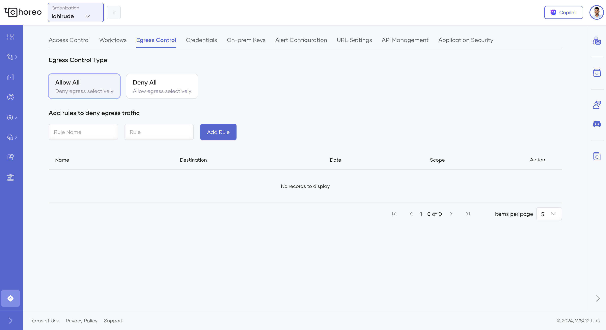
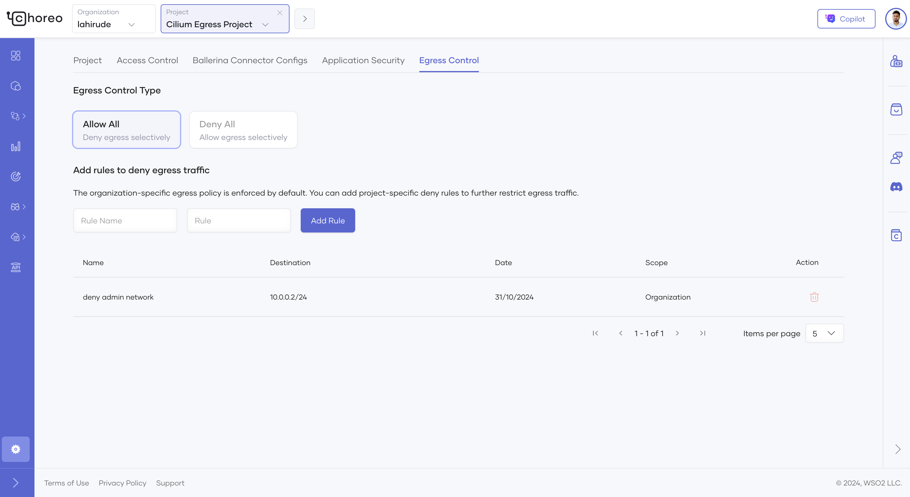

# Control Egress Traffic for your Organization

In Choreo, you have the option to control egress traffic originating from your applications. You can control egress traffic at the organization level by defining an allow list or a deny list. Default egress behaviour is allow all which means egress traffic to any destination is allowed.

## Configure egress rules at the organization level

To configure egress rules at the organization level, follow the steps below.

1.  Go to **Settings** in the left side menu and select **Egress Control**.
2.  Click on the **+ Create** button to create new egress rules.
3.  Choose the egress control type based on your requirements and add egress rules.

    - **Allow All** - Under this egress control mode, all the egress traffic is allowed by default and you can selectively deny egress traffic to specific IP ranges.
    - **Deny All** - Under this egress control mode, all the egress traffic is denied by default and you can selectively allow egress traffic to specific IP ranges or domains.

        !!! note 
            - Once egress control mode is selected and a rule is created, you cannot switch the egress control mode. You have to delete the egress rules and create again.
            - Configuring egress rules can break your exisiting applications as egress traffic may get blocked based on the egress rules configured.
            - For Deny All egress control mode, choreo managed database hosts needs to be added to the allow list.
            - Egress rules configured are not bound to any environment and will be applied to all the environments of an organization.
            - Egress rules configured are **not** applied for API proxies.

    

## Override organization level egress rules at the project level

Egress rules configured at the organization level can be overriden at the project level depending on the egress control type chosen at the organization level.

To configure egress rules at the project level, follow the steps below.

1. Go to **Settings** in the left side menu inside a project and select **Egress Control**.
2. Egress rules inherited from the organization level is shown at the project level egress control settings.
3. Depending on the egress control mode chosen at the organization level, you can override the organization level egress rules.

    - **Allow All** - If Allow All egress control mode is selected at the organization level, additional deny rules can be added at the project level to restrict egress traffic further for a specific project.
    - **Deny All** - If Deny All egress control mode is selected at the organization level, allow rules added at the organization level can be removed to restrict egress traffic further for a specific project.

    

