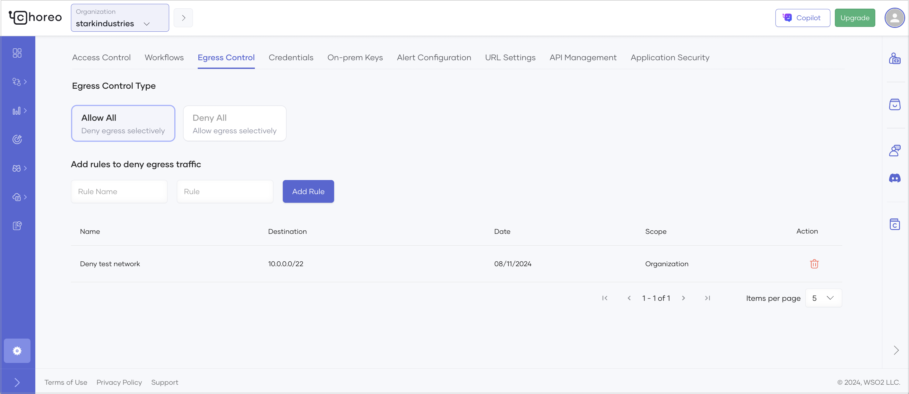
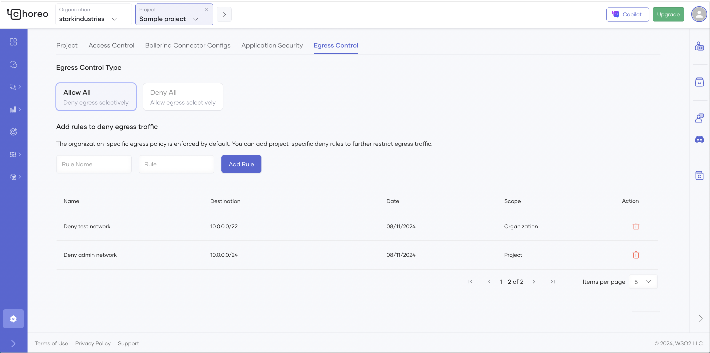

# Control Egress Traffic for Your Organization

In Choreo, you can manage egress traffic originating from your applications by setting up an allow list or deny list. By default, egress traffic is allowed to any destination unless specifically restricted.

## Configure an egress policy at the organization level

To configure an egress policy at the organization level, follow these steps:

1. Sign in to the [Choreo Console](https://console.choreo.dev/).
2. In the Choreo Console header, go to the **Organization** list and select your organization.
3. In the left navigation menu, click **Settings**. This opens the organization-level settings page.
4. Click the **Egress Control** tab.
5. Click **+ Create** to add a new egress policy.
6. Select the type of egress control to apply and add the required rules:

    - **Allow All**: Allows all egress traffic by default. You can selectively block traffic to specific IP ranges.
    - **Deny All**: Blocks all egress traffic by default. You can selectively allow traffic to specific IP ranges or domains.

        !!! note

             - Once you select an egress control type and create a rule, you cannot change the type. To change the type, you must delete existing rules.
             - Egress rules you add can disrupt your application if they block traffic to required destinations. Ensure you add rules appropriately to prevent such disruptions.
             - If you use the **Deny All** type, be sure to add Choreo-managed database hosts to the allowed list.
             - Egress policies apply across all environments in an organization.
             - Egress policies do not apply to API proxies.

    

## Override the organization-level egress policy at the project level

An egress policy set at the project level can override the organization-level policy, depending on the egress control type you select.

To override the organization-level egress policy at the project level, follow these steps:

1. Sign in to the [Choreo Console](https://console.choreo.dev/).
2. In the Choreo Console header, go to the **Project** list and select your project.
3. In the left navigation menu, click **Settings**. This opens the project-level settings page.
4. Click the **Egress Control** tab. You will see that the organization-level egress policy is enforced by default.
5. Add required project-level rules to further restrict egress traffic.

    - If the **Allow All** egress control type is selected at the organization level, you can add project-level deny rules to further restrict traffic.
    - If the **Deny All** egress control type is selected at the organization level, you can remove allow rules inherited from the organization level to further restrict traffic.

    
