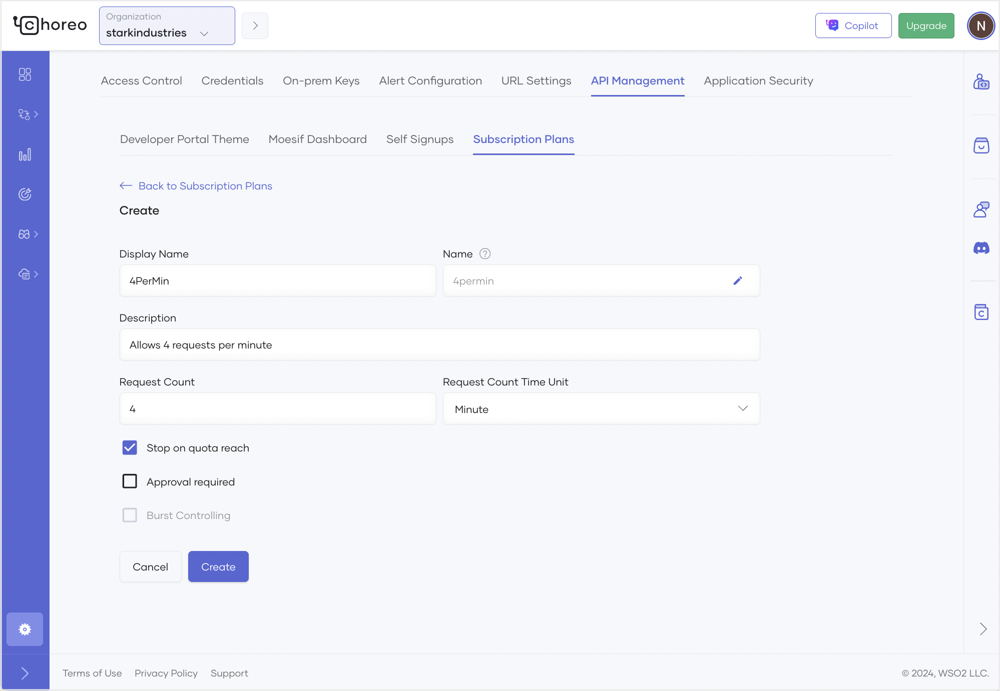

# Create API Subscription Plans

API subscription plans are essential to control and manage access to APIs. These plans define the rules and limitations on how clients can interact with APIs, ensuring efficient resource utilization and robust security. With the option to set rate limits and burst control, subscription plans allow API providers to manage traffic, prevent misuse, and offer tiered service levels. Organizations can implement subscription plans to provide varying levels of API access, accommodating different user needs and business models, while ensuring optimal performance and security. 

In Choreo, users with the administrator role can create, update, and delete subscription plans at the organization level. 

!!! tip
    Deleting a subscription plan is only possible if there are no active subscriptions associated with it.  

To create an organization-level subscription plan, follow the steps given below: 

1. Sign in to the [Choreo Console](https://console.choreo.dev/).
2. In the Choreo Console header, go to the **Organization** list and select your organization. 
3. In the left navigation menu, click **Settings**. This opens the organization-level settings page.
4. Click the **API Management** tab and then click **Subscription Plans**.
5. Click **+ Add Subscription Plan**.
6. In the **Create Subscription Plan** pane, enter the appropriate values for each field:
    
    !!! note
         - In the **Name** field, you must specify a name to uniquely identify the subscription plan in various contexts. The value is editable only at the time you create the subscription plan. You cannot change the name after you create it.
         - The **Stop on Quota Reach** checkbox is selected by default when creating a subscription plan. When selected, requests return an HTTP 429 response if the request count exceeds the limit. If you clear the checkbox, requests are allowed even if the quota is exceeded.
         - Burst control protects your backend from sudden request spikes and manages API usage. It’s especially useful for subscription plans where the request count is enforced over a long period, to prevent consumers from using their entire quota too quickly. Ensure you select the **Burst Control** checkbox when the **Request Count Time Unit** is selected as **Hour** or **Day**.
         - Select the **Approval required** checkbox if subscription requests made to this plan require administrator or API publisher approval to activate the plan. This allows for manual review and approval of a subscription before granting API access.
  
    

7. Click **Create**. This creates the subscription plan and lists it under **Subscription Plans**.

After creating subscription plans, users with the API publisher role can [assign subscription plans to APIs](../api-management/manage-api-traffic/assign-subscription-plans-to-apis.md). API consumers can then choose the appropriate subscription plan during the subscription process depending on their requirements.
