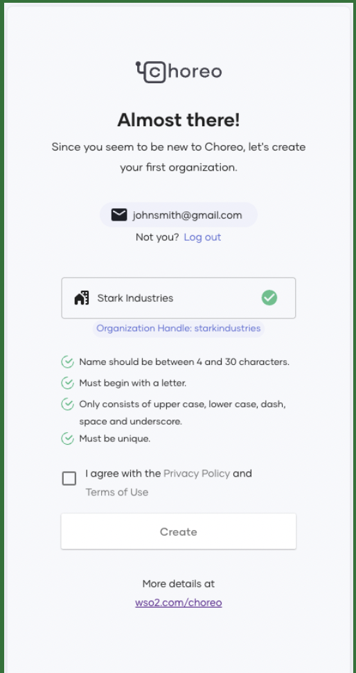

# Customize the Developer Portal Domain

A custom domain for your site is essential for effective branding, discoverability, and credibility. Choreo allows you to configure a custom domain for your organization's developer portal.

Follow the steps below to configure the custom domain for the Developer Portal:

## Prerequisites

1. Sign in to the Choreo Console at <a>https://console.choreo.dev/</a> using a Google/ GitHub/ Microsoft account.
2. If you are a new user, create an organization. Enter a unique organization name. For example, "Stark Industries".
    
    {.cInlineImage-small}

3. Obtain a custom domain through a domain registrar. 
4. Through your DNS administrator, create a `CNAME` type DNS record and associate it with the Choreo Developer Portal custom access domain: `customdns.devportal.choreo.dev`. 
5. Optionally, create TLS certificates and keys to enable TLS for the custom domain. For testing purposes, you can also opt to use the `let's encrypt` option. This option allows Choreo to create and manage the certificates on your behalf.

## Configure a custom domain for your Choreo Developer Portal

1. Click **Settings** on the left navigation menu. 
2. Click the **Domains** tab and then click on the **Developer Portal** tab. 
3. Click **Add Custom Domain**. 
4. Enter your domain name and click **Verify**. Once Choreo verifies the custom domain successfully, click **Next**.
5. Add the TLS certificates you created for the custom domain and click **Add**. Alternatively, you can click the **Let's Encrypt** option to let Choreo generate and manage the certificates for you. However, we recommend you use **Let's Encrypt** for testing only. 

That's it! You have successfully configured a custom domain for your organization's Choreo Developer Portal. 

