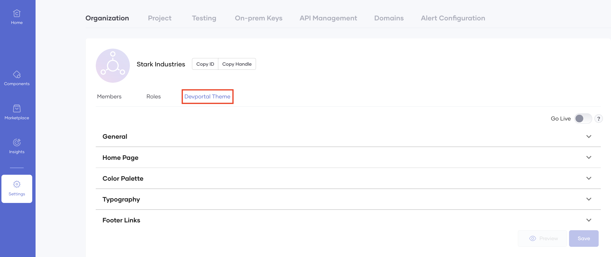
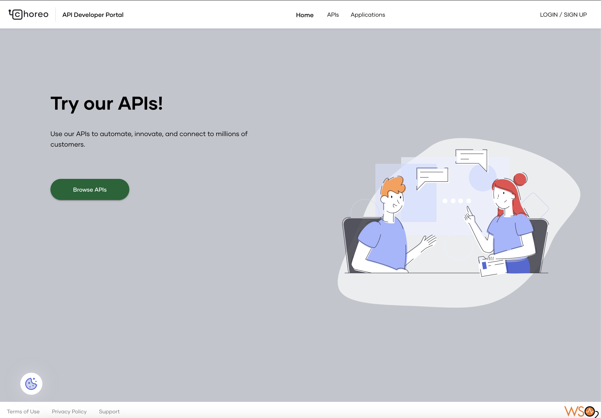

# Customize the Developer Portal

You can share APIs internally and externally through the Choreo Developer Portal. You can change the look and feel of your Developer Portal by changing the theme to match your brand. Doing so will help you give a better developer experience to your users.

To configure the Developer Portal theme, follow the steps given below:

!!! Note
    To change the Developer Portal theme for an organization, you need to be an admin user of that organization.

1. Sign in to the Choreo Console at <a>https://console.choreo.dev/</a> using a Google, GitHub, or a Microsoft account.

2. If you are a new user, create an organization. Enter a unique organization name. For example, "Stark Industries".

    {.cInlineImage-small}

3. In the left pane, click **Settings**.

4. In the **Organization** tab, click **Devportal Theme**.

    

    Once you access the theme, you can customize the Home page, color theme, font, header and footer, logos, etc., by expanding the **General**, **Home Page**, **Color Palette**, **Typography**, and **Footer Links** sections.

5. Make a change to the theme. For example, let's change the title on the home page and the color theme. 

    1. To update the title on the Home page, expand the **Home Page** section, and in the **Title** field, change the default text (for example, to `Try our APIs!`).
   
    2. To update the color theme, expand the **Color Palette** section, and change the colors as required (for example, change the background color to `#C3C5CD` and the primary color of the buttons to `#086634`).
   
    3. Click **Preview** to view a preview of the Developer Portal with the changes you made. For example, let's assume you changed the primary color of the background to `#C3C5CD` and the primary color of the buttons to `#086634`. Based on these changes, the preview appears as follows.

         
   
    4. Click **Save**.

6. Sign in to Choreo Developer Portal at [https://devportal.choreo.dev](https://devportal.choreo.dev).

The Home page will appear as it did in the preview.

## Reset the Developer Portal theme

If you changed the Developer Portal these and want to reset it, follow the steps given below:

1. Access Choreo Console and in the left pane, click **Settings**.

2. In the **Organization** tab, click **Devportal Theme** and then click **Reset to Default**.

