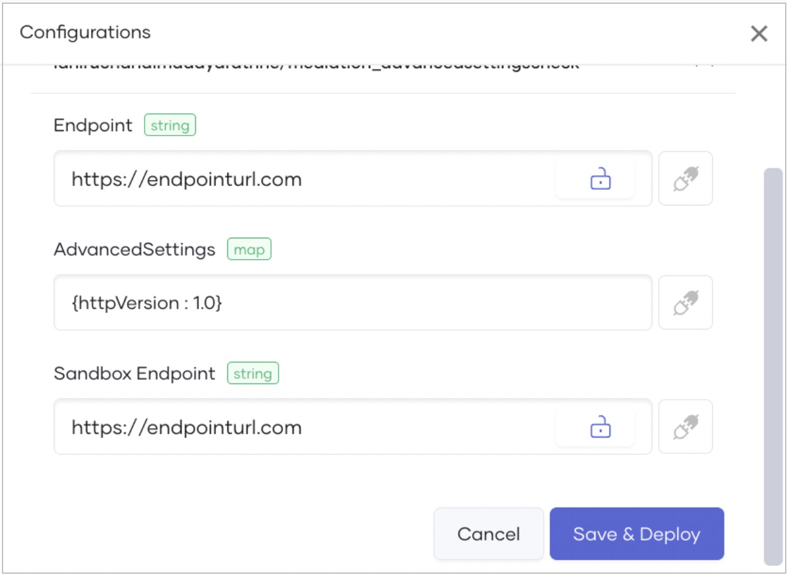
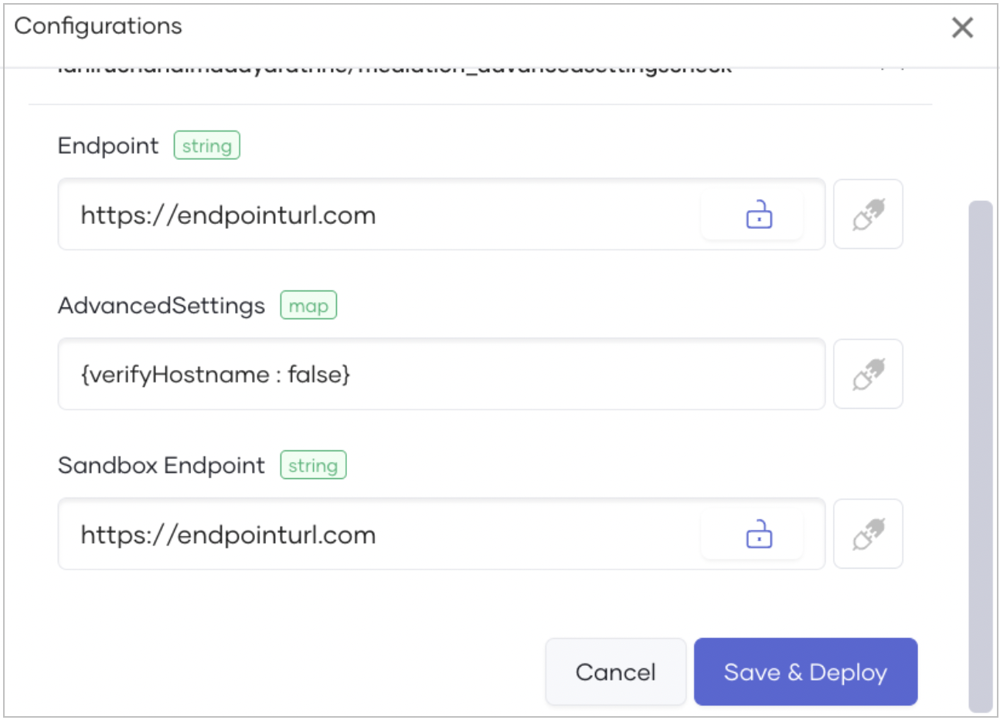
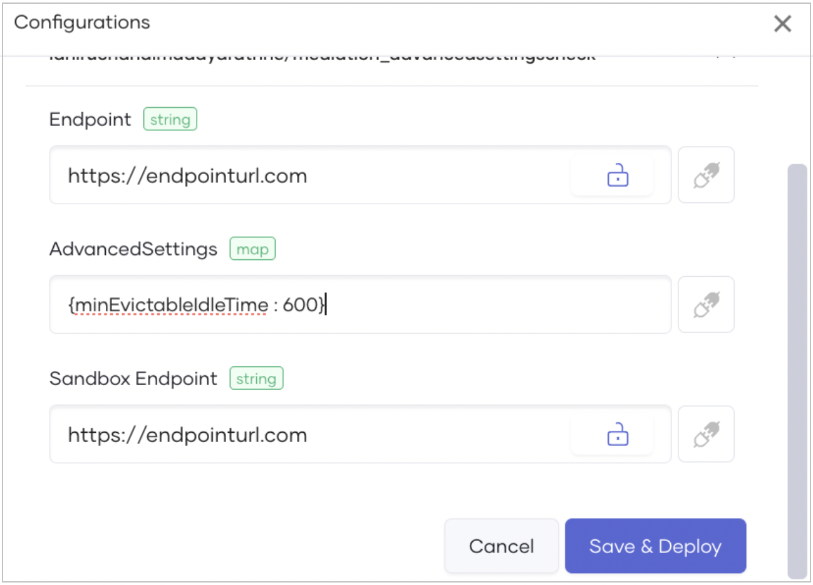
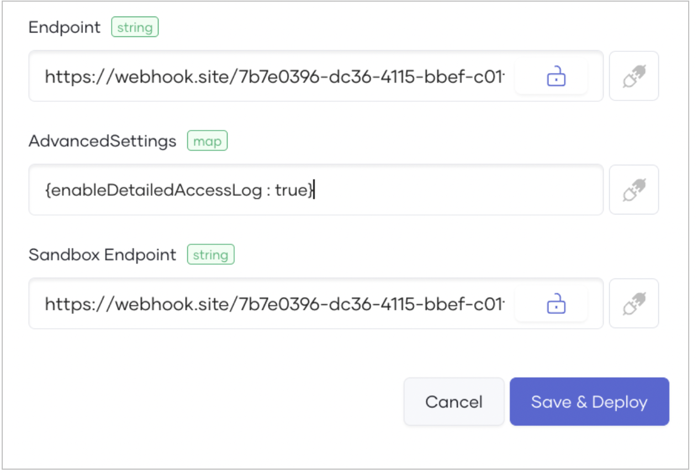

# Apply Advanced Settings on Mediation Policies

Advanced settings for mediation policies are available for proxy components with an attached mediation policy. For details on attaching a mediation policy to a proxy component, see [Attach and Manage Policies](../api-policies/attach-and-manage-policies.md).

The approach to applying advanced settings depends on whether the proxy component is deployed or not.

## Mediation policy advanced settings

| **Setting**                     | **Purpose**    | **How to apply**  | **Impact**   |
|---------------------------------|----------------|-------------------|--------------|
| **HTTP version**                | By default, Choreo supports HTTP 1.1. If necessary, you can change to HTTP 1.0 or HTTP 2.0. | Specify the required HTTP version in the **Advanced Settings** field.    | The mediation application will use the specified HTTP version when interacting with backend services.  |
| **Hostname verification**       | Choreo enables hostname verification by default when using mTLS. You can disable it if necessary. | Set the `verifyHostname` parameter to `false` in the **Advanced Settings** field.      | Hostname verification will be skipped during mTLS interactions.                              |
| **Minimum evictable idle time** | Determines how long (in seconds) an outgoing connection remains idle before eviction. The default is 300 seconds. | Set the required idle time in the **Advanced Settings** field.             | Idle connections will be closed and evicted after the defined period.                    |
| **Detailed access log**         | By default, logs related to the mediation application are generated and can be viewed as [runtime logs](../../monitoring-and-insights/view-logs.md#runtime-logs). You can disable these logs if necessary.      | Set the `detailedAccessLog` parameter in the **Advanced Settings** field.     | Logs related to the mediation application will not be generated.    |

## Configure advanced settings for a proxy component

To configure advanced settings for a proxy component with an attached mediation policy, follow these steps:

1. Sign in to the [Choreo Console](https://console.choreo.dev).
2. In the **Component Listing** pane, click on the REST API Proxy component for which you want to configure advanced settings.
3. In the left navigation menu, click **Deploy**.
4. Depending on the deployment status of the proxy component, follow one of these steps:
   - If the proxy component is not deployed, go to the **Set Up** card and click **Configure & Deploy**. 
   - If the proxy component is already deployed, go to the respective environment card depending on the environment you want to apply advanced settings, and then click the **Environment Variables** icon.
5. In the **Configurations** pane that opens, expand the **Defaultable Configurables** section. 
6. In the **Advanced Settings** field, configure the necessary settings as described in the [Mediation policy advanced settings](#mediation-policy-advanced-settings) section.
7. Click **Save & Deploy**.
