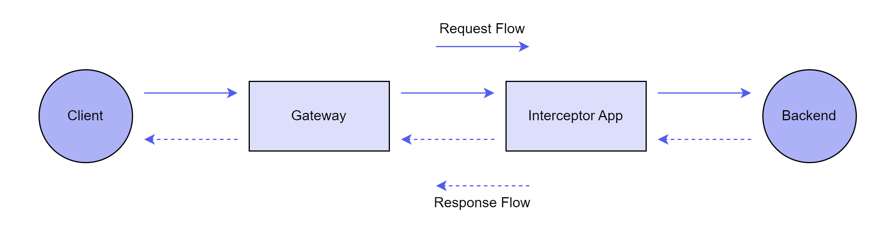
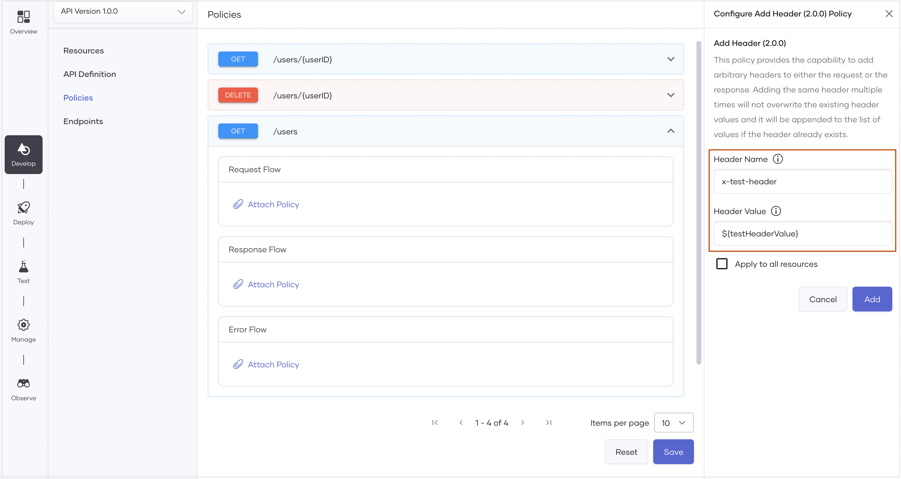
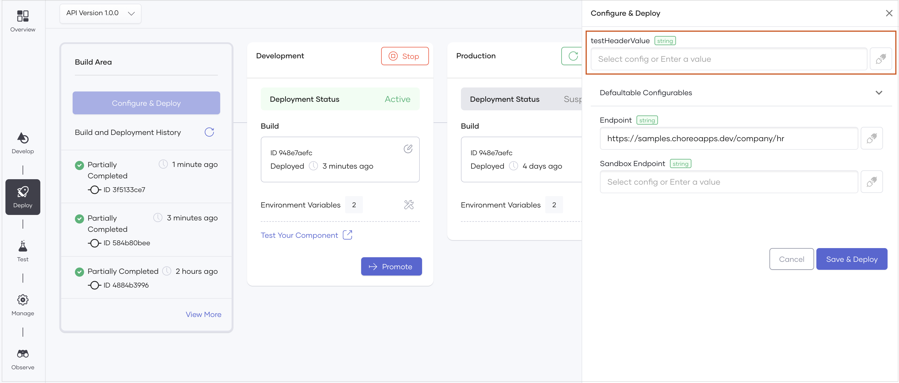

# Attach and Manage Policies

You can easily attach one or more policies to an API proxy component implementation via the Choreo Console. If necessary, you can also rearrange or swap the policies you attach.

In Choreo, when you attach a mediation policy to a proxy, the deployment is a two-step process.

1. Deployment initiation: 

     If the component to which you want to attach the mediation policy is new, the system creates and commits a new repository with the mediation service code based on the attached policy. This new service is called the mediation application. 

2. Deploying the API:

     Once the deployment initiation is complete, you can specify configuration values if any, and proceed to deploy. Choreo builds the generated mediation application and pushes the Docker image to the Docker registry. Finally, Choreo deploys the mediation application with the API Proxy.

When a mediation policy is attached to a specific flow, the API invocation undergoes the following behavioral modification:
 
 

 - In the request path, the requests that pass through the gateway reach the relevant component, and Choreo executes any attached policies to the resource's request path before sending it to the backend. 

- In the response path, the mediation component receives response messages from the backend, and Choreo executes any mediation policies attached to the `Response` flow or the `Error` flow. Then the response is forwarded to the client.

- If an error occurs during the execution of policies or due to an internal error, Choreo executes the `Error` flow and sends an error response to the client.

## Attach a policy

To attach a policy to the `Request`, `Response`, or `Error` flow of a REST API proxy, follow the steps given below:

1. Sign in to the [Choreo Console](https://console.choreo.dev).
2. In the **Component Listing** pane, click on the REST API Proxy component for which you want to attach a policy.
3. In the left navigation menu, click **Develop** and then click **Policies**.
4. From the list of resources, expand the resource to which you want to attach the policy. 
5. Click **Attach Mediation Policy** in the respective flow for which you want to attach a policy.
6. In the **Policy List** pane that opens, click on a required policy to view its details.
7. If the attached policy requires parameter configuration, on the policy pane enter the appropriate values and configure the parameters. To make a parameter a configurable variable, input the value in the `${<variableName>}` format. For example, you can use `${name}` as an example.

    
 
8. To attach the policy, click **Add**.

After attaching an API Policy, it is necessary to deploy the API for the policy to become active within its corresponding flow. 
To deploy the API follow the steps below: 

9. In the left navigation menu, click **Deploy** and then click **Configure & Deploy**. Choreo performs the mediation application generation step and opens the **Configure & Deploy** pane.

10. In the **Configure & Deploy** pane, if you have any configurable variables that require values, specify appropriate values for them.

     

11. Click **Save & Deploy**.

## Refresh mediation policies

Choreo selectively generates and builds the mediation application code during component deployment depending on specific changes. These changes include:

 - Addition, deletion, or modification of API resources.
 - Attachment, removal, or editing of API mediation policies.
 - Endpoint modifications via the **Develop** page.
 - Initial configuration or removal of backend endpoints or mutual TLS certificates.

If none of the above changes occur during deployment, Choreo skips the code generation and build process of the mediation application.

!!! info
    - If you want to enforce the code generation and build process of the mediation application in instances where the specified changes do not take place, you must turn on the **Refresh Mediation Policies** toggle when you configure and deploy the component. 
    - It is useful to enable **Refresh Mediation Policies** when you want to incorporate the latest Ballerina patches for your generated mediation application. However, this can result in longer deployment times.

## Implement an API policy

Choreo allows you to implement an API policy as a Ballerina project and attach it to an API proxy component. 

!!! info
    Supported Ballerina version: 2201.5.5 

To implement a policy, follow the steps given below: 

### Prerequisites

1. Set up [ Ballerina 2201.5.5](https://ballerina.io/downloads/swan-lake-release-notes/swan-lake-2201.5.5).
2. Open the `~/.ballerina/settings.toml` file and ensure you have configured an access token to Ballerina Central. If you have not configured an access token, follow the steps given below to configure one: 
    1. Generate a token via [https://central.ballerina.io/dashboard?tab=token](https://central.ballerina.io/dashboard?tab=token).
    2. Download the generated `Settings.toml` file and copy it to your local `~/.ballerina` directory.
    
Alternatively, you can set the access token via the `BALLERINA_CENTRAL_ACCESS_TOKEN` environment variable.

``` 
export BALLERINA_CENTRAL_ACCESS_TOKEN=<access-token> 
```

### Step 1: Initialize a Ballerina project

Choreo provides a template to initialize a mediation policy project with all the required configurations. The mediation policy project will be created as a Ballerina project.

To create a Ballerina project for the mediation policy using `mediation.template` as the project template, issue the following command:  
   
**Format:**

```
    bal new -t choreo/mediation.template:1.0.0 <policy-name> 
```
    
**Example:**

```
    bal new -t choreo/mediation.template:1.0.0 validateHeader 
```
 The Ballerina project that is created should have the following content: 


Depending on your requirement, you can modify the `Ballerina.toml` and the `Package.md` files of the generated project. For example, you can update the org, package, package version, API documentation content, keywords, etc.

!!! note
    To successfully publish to Ballerina Central, make sure you update the `org` value to your organization name.

```
     [package]
        org = "starkindustries"
        name = "validateHeader"
        version = "1.0.0"
        export = ["validateHeader"]
        distribution = "2201.5.5"
        keywords = ["choreo-apim-mediation-policy","choreo-apim-mediation-request-flow","choreo-apim-mediation-response-flow","choreo-apim-mediation-fault-flow"]
```

### Step 2: Implement the policy

In this step, you will implement the policy. 

Let's assume you want to implement a policy to validate an incoming header in the request and the response. 

- **Request path**: If the request header is not present or if the validation fails, you want to log an error and return a `403 Bad Request` response to the client.
- **Response path**: You want to log a message to indicate whether the request is valid or not.

To implement the policy, open the `policy.bal` file in the Ballerina project and update the generated policy stubs(i.e., request, response, or fault) appropriately. 

The following sections walk you through sample implementations for the **Request** and **Response** stubs:

#### Request flow

The following is a sample implementation for the request flow:
 
```ballerina
@mediation:RequestFlow
public function validateRequestHeader(mediation:Context ctx, http:Request req, string headerName, string headerValue) returns http:Response|false|error|() {
   string|http:HeaderNotFoundError header = req.getHeader(headerName);
   if (header is http:HeaderNotFoundError) {
    string message = string `Header ${headerName} is not found`;
    log:printError(message);
    return generateResponse(message, http:STATUS_BAD_REQUEST);
   }
   if (header != headerValue) {
    string validationFailedMessage = string `Header validation failed. Expected ${headerValue} but found ${header}`;
    log:printError(validationFailedMessage);
    return generateResponse(validationFailedMessage, http:STATUS_BAD_REQUEST);
    }
    log:printInfo("Header validation successful");
    return ();
};
    
function generateResponse(string message, int statusCode) returns http:Response {
    http:Response response = new();
    response.setTextPayload(message); 
    response.statusCode = statusCode;
    return response;
}

```

#### Response flow

The following is a sample implementation for the response flow:

```ballerina
@mediation:ResponseFlow
public function validateResponseHeader(mediation:Context ctx, http:Request req, http:Response res, string headerName, string headerValue) returns http:Response|false|error|() { 
   string|http:HeaderNotFoundError header = res.getHeader(headerName);
   if (header is http:HeaderNotFoundError) {
    string message = string `Header ${headerName} is not found`;
    log:printError(message);
    return ();
   }
   if (header != headerValue) {
    string validationFailedMessage = string `Header validation failed. Expected ${headerValue} but found ${header}`;
    log:printError(validationFailedMessage);
    return ();
   }
   return ();
}

```

#### Fault flow

In this guide, you are not going to make any changes to the `Fault` flow. Therefore, you can remove the `Fault` flow stub from the `policy.bal` file.

!!! note 
    The  **@mediation:RequestFlow**, **@mediation:ResponseFlow**, and **@mediation:FaultFlow** annotations are bound with the keywords in the `Ballerina.toml`. Therefore, the changes you make to the policy stubs should reflect in the `Ballerina.toml` file. For example, if the policy is applicable only on the request and response paths, you can remove the  **@mediation:FaultFlow** annotation from the policy. Then, you **MUST** also remove the **choreo-apim-mediation-fault-flow** keyword from the generated `Ballerina.toml` file. If you do not do so, the Ballerina compiler will show an error at compile time.

#### Publish as a private custom policy
 
 Choreo supports publishing a policy as a private custom policy. Publishing a policy as a private custom policy makes the policy inaccessible outside of the organization. To publish a policy as a private custom policy, change the visibility to `private` prior to pushing the package to Ballerina Central as follows:

 1. Open the `Ballerina.toml` file of your policy. 
 2. Set the visibility to **private** by adding the configuration `visibility="private"`. For example:

     ```
     [package]
        org = "orgName"
        name = "packageName"
        version = "1.0.2"
        export = ["packageName"]
        distribution = "2201.5.5"
        keywords = ["choreo-apim-mediation-policy","choreo-apim-mediation-request-flow","choreo-apim-mediation-response-flow","choreo-apim-mediation-fault-flow"]
        visibility = "private"
     ```

 3. Package and publish your policy to Ballerina Central.     

#### Best practices 

When implementing a policy, it is essential to follow best practices to ensure efficiency and maintainability. Here are some recommended best practices to follow:

- Organize the source code within the default module of the package. Do not add any additional modules.
- A policy implementation can contain any combination of flows. A generated project contains stubs for all three flows: `Request`, `Response`, and `Fault`. You can remove any stub that you do not require. For example, when you create a policy that re-writes the resource paths, you can remove the `Response` and `fault` stubs. 
- The HTTP request/response objects and context record parameters gets passed as references to the policy functions. Therefore, the changes you make to these values persist throughout the policy execution and are propagated to subsequent policies. This behavior allows the request and response objects to accumulate transformations applied by attached policies.
- Familiarize yourself with the different return types of policy flows. The following return types are unmodifiable:
    - **http:Response** - Returns an HTTP response when you terminate the mediation flow prematurely. For example,  in the in-flow sequence, the mediation sequence terminates before calling the backend. The mediation policy then sends an HTTP response to the client.
    - **false** - Returns `false` if you want to terminate the mediation sequence with a predefined response (on the Choreo side).
    - **error** - Returns an error if you want to terminate the mediation flow and transfer control to the fault flow. The fault flow would then construct an error response and send it to the client.
    - **()** - Returns () to signal the successful completion of the policy. Once the proxy has completed executing the policy, it starts to execute the next policy in the sequence.

### Step 3: Publish the policy

Once you implement a policy, you must publish it to Ballerina Central. 

When you attach a policy and deploy an API, Choreo pulls the necessary packages from Ballerina Central and bundles them into the mediation application under the hood. Therefore to use policies in your APIs, you must publish them as public packages. 

To publish the policy, follow the steps given below:

1. To package the policy before you publish it to Ballerina Central, issue the following command:
    ``` 
        bal pack 
    ```
2. To publish the package to Ballerina Central, issue the following command:

    ``` 
        bal push 
    ```

Once you publish the package, it will appear as follows in the policy list:


### Write unit tests

You can write unit tests to test policy functions in a manner similar to how you write unit tests for a regular [Ballerina function](https://ballerina.io/learn/test-ballerina-code/test-a-simple-function/). 

The following is a sample unit test for the `validateRequestHeader` function:

```
import ballerina/http;
import choreo/mediation;
import ballerina/test;


@test:Config {}
public function testRequestHeaderValidationFailure() {
  http:Request req = new;
  http:Response|false|error|() result = validateRequestHeader(createContext("get", "/test"), req, "testHeader", "test");


  if !(result is http:Response) {
    test:assertFail("Expected http:Response, found " + (typeof result).toString());
  }


  test:assertEquals(result.statusCode, http:STATUS_BAD_REQUEST, "Status code mismatch");
}


function createContext(string httpMethod, string resPath) returns mediation:Context {
   mediation:ResourcePath originalPath = checkpanic mediation:createImmutableResourcePath(resPath);
   mediation:Context originalCtx =
               mediation:createImmutableMediationContext(httpMethod, originalPath.pathSegments(), {}, {});
   mediation:ResourcePath mutableResPath = checkpanic mediation:createMutableResourcePath(resPath);
   return mediation:createMutableMediationContext(originalCtx, mutableResPath.pathSegments(), {}, {});
}

```

The policy function modifies the same request/response/context instance that you pass to it. You can check the request/response/context instance after calling the policy function to verify changes.

### Glossary

Here are some of the common terms used when working with policies in Choreo:

#### mediation:Context

The mediation context is used to pass parameters between policies. It is created per request and you can access it in any of the flows. For example, if a correlation ID needs to be set to the request, you can set it in the context of the request flow and access it in the response or fault flow. 

The mediation context can include the following functions:

```
# Retrieves the value for the specified key.   
public function get(string name) returns anydata;


# Stores the provided key-value pair. If a mapping exists for the key, the value is overwritten.
public function put(string name, anydata value);


# Removes the entry mapped by the specified key and returns the removed value.
public function remove(string name) returns anydata;


# Retrieves the value for the specified key. If there is no mapping for the key, return the specified
public function getOrDefault(string name, anydata default) returns anydata;


# Checks whether a mapping exists for the specified key.
public function hasKey(string name) returns boolean;


# Returns the `mediation:Context` instance which captured the initial contextual information of the resource,
# before the mediation flow was invoked. Calling this on an original `mediation:Context` object will return itself.
public function originalContext() returns Context;


# The HTTP method of the resource method
public function httpMethod() returns string;


# Retrieves an instance of `mediation:ResourcePath` which is an API for contextual information on the resource path
# of this resource. It also contains methods for modifying the resource path as the user sees fit. This resource
# path is the same path used by the mediation service for deriving the backend endpoint's resource to invoke.
# Therefore, the default behavior of the mediation service is to invoke a resource in the backend endpoint which
# has the same relative resource path as the corresponding mediation service resource.
public function resourcePath() returns ResourcePath;


# Sets the given `mediation:ResourcePath` instance as the resource path of this context.
public function setResourcePath(ResourcePath path);


# Adds a mapping between a path param name and a resolved value for it. There need not be a path parameter in the
# resource path by the name specified in `name` for one to use this method. On its own, the path param values have
# no bearing on the resource path.
public function addPathParamValue(string name, PathParamValue value);


# Returns the collection of resolved values for the path parameters in this particular context, mapped
# by the parameter name.
public function resolvedPathParams() returns map<PathParamValue> & readonly;


# Removes the resolved path parameter value which maps to the specified name.
public function removePathParamValue(string name);


# Adds a query parameter to the request to be sent to the backend. If there is already a query parameter by
# with the same name, the new value will be appended to it, making it an array.
public function addQueryParam(string name, string value);


# Removes the specified query parameter from the request. If the value of the parameter is an array, the whole
# array will be removed.
public function removeQueryParam(string name);


# Retrieves a map of all the query parameters in the current request context. The returned map is a read-only snapshot
# of the map of query parameters in the context at the time this method was called.
public function queryParams() returns map<string[]> & readonly;
```

### Keywords

The `Ballerina.toml` file needs to include the following keywords for the mediation policies to work:

- **choreo-apim-mediation-policy**: This keyword is a mandatory keyword that is required to identify that the package is a mediation policy type.
- **choreo-apim-mediation-request-flow**: Specifies whether the policy applies to the request flow.
- **choreo-apim-mediation-response-flow**: Specifies whether the policy applies to the response flow.
- **choreo-apim-mediation-fault-flow**: Specifies whether the policy is applicable for the fault flow.

#### Policy name and description

The `Package.md` file contains information about the policy. Choreo uses this information to render the policy configuring UI. This file is written in Markdown format and should be structured as follows.

**Format:**

```
# <policy-name>


## Overview


<policy description>

```

**Example:**

```
# ValidateHeader


## Overview


This policy validates the request and response headers with the configured values.

```

#### Policy versioning

When it comes to policy versioning in Choreo or mediation dependencies, it is important to consider the major version changes in the Ballerina language. For example, transitioning from update 1 to update 2 requires a major version increment, which can introduce significant incompatibilities.

Therefore, to ensure compatibility, the recommended approach is to version the policy package in a manner that the major version gets upgraded when the Choreo/mediation dependency version is upgraded to a major version.  
