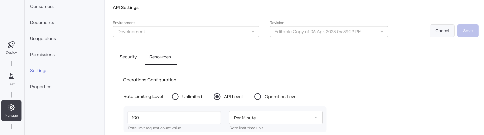
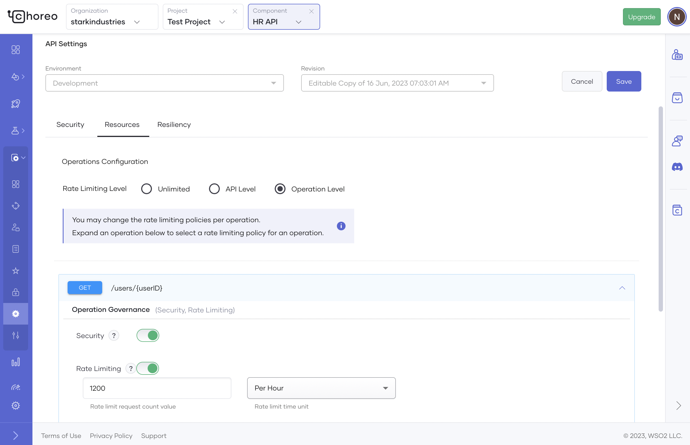

# API Rate Limiting

API rate limiting is a technique that allows you to control the rate of requests made to an API. Rate limiting helps 
prevent system overload and enhances API performance. When you limit the number of requests that can be made in a 
specific time frame, you can ensure that your API is available and responsive to all users while protecting it from 
malicious attacks.

This page walks you through the steps to enable rate limiting for your APIs via Choreo and also provides information on 
the rate-limiting options supported by Choreo.

## Enable rate limiting for an API

To enable rate limiting for an API, follow the steps given below:

1. Sign in to the [Choreo Console](https://console.choreo.dev/). 
2. In the **Component Listing** pane, click on the component for which you want to apply rate limiting.
3. In the left navigation menu, click **Manage** and then click **Settings**.
4. In the **Settings** pane, go to the **API Settings** section and click **Edit**.
5. Click the **Resources** tab and select a **Rate Limiting Level** depending on your requirement.

## API-level rate limiting

API-level rate limiting applies the allocated request count for the specified time unit to all operations in the API.

{.cInlineImage-full}

## Operation-level rate limiting

Operation-level rate limiting allows you to configure different rate-limiting values for each operation. You can use this option to define specific rate-limiting values for critical API operations that require an extra layer of protection.

{.cInlineImage-full}

## Rate-limiting response headers

The following table lists the response headers available when you enable rate limiting for your APIs. You can implement necessary rate-limiting scenarios depending on the response header values.

| **Header Name**  | **Description** |
|------------------|-----------------|
| `x-ratelimit-limit`     | Denotes the request count allocated for the specified time unit.       |
| `x-ratelimit-reset`     | Provides the time remaining to start the next rate-limiting time unit. |
| `x-ratelimit-remaining` | Denotes the remaining request count for the specified time unit.       |
| `x-ratelimit-enforced`  | Visible after exceeding the allocated request count.                   |
