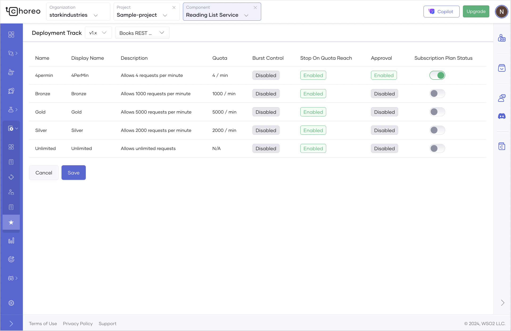

# Assign Subscription Plans to APIs

API subscription plans allow API publishers to control and manage access to APIs. These plans define the rules and limitations on how clients can interact with APIs, ensuring efficient resource utilization and robust security.

Choreo allows users with the administrator role to create, update, and delete subscription plans at the organization level. For instructions on creating subscription plans, see [Create API Subscription Plans](../../administer/create-api-subscription-plans.md).

Once created, Choreo allows API publishers to assign subscription plans to APIs, providing different levels of access based on user needs.

To assign subscription plans to an API, follow the steps given below: 

1. Sign in to the [Choreo Console](https://console.choreo.dev/).
2. In the **Component Listing** pane, click on the component for which you want to assign subscription plans.
3. In the left navigation menu, click **Manage** and then click **Subscription Plans**. This displays the subscription plans available for the component.
4. Enable the **Subscription Plan Status** toggle corresponding to the subscription plans you want to assign to the API.

    

5. Click **Save**.

When an API has subscription plans assigned to it, API consumers can select the plan that best fits their requirements during the subscription process. For details, see [Subscribe to an API with a Subscription Plan](./subscribe-to-an-api-with-a-subscription-plan.md)
