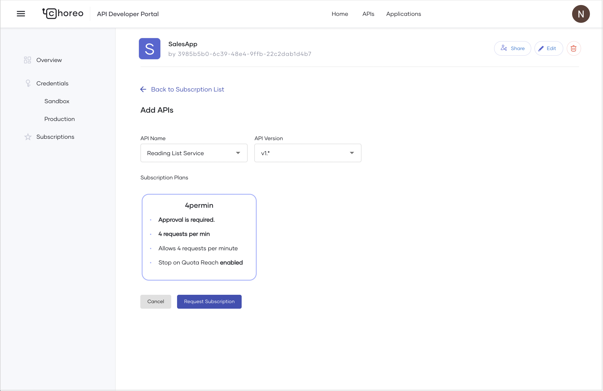

# Subscribe to an API with a Subscription Plan

If an API has subscription plans assigned to it, API consumer can select the subscription plan that best fits their requirement at the time of subscribing to the API.

To subscribe to an API with a subscription plan, follow the steps given below:

1. Sign in to the [Choreo Developer Portal](https://devportal.choreo.dev).
2. In the Developer Portal header, click **Applications**.
3. On the **My Applications** page, click on the application you want to use to subscribe to an API.
4. In the left navigation menu, click **Subscriptions**. 
5. In the **Subscription Management** pane that opens, click **+ Add APIs**.
6. In the **Add APIs** pane that opens, select the API, API version, and subscription plan with which you want to subscribe to the API.
7. Click **Add Subscription**.

    

To verify that the subscription plan works as expected, follow the steps given below:

1. In the Developer Portal header, click **APIs**.
2. Search for the API you subscribed to and click **Try Out**.
3. Invoke the API until you exceed the request limit set in the subscription plan. You will see that the API throttles further requests once the limit is reached.

    
