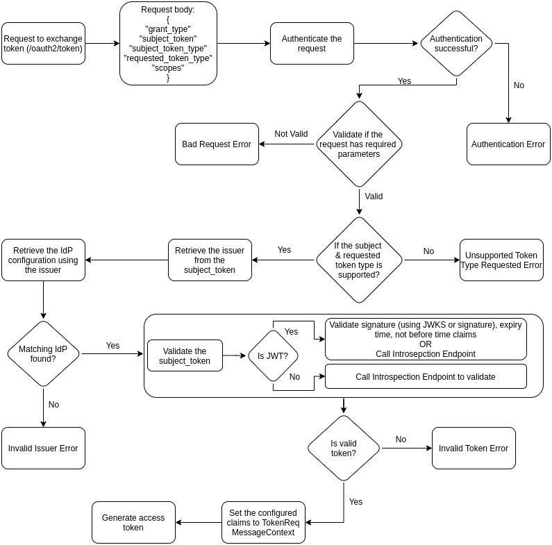
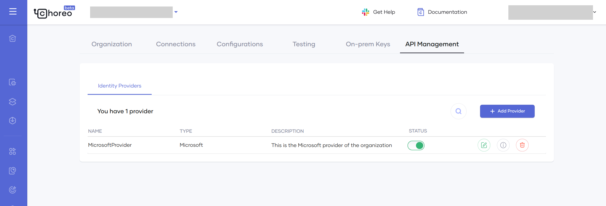
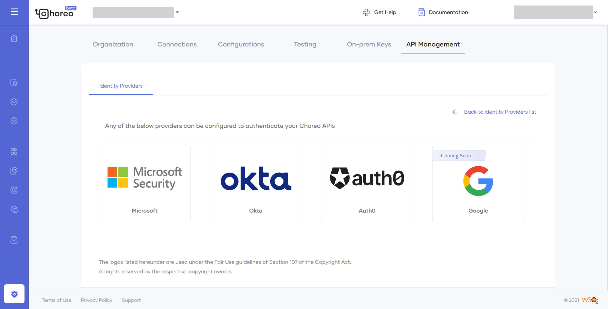
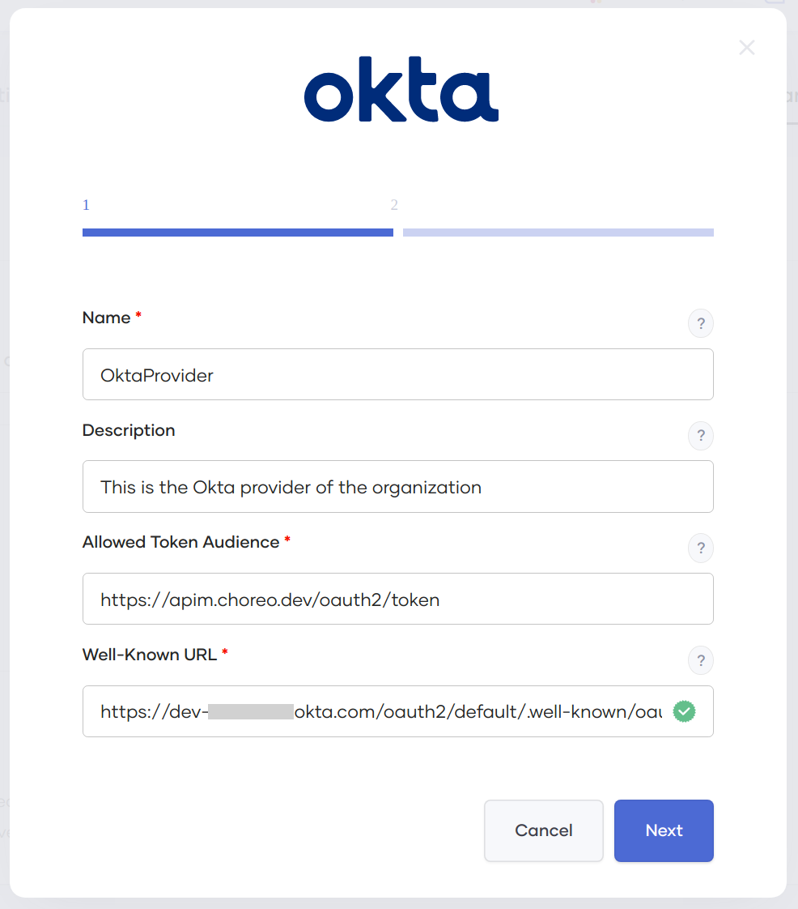
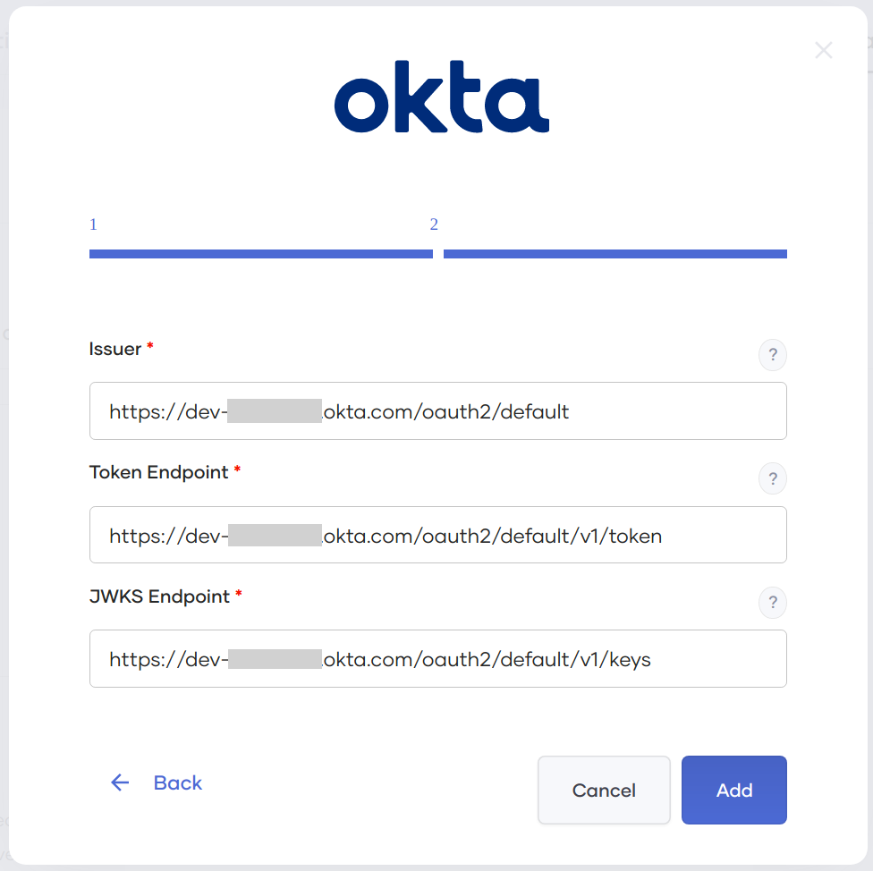
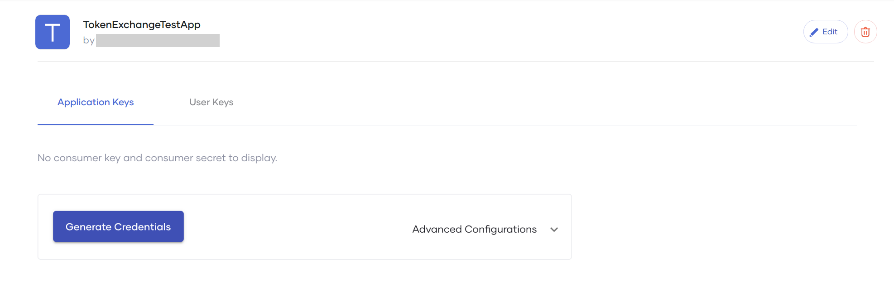
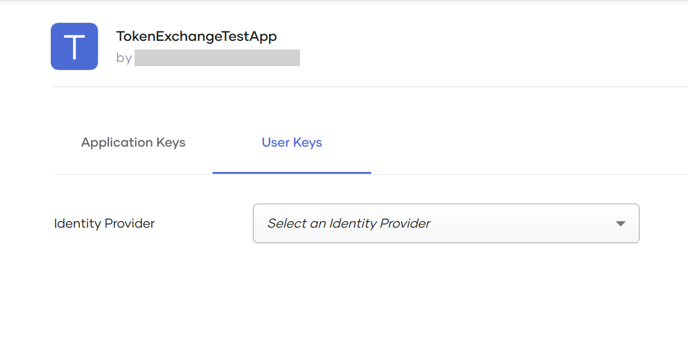
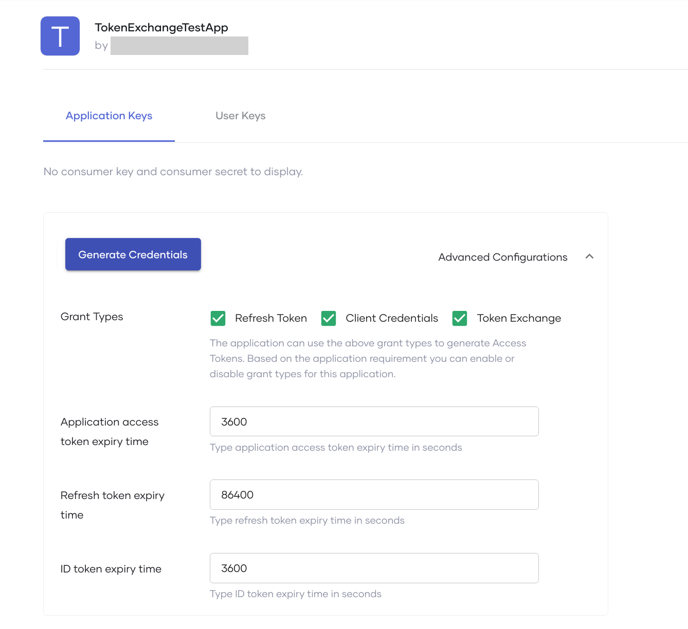
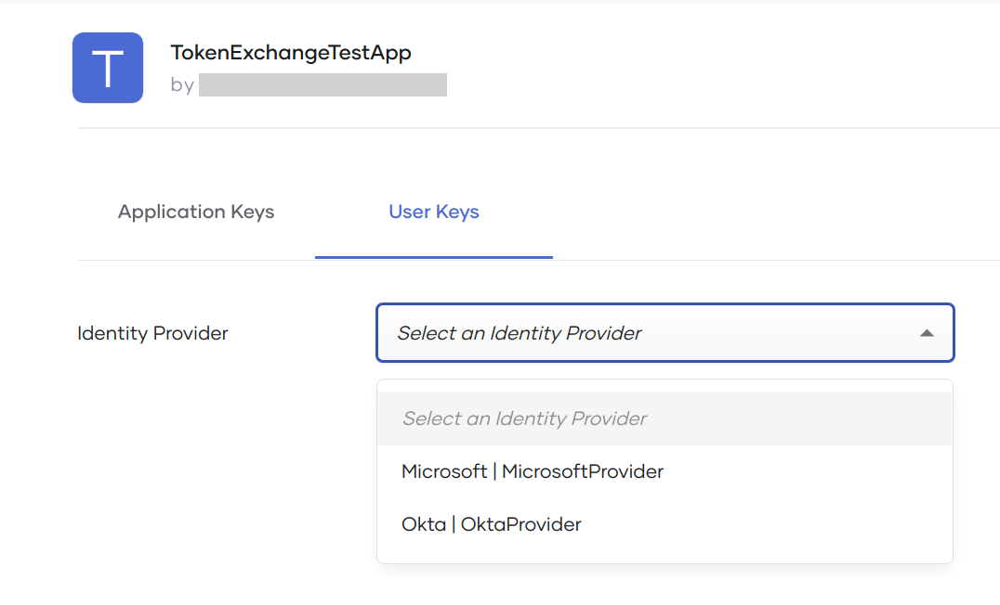
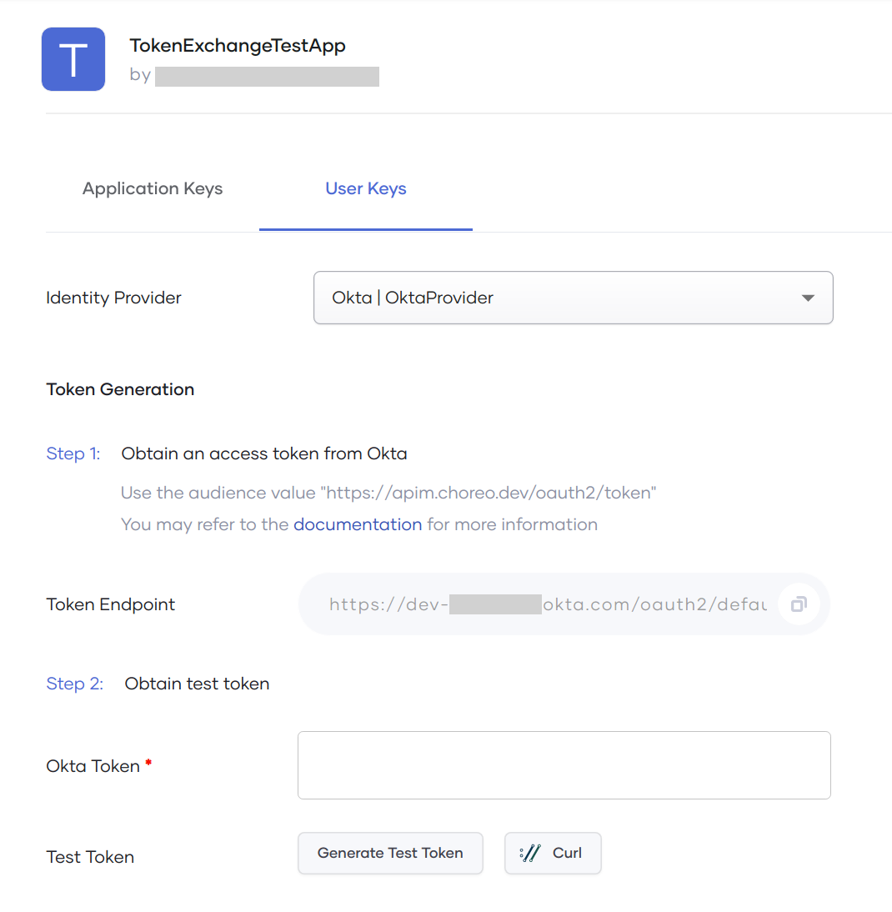

# Connect to an External Identity Provider

Choreo uses an in-built Identity Provider (IdP) by default to manage OAuth clients and generate tokens required to authenticate Choreo APIs. Choreo also grants organization administrator privileges to users to configure a required authorization server as an IdP via the Choreo Console. This allows you to [add one or more external identity providers](#add-an-external-identity-provider) to your Choreo organization and [obtain access tokens from the identity providers](#obtain-an-access-token-from-an-external-identity-provider) to exchange and get Choreo access tokens to invoke APIs. This capability lets you expose your APIs to users who are external to Choreo.

## Token exchange

Choreo supports the token exchange grant type to exchange a JSON Web Token (JWT) issued by an external IdP for a Choreo token. The token exchange grant type uses the protocol defined in the [OAuth 2.0 token exchange specification](https://datatracker.ietf.org/doc/html/rfc8693), which describes how to request and obtain security tokens from OAuth 2.0 authorization servers and exchange a security token for another type of token. The following diagram depicts the token exchange flow in Choreo:

{.cInlineImage-full}

When you provide a JWT access token (referred to as the `subject_token` in the preceding diagram), a request is sent to the Choreo token endpoint to exchange the JWT with a Choreo JWT. On validation of the request sent, the corresponding IdP configuration is retrieved based on the issuer. Then the `subject_token` validation (signature and expiry time validation) takes place. Successful validation generates a Choreo access token and returns it to you.

Now that you understand the token exchange flow, you can go ahead and add an external identity provider depending on your requirement. 

## Add an external identity provider

Follow this procedure to add an external IdP to your Choreo organization:

!!! note
    You must have organization administrator privileges to add an external IdP.

1. Sign in to the Choreo Console at [https://console.choreo.dev/](https://console.choreo.dev/).

2. In the left navigation menu, click **Settings**.    

3. Go to the **API Management** tab and click **Identity Providers**. This displays the existing identity providers in your organization if you have already added any.

    {.cInlineImage-full}

4. Click **+ Add Provider**. This displays the identity providers supported by Choreo.

    {.cInlineImage-full}

5. Click on the IdP you want to add. This displays a form where you must enter details to set up the IdP.   This example walks you through the steps to add **Okta** as the IdP. The details you need to fill in are similar for other IdPs as well.

6. Enter appropriate values for each of the fields and click Next. The following table describes each field in detail: 

    <table>
    <tr class="header">
    <th><b>Field</b></th>
    <th><b>Description</b></th>
    </tr>
    <tr class="odd">
    <td>**Name**</td>
    <td>The name of the IdP. You cannot modify the value after you add the IdP.</td>
    </tr>
    <tr class="even">
    <td>**Description**</td>
    <td>A brief description of the IdP.</td>
    </tr>
    <tr class="odd">
    <td>**Allowed Token Audience**</td>
    <td><b>Okta:</b> The audience of the authorization server for which the access token is necessary. 
        You can update this default value via the Okta authorization server by navigating to the following path: 
        Security → API → Authorization Server → Your Authorization Server → Settings → Audience  
        <b>Microsoft:</b> The identifier that identifies the intended recipient of the token.
This value should be the application ID URI of the application in Azure Active Directory (Azure AD) for which the token is requested.
          
        <b>Auth0:</b> The unique API identifier to use as the audience parameter in the authorization call. 
         You can update this value in the Auth0 server by navigating to the following path: 
         Applications → APIs → Your API → General Settings → Identifier 
    </td>
    </tr>
    <tr class="even">
    <td>**Well-Known URL**</td>
    <td>
The OpenID Connect discovery endpoint URL. This returns the metadata related to the OpenID Provider's configuration.

    </td>
    </tr>
    </table>

     {.cInlineImage-half} 

     When you specify the **Well-Known URL**, the values for the **Issuer**, **Token Endpoint**, and **JWKS Endpoint** fields are filled in automatically in the next screen. Depending on your requirement, you can either keep the values as it is or manually change the values. The following table describes each field in detail:

    <table>
    <tr class="header">
    <th><b>Field</b></th>
    <th><b>Description</b></th>
    </tr>
    <tr class="odd">
    <td>**Issuer**</td>
    <td>The issuer identifier of the IdP, which is in the `iss` claim of the JWT issued.</td>
    </tr>
    <tr class="even">
    <td>**Token Endpoint**</td>
    <td>The token endpoint URL of the IdP from where the OAuth client can get an access token.</td>
    </tr>
    <tr class="odd">
    <td>**JWKS Endpoint**</td>
    <td>The URL that returns the JSON web key (JWK) set of the IdP. This returns a collection of JSON Web Keys used to verify the signature of the JWT tokens.
    </td>
    </tr>
    </table>

     {.cInlineImage-half}

8.  Click **Add**. This adds Okta IdP to the list of existing identity providers in your organization.

Now that you have added an external IdP, you can go ahead and obtain access tokens from that IdP to exchange and get Choreo access tokens to invoke APIs.

## Obtain an access token from an external identity provider

Follow this procedure to obtain an access token from an external IdP and exchange it with a Choreo token within your organization:

1. Sign in to the Choreo API Developer Portal at [https://devportal.choreo.dev/](https://devportal.choreo.dev/).

2. Click the **Applications** tab.

3. Create a new application or use an existing application.

4. In the left navigation menu, click **OAuth2 Tokens** under **Production Keys**. This displays the following page if you have not generated the **Consumer Key** and **Consumer Secret**:

    {.cInlineImage-full}

5. Click **Generate Credentials** to generate the **Consumer Key** and **Consumer Secret**.

6. Click the **User Keys** tab.

    {.cInlineImage-half}
   

    !!! tip
        The **User Keys** tab is only enabled if you meet the following prerequisites: 
          - Have at least one external IdP added to your organization. 
          - Before you click **Generate Credentials**, click **Advanced Configurations** and make sure you select **Token Exchange** as a **Grant Type**.  

           {.cInlineImage-half}
    

7. Select an IdP from the **Identity Provider** drop-down list.

    {.cInlineImage-half}

    This displays the steps you need to follow to generate a token:

    {.cInlineImage-half}

8. As mentioned in **Step 1** in the UI, obtain an access token from the external IdP that you selected.
   
9. Paste the access token in the **<Your_IdP_name> Token** field. Here, you see the field name displayed as **Okta Token**.

10. Click **://Curl** and copy the cURL command to obtain the Choreo access token. Alternatively, you can click **Generate Test Token** to get the Choreo access token via the UI.

Now you can use the generated Choreo access token to invoke APIs that you have subscribed to using the application.
