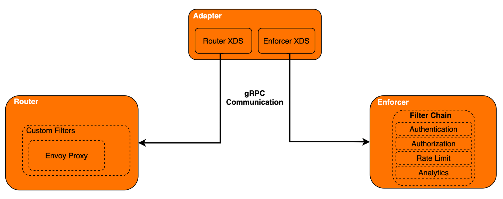

# API Concepts
Choreo's API management capabilities allow you to create APIs, manage APIs, and expose services and external APIs as managed APIs. Here are some basic concepts which will help you understand API management in Choreo as you create and manage your APIs in the [Choreo Console]({{choreo_console}}).
 
## API
An API is an intermediate layer that acts as a communication protocol between a consumer and a service, simplifying the consumption of the service. In addition to hiding the underlying implementation details of a service, an API provides a secure, controlled, and well-documented approach to access an exposed service.

## API Management Components
API management in Choreo is facilitated by the key components: [API Publisher](#api-publisher), [Developer Portal](#developer-portal), [API Key Manager](#api-key-manager),and [Choreo Connect](#choreo-connect).  

### API Publisher 
The API Publisher is designed for API creators to develop, document, secure, test, and version APIs with ease. It also caters to more API management-related tasks, such as allowing API Publishers to deploy and publish APIs and applying rate-limiting policies.

### Developer Portal
The Developer portal allows API publishers to host and advertise their APIs and API consumers to discover, evaluate, subscribe to, and consume APIs securely.

### API Key Manager
The API Key Manager is the identity provider for Choreo and acts as the Secure Token Service (STS). Choreo's API management supports OAuth2.0 and API-Key-based authentication mechanisms.

In Choreo, tokens are bound to an application. The Key manager provides a token API to generate access tokens. Clients can use these tokens to invoke APIs exposed by Choreo. The Key Manager also exposes a revoke token API that clients can use to revoke an access token. A client can generate an OAuth2.0 access token by invoking the token API directly or via the Developer Portal UI. Alternatively, a client can generate an API Key through the Developer Portal without calling the Key Manager. The API Key is a self-signed JWT token. When a client invokes an API with an OAuth2.0 access token or an API Key, the Gateway validates the token by validating its signature and subscription.

The Key Manager performs scope validation as well.

### Choreo Connect

Choreo Connect is an API gateway designed for microservices that is cloud-native, decentralized, and developer-centric. This API gateway is a lightweight message processor for APIs that facilitates message security, transport security, routing, and other API Management functions such as throttling, rate-limiting, etc.

Choreo Connect consists of three components: Router, Enforcer, and Adapter.

{:style="height:75%;width:90%"}

#### Router

Router in Choreo Connect uses the [Envoy Proxy](https://www.envoyproxy.io/) and is primarily responsible for routing traffic to the relevant endpoints. The Router is also capable of exposing the APIs in Choreo and thereby making them discoverable.

#### Enforcer

Enforcer is responsible for carrying out API management-related tasks such as controlling access, enabling security, publishing analytics, etc. When the Router receives a request, it sends it to the Enforcer. The Enforcer performs the relevant API management-related tasks on the request and replies to the Router. Based on the Router's response, the Enforcer will decide to allow or deny the request to pass to the backend.

#### Adapter 

The Adapter is responsible for converting the API definition to a format understood by the Router and the Enforcer. The Adapter will pass the data to and from the Router and Enforcer. 

### Traffic Manager 

The Traffic Manager helps regulate API traffic, make APIs and applications available to consumers at different service levels, and secure APIs against security attacks. The Traffic Manager features a dynamic throttling engine that processes rate-limiting policies in real-time. 

Additionally,  the Traffic Manager keeps the API Gateway's in-memory map, which it uses for key validation, up-to-date via a JMS topic. The Traffic Manager publishes artifact (API/application) update events that it receives from the API Publisher and API Developer Portal to a JMS topic. The API Gateway receives these events via the JMS topic and updates its in-memory map.

## API Lifecycle
API lifecycle comprises of the stages an API goes through from creation to retirement. API lifecycle is independent of its backend service. The lifecycle states are `Created`, `Prototyped`, `Published`, `Deprecated`, `Blocked`, and `Retired`.

