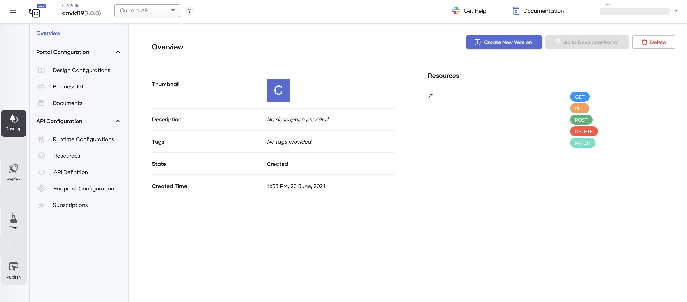
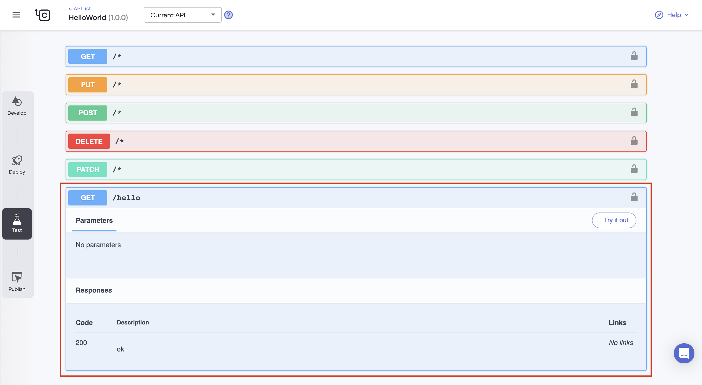
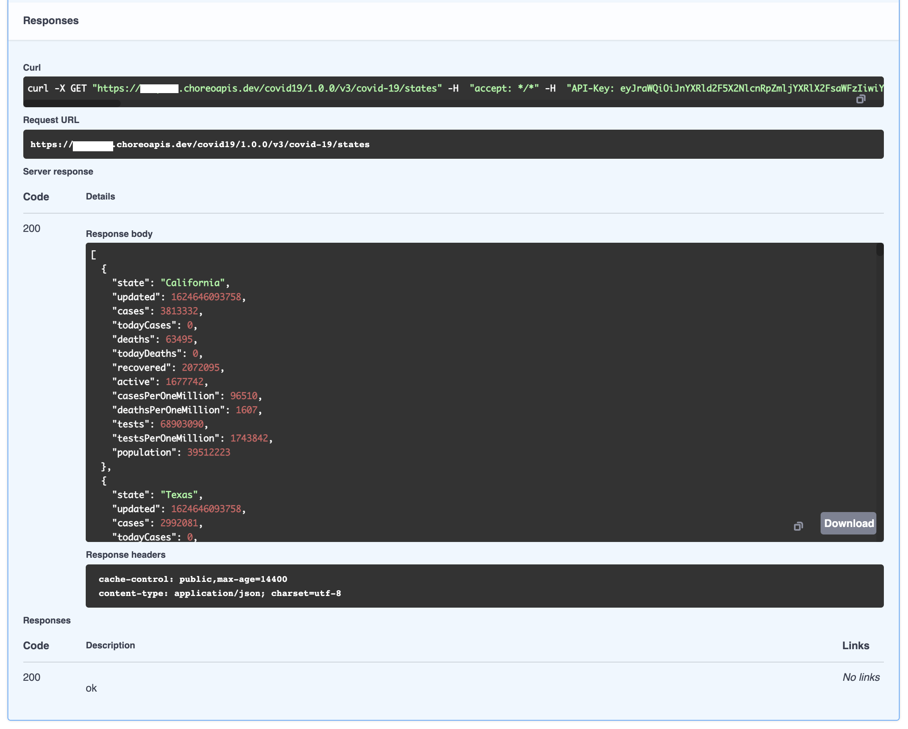
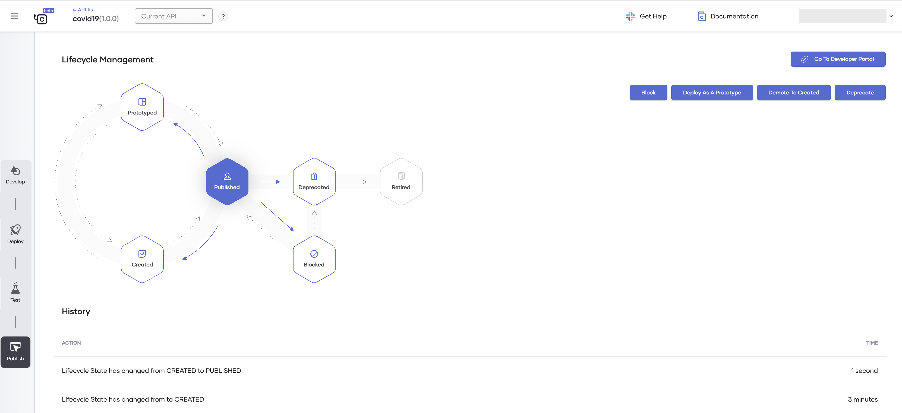
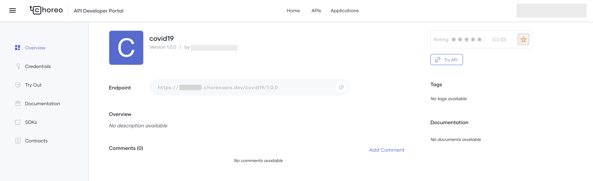

# Create and Publish Your First API

Choreo API management capabilities allow you to create, publish, and manage all aspects of an API and its lifecycle.
This quick start guide walks you through the steps to quickly create and publish a REST API using Choreo. 
 
## Step 1: Create an API from scratch
Follow this procedure to create an API:

1. Sign in to the Choreo Console at [https://console.choreo.dev/](https://console.choreo.dev/).
2. Go to the **APIs** card and click **Get Started**. This takes you to the **Create API** page.
3. On the **Create API** page, go to the **Start from scratch card** and click **Next**.
4. In the **Create API from REST API** form, enter the details as follows:
    
    | **Field**        | **Value**                                        |
    |------------------|--------------------------------------------------|
    | **API Name**     | `covid19`                                     |
    | **API Version**  | `1.0.0`                                          |
    | **Endpoint**     | `https://disease.sh`|

5. Click **Create**. This creates the API and displays an overview of the API.

    {.cInlineImage-full}
       
6. To add a resource to the API, follow this procedure:
    1. Under **API Configuration**, click **Resources**.
    2. Select **GET** from the **HTTP Verb** drop-down list.
    3. In the **URI Pattern** field, enter `/v3/covid-19/states` and then click the **+** icon next to the text to add the resource.
    4. Click **Save**.
    5. You can see a confirmation message to proceed with the changes. Click **Save** to proceed.

Now you have successfully created the API and added a `GET` resource to it.

## Step 2: Deploy the API
Follow this procedure to create a revision of the API and deploy it so that you can try it out:

1. Click **Deploy** in the left pane.
2. On the **Deployments** page, click **Create a Revision and Deploy**.
3. In the **Create Revision and Deploy** form, enter `Demo revision` as the description and then click **Deploy**.

Now you have successfully created a revision from the current API and deployed it.

## Step 3: Test the API
Follow this procedure to test the API revision that you deployed:

1. Click **Test** in the left pane.
2. Click **GET TEST KEY** to obtain an access token.
3. Click the `GET` resource you added to expand it.

    {.cInlineImage-full}
    
4. Click **Try it out** and then click **Execute**. You can see the COVID-19 data for all the states of the USA as the response from the API.

    {.cInlineImage-full}

Now you are ready to publish the API to the API Developer Portal so that external consumers can consume the API.

## Step 4: Publish the API
Follow this procedure to publish and view the API to the API Developer Portal so that external consumers can consume the API:

1. Click **Publish** in the left pane.
2. On the **Lifecycle Management** page, click **Publish**.
3. Click **Go to Developer Portal**. This signs you in to the API Developer Portal.

    {.cInlineImage-full}
     
    You can see the published API in the API Developer Portal.
    
    {.cInlineImage-full}

## Step 5: Invoke the API 
Follow this procedure to invoke the API from the API Developer Portal:

1. Click **Credentials** in the left pane.
2. Click **Generate Credentials**. This creates credentials for an internal application and subscribes this API to that internal application.
2. Click **GENERATE ACCESS TOKEN**. Copy the generated access token.
3. Click **Try Out** in the left pane. 
4. Paste the copied access token in the **Access Token** field.
5. Click the `GET` resource you added to expand it.
6. Click **Try it out** and then click **Execute**. You can see the COVID-19 data for all the states of the USA as the response from the API.

Congratulations! You have successfully created a REST API, published it on the API Developer Portal, and finally invoked the API via the API Developer Portal.
