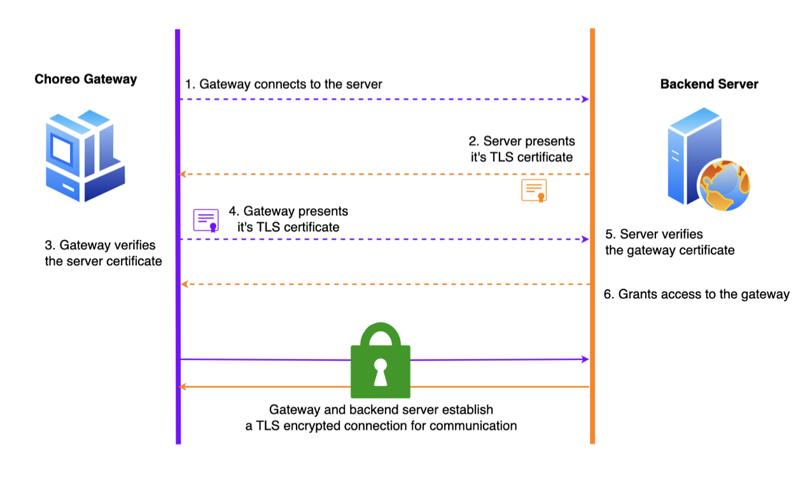
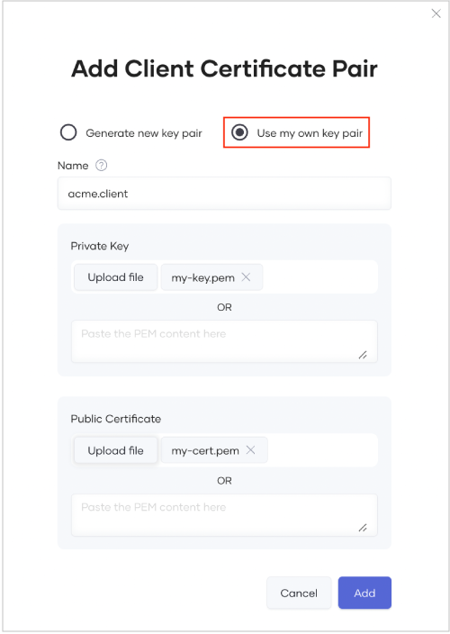
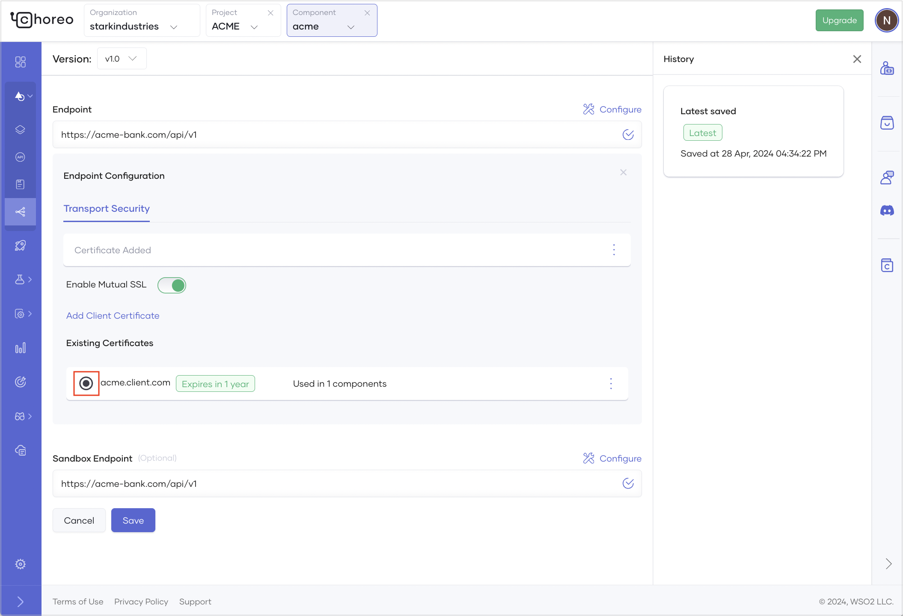

# Secure Communication Between the Choreo Gateway and Your Backend with Mutual TLS

To establish secure communication between the Choreo Gateway and your backend, you can configure mutual TLS.

Mutual TLS authentication involves both the client and server validating each other’s certificates before establishing a connection. The following diagram depicts this scenario:

## Configure mutual TLS to establish secure connectivity

To establish secure connectivity between the Choreo Gateway and your backend using mutual TLS, you must add the certificate of the backend (server certificate) to Choreo and add the certificate of Choreo (client certificate) as a trusted certificate in the backend.

### Step 1: Configure the backend certificate 

#### Prerequisites

- The endpoint must be protected with TLS. 
- The public certificate of the backend server should be extracted in PEM format and saved on the disk with the `.pem` extension.

To configure the backend certificate, follow the steps given below:

1. Sign in to the [Choreo Console](https://console.choreo.dev/).
2. In the **Component Listing** pane, click on the API proxy for which you want to configure TLS. For instructions on how to create an API proxy component, see [Develop an API Proxy: Step 1](../develop-components/develop-an-api-proxy.md#step-1-create-an-api-proxy).
3. In the left navigation menu, click **Develop** and then click **Endpoints**.
4. On the **Endpoints** page, click **Configure** corresponding to the endpoint.
5. Click **Upload Endpoint Certificate**, and select the certificate file that you extracted in the prerequisites section to add it. This adds the certificate to all the environments as the default certificate for the endpoint. You can override this certificate if necessary when you deploy or promote the API.

### Step 2: Configure mutual TLS with the backend service

There are two approaches you can take to configure mutual TLS.

 - Generate a key pair with a self-signed certificate from Choreo, download the public certificate, and subsequently add and configure it in the backend.
 - Upload your own public or private certificate pair to Choreo. Subsequently, add and configure the public certificate of this key pair in your backend.

Follow the step-by-step instructions below depending on how you want to establish mutual TLS with the backend service:

=== "Generate a key pair through Choreo"
    When you follow these steps, Choreo generates a key pair with a self-signed certificate. You can attach this key pair to any API proxy created within the same project.

    1. Sign in to the [Choreo Console](https://console.choreo.dev/).
    2. In the **Component Listing** pane, click on the API proxy for which you want to generate a key pair. For instructions on how to create an API proxy component, see [Develop an API Proxy: Step 1](../develop-components/develop-an-api-proxy.md#step-1-create-an-api-proxy).
    3. In the left navigation menu, click **Develop** and then click **Endpoints**.
    4. On the **Endpoints** page, click **Configure** corresponding to the endpoint.    
    5. If your backend does not use a CA-signed certificate and you have not already added the backend certificate, click **Upload Endpoint Certificate** and add the backend certificate.
    6. To enable mutual SSL, turn on the **Mutual SSL** toggle.
    7. Click **Add Client Certificate**.
    8. In the **Add Client Certificate Pair** dialog, select **Generate new key pair** and specify a value as the common name for the certificate pair. This value will be used to identify the certificate.

        
       
    9. Optionally, click **Show advanced options** to expand the section and specify appropriate values for each of the fields.
    10. Click **Generate**. This generates the certificate and lists it under **Existing Certificates**.
    11. Click the more options icon corresponding to the certificate and then click **View and Download**.

         
       
        This opens the certificate for you to view and download.

         

    12. To download the certificate in PEM format, click **Download**. You can add this certificate as a trusted certificate in the API backend server.
    
    Now you can associate the certificate with the API and deploy the API.

=== "Use your own certificate pair"
    Here, you can use your own public certificate and private certificate as client certificates.

    1. Sign in to the [Choreo Console](https://console.choreo.dev/).
    2. In the **Component Listing** pane, click on the API proxy for which you want to generate a key pair. For instructions on how to create an API proxy component, see [Develop an API Proxy: Step 1](../develop-components/develop-an-api-proxy.md#step-1-create-an-api-proxy).
    3. In the left navigation menu, click **Develop** and then click **Endpoints**.
    4. On the **Endpoints** page, click **Configure** corresponding to the endpoint.
    5. If your backend does not use a CA-signed certificate and you have not already added the backend certificate, click **Upload Endpoint Certificate** and add the backend certificate.
    6. To enable mutual SSL, turn on the **Mutual SSL** toggle.
    7. Click **Add Client Certificate**.
    8. In the **Add Client Certificate Pair** dialog, select **Use my own key pair**.

        
       
    9. Upload the private key and public certificate in PEM format or copy and paste the content of the private key and public certificate.
    10. Click **Add**. This generates the certificate and lists it under **Existing Certificates**.
    11. Click the more options icon corresponding to the certificate and then click **View and Download**.

         
       
        This opens the certificate for you to view and download.

         

    12. To download the certificate in PEM format, click **Download**. You can add this certificate as a trusted certificate in the API backend server.
   
    Now you can associate the certificate with the API and deploy the API.

### Step 3: Associate the certificate with the API

To associate a certificate with the API, follow the steps given below:

1. On the **Endpoints** page, go to the **Existing Certificates** section.
2. Select the certificate you want to associate with the API.

    

3. Click **Save**.
   
### Step 4: Deploy the API 

To deploy the API, follow the steps given below:

1. In the left navigation menu, click **Deploy**.
2. In the **Build Area** card, click **Configure & Deploy**.
3. Once the mediation application generation phase is complete, verify the endpoint URL populated for the environment and then click **Save & Deploy**.

Once the deployment is complete, you can [test the API](../testing/test-rest-endpoints-via-the-openapi-console.md). 

## Change the certificate for the production environment

If the API backend changes depending on the environment, the respective certificate must be updated for each environment. 

Here, let's take a look at the steps to update the certificate for the production environment:

1. On the **Deploy** page, go to the **Development** card and click **Promote**.
2. In the **Configurations** pane that opens, click **Endpoint Configuration**. You will see all applicable certificates listed in the **Mutual TLS** list. 
3. Select the certificate applicable to the production environment and click **Promote**. This promotes the component to the production environment with the selected certificate.
