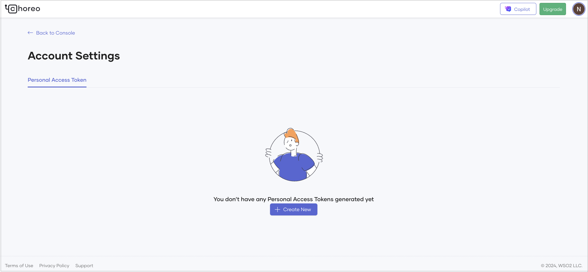

# Manage Authentication with Personal Access Tokens

Personal access tokens (PATs) provide a secure method to authenticate with the Choreo CLI, allowing you to manage access without relying on primary credentials.

## What are personal access tokens?

Personal access tokens are unique strings that provide an alternative to username and password authentication. You can create PATs for specific use cases, associating them with your account to grant granular access to your application resources as needed.

!!! note 
      PATs should be treated like passwords and stored securely.

## Sample use cases for personal access tokens

PATs are versatile and suitable for various tasks in the Choreo CLI:

- **Automated scripting**: To use in scripts for CI/CD pipelines or task automation, avoiding repeated sign-in prompts. This simplifies setting up CI/CD pipelines or other automation that rely on the CLI.
- **Granular permissions for specific tasks**: To limit access to certain commands or specific features without providing full access, you can configure PATs with restricted permissions.
- **Temporary access**: To grant temporary access for short-term projects or collaborations, without sharing full credentials.
- **Integration with third-party tools**: To authenticate other tools or services that need access to
your resources, such as analytics tools, monitoring systems, or deployment services. This approach keeps your main
credentials secure while allowing API access.
- **Multiple account management**: If you work with multiple accounts or roles, you can
use separate PATs for each role for easy context switching.

## Set up personal access tokens

To create a PAT to use with the Choreo CLI, you must set up and retrieve a token from the Choreo Console.

Follow these steps to create a PAT for Choreo CLI:

1. Sign in to the [Choreo Console](https://console.choreo.dev/).
2. Go to the Choreo Console header right corner, click your profile picture, and then click **Account Settings**.

    

3. Click the **Personal Access Tokens** tab.

    

4. Click **+ Create New**.
5. Specify a name for your token and define its scopes and permissions. By default, all necessary scopes for CLI functionality are selected.

    

6. Click **Generate**.
7. Copy and securely store the displayed token. You won’t be able to view it again.
8. Click **Done**.

!!! info "Caution" 
     - Treat the token as confidential information. 
     - Avoid storing the token in unprotected files.

## Use a personal access token with the Choreo CLI

Once you generate a token, you can use it to authenticate with the Choreo CLI and perform various operations. 

### Command syntax

To log in with the token, use the following command:

```bash
choreo login --with-token
```

This command reads the token from the standard input.

**Example:**

```bash
export CHOREO_TOKEN= <YOUR_PERSONAL_ACCESS_TOKEN>
echo "$CHOREO_TOKEN" | choreo login --with-token
```

!!! note 
     Replace `YOUR_PERSONAL_ACCESS_TOKEN` with your actual token.

## Manage and revoke tokens

To manage or revoke existing tokens, follow these steps:

1. Sign in to the [Choreo Console](https://console.choreo.dev/).
2. Go to the Choreo Console header right corner, click your profile picture, and then click **Account Settings**.
3. On the **Account settings** page, click the **Personal Access Tokens** tab.
4. Go to the token you want to revoke and click **Revoke**.

!!! tip 
     To maintain security, you must regularly review and revoke tokens that are no longer in use.


## Best practices for token management

- **Limit scope:** Assign only the necessary permissions to each token.
- **Rotate tokens regularly:** Replace tokens periodically to enhance security.
- **Use secure storage:**  Store tokens in a secure location, such as a secrets manager.
- **Revoke unused tokens:** Regularly audit and revoke inactive tokens.
