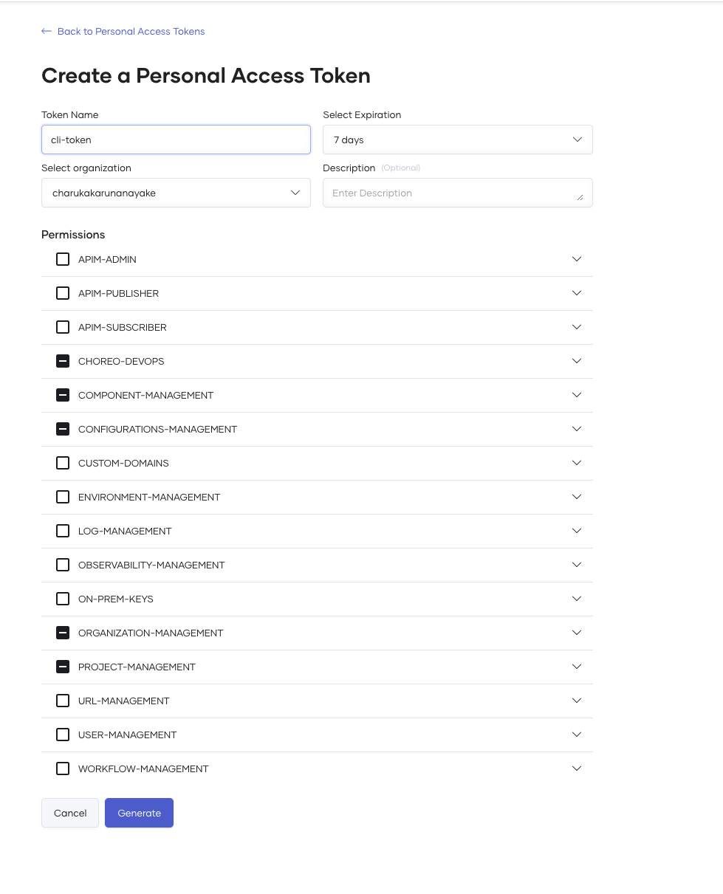
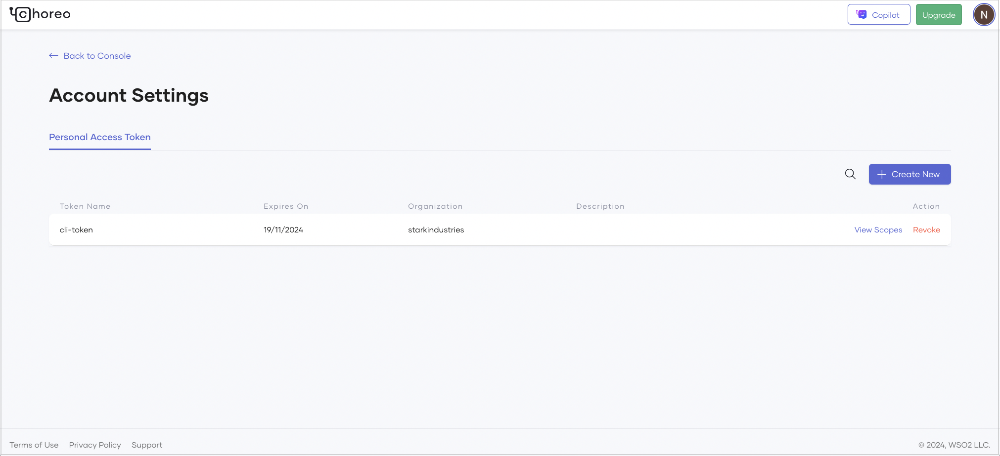

# Personal Access Tokens Guide for Choreo CLI

## Introduction
Personal Access Tokens (PATs) allow you to authenticate without using your primary credentials, adding an extra layer of security and ease of management. 

---

## Table of Contents

1. [What Are Personal Access Tokens?](#what-are-personal-access-tokens)
2. [Use Cases for Personal Access Tokens](#use-cases-for-personal-access-tokens)
3. [Setting Up Personal Access Tokens](#setting-up-personal-access-tokens)
3. [Using Personal Access Tokens with Choreo CLI](#using-personal-access-tokens-with-cli-tool)
4. [Managing and Revoking Tokens](#managing-and-revoking-tokens)
5. [Best Practices for Token Management](#best-practices-for-token-management)

---

### What Are Personal Access Tokens?
Personal Access Tokens (PATs) are unique strings that allow you to authenticate without requiring a username and 
password each time. PATs are associated with your account and can be created for specific use cases, allowing granular 
access to your app resources.

> **Note:** PATs should be treated like passwords and stored securely.

---

### Use Cases for Personal Access Tokens

Personal Access Tokens can be helpful in many scenarios. Below are some common use cases for leveraging PATs within 
Choreo CLI:

- **Automated Scripting**: PATs can be used in scripts to perform automated tasks like deployments or data updates 
without prompting for login credentials each time. This makes it easy to set up CI/CD pipelines or other automation 
that relies on the CLI.

- **Granular Permissions for Specific Tasks**: When you want to grant access to certain commands or parts of the app
platform but don’t want to share full access, PATs can be configured with restricted permissions to ensure secure,
limited access.

- **Temporary Access**: If you only need access for a short period, such as during a project or a temporary 
collaboration, a PAT can provide that access without sharing full account credentials.

- **Integrating with Third-Party Tools**: PATs can be used to authenticate other tools or services that need access to
your resources, such as analytics tools, monitoring systems, or deployment services. This approach keeps your main
credentials secure while still allowing API access.

- **Maintaining Multiple Accounts**: If you work with multiple accounts or roles within the same app platform, you can
use different PATs for each role. This lets you switch contexts easily without repeatedly logging in and out.

---

### Setting Up Personal Access Tokens

To use Personal Access Tokens with the Choreo CLI, follow these steps to set up and retrieve a token from 
the Choreo Console.

#### Step 1: Log into Your Account
1. Go to [Choreo Console](https://console.choreo.dev).
2. Navigate to **Account Settings**.
3. From the Account settings page go to **Personal Access Tokens** section.


#### Step 2: Generate a New Token
1. Click on **Create New**.
2. Specify a name for your token and define its scope and permissions by default this would select all the necessary 
scopes for the CLI to function.
3. Click **Generate**.




4. Copy the token shown on the screen and store it securely. You won’t be able to view it again.

> **Warning:** Treat your token as confidential information. Do not share it or store it in unsecured files.

---

### Using Personal Access Tokens with Choreo CLI

After generating your token, you can use it with Choreo CLI for various operations. Here’s how to authenticate with 
a Personal Access Token.

#### Command Syntax
To use a token, use the login command with the flag `--with-token`:

```bash
choreo login --with-token
```

This command would read the token from the standard input

**Example:**
```bash
export CHOREO_TOKEN=<YOUR_PERSONAL_ACCESS_TOKEN>
echo "$CHOREO_TOKEN" | choreo login --with-token
```

> **Note:** Replace `YOUR_PERSONAL_ACCESS_TOKEN` with your actual token.

---

### Managing and Revoking Tokens

To manage or revoke existing tokens, return to the **Personal Access Tokens** section in your account settings.

1. Locate the token you want to revoke.
2. Click on **Revoke** next to the token.

> **Tip:** Regularly review and revoke tokens that are no longer in use to maintain security.



---

### Best Practices for Token Management

- **Limit Scope:** Only grant the permissions needed for each use case.
- **Rotate Tokens Regularly:** Replace tokens periodically to reduce the risk of compromise.
- **Use Secure Storage:** Store tokens in a secure location, such as a secrets manager.
- **Revoke Unused Tokens:** Regularly audit and revoke tokens no longer required.

