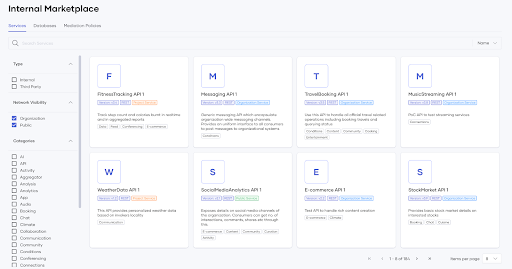

# Choreo Marketplace

The Choreo Marketplace promotes and facilitates reusing and sharing services. It allows you to share all the services deployed in Choreo.
You can easily browse and search available services within the Marketplace and refer to the service definitions, documentation, instructions on how you can use it, etc. 

{.cInlineImage-full}

## Discover services

The Marketplace includes all services deployed in your organization. This may be a large number of services. Therefore, effective discoverability is desirable.

You can use the search or apply various filter criteria to explore the services available.

### Search

The top search bar provides universal searching to find the services. It allows you to search for a text in the following search attributes:

- **Name**: The service name.
- **Label**: The service labels.
- **Content**: The service content: overview, summary, and documentation.
- **All**: All of the above criteria.

### Filter

The Choreo Marketplace provides a filtering capability through the left-hand side filter panel. It allows you to filter with the following filter attributes:

- **Type**: This filter enables you to categorize services based on their type, with two available options: "Internal" and "Third-party". "Internal" refers to services deployed within Choreo, while "Third-party" refers to services running externally to Choreo, independently added to the Marketplace.

- **Network Visibility**: This filter enables you to categorize services based on their network visibility level, with three choices: "Public," "Organization," and "Project".  "Public" filters services exposed publicly, "Organization" represents services exposed across the entire organization, and "Project" represents services exposed at the project level.

## Explore a service 

You can click on the service card to open the detailed view of the service. The detailed service page features the service name, summary, version, labels, and service icon as the header.

Choreo organizes the service content into four tabs. The four tabs contain information as follows: 

- **Overview**: Choreo displays the service overview provided by the service developer. If the service developer has not provided any content at service creation, this section will be disabled. The service developer can provide the overview content via the Manage → Marketplace section of the component.

- **API definition**: Includes the API definition for the service, extracted from the `component.yaml` file in the user repository. If an API definition is not provided, this tab will be empty.

    !!! note
        If you are are currently using the `component-config.yaml` or `endpoints.yaml` configuration files, see the respective [migration guide](../develop-components/manage-component-source-configurations.md#migration-guide) for instructions on migrating to the recommended `component.yaml` configuration file.

- **How to use**: Includes instructions on how to use the selected service. This includes instructions on [creating a connection](../develop-components/sharing-and-reusing/create-a-connection.md).

- **Related documents**: Includes any additional content the user has provided as documents through the Manage -> Marketplace section of the component.

## Add a service to the Choreo Marketplace

You can add services to the Marketplace as Choreo services as follows: 

### Add a Choreo service

In Choreo, a service exposed through the platform is termed a Choreo service, with each service being identifiable by an endpoint within a Choreo service component. The Marketplace showcases a service for each endpoint within a service component.

Upon deployment to the initial environment, services get automatically added to the Marketplace. Choreo effortlessly collects essential details such as component name, endpoint name, description, and service definitions during this deployment, utilizing them to generate the corresponding service entries in the Marketplace.

The service name follows the convention of `component name - endpoint name`, while all other details remain unchanged.

## Service versioning in the Choreo Marketplace

In the Choreo Marketplace, service versions are displayed in their major version format. Each service in the Choreo Marketplace represents the latest version of the service within its major version, following semantic versioning principles.

For example, if a Choreo service has versions `v1.0`, `v1.1`, `v1.2`, and `v2.0`, the Choreo Marketplace displays services with versions `v1` and `v2` representing the latest versions `v1.2` and `v2.0` respectively.

When you deploy a new minor version of a service already deployed in Choreo, the corresponding service in the marketplace automatically updates to reflect the latest version within the same major version.

### Semantic-version-based intelligent routing in the Choreo Marketplace

When you use a service from the Choreo marketplace as a dependency, the dependent service's traffic automatically routes to the latest version of the corresponding service within the same major version. This ensures that your dependencies remain up-to-date without requiring manual updates within a major version.

For example, if you create a connection to connect your Choreo component named `Foo` to a Choreo service named `Bar`, which is currently available in the Choreo Marketplace as version v1, and if the latest version of the service `Bar` within the v1 range is v1.2, the component `Foo` will automatically connect to `Bar` v1.2.  Subsequently, when `Bar` releases version v1.3, traffic from `Foo` will automatically route to `Bar` v1.3.

## Edit services in the Choreo Marketplace

You can edit services in the Choreo Marketplace. During redeployment to any environment, Choreo automatically updates service definitions, visibility, and descriptions.
