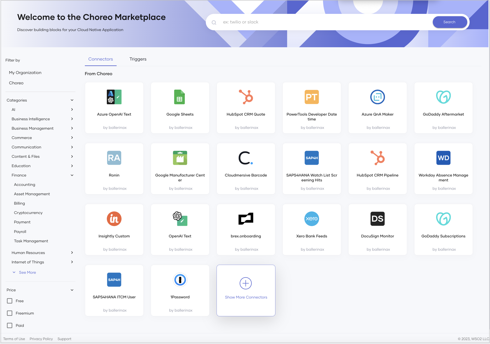
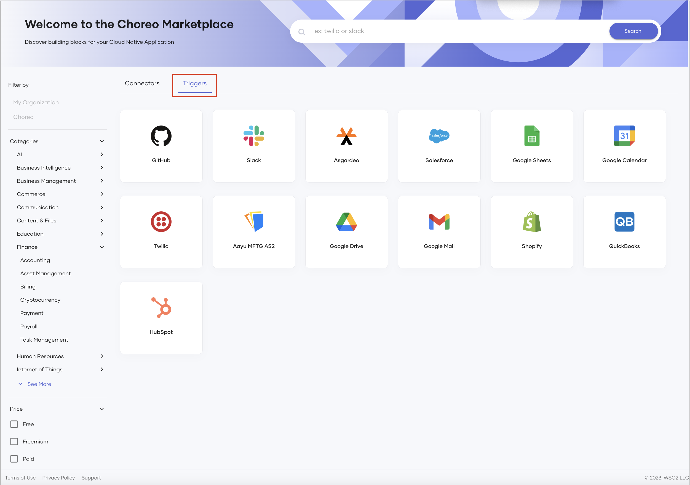
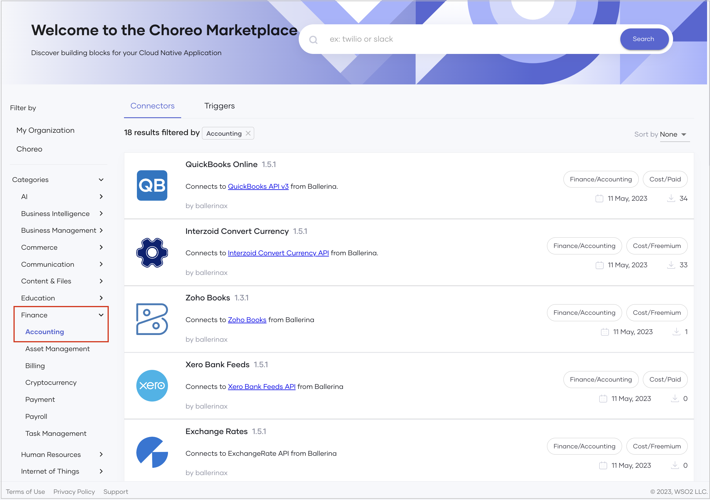
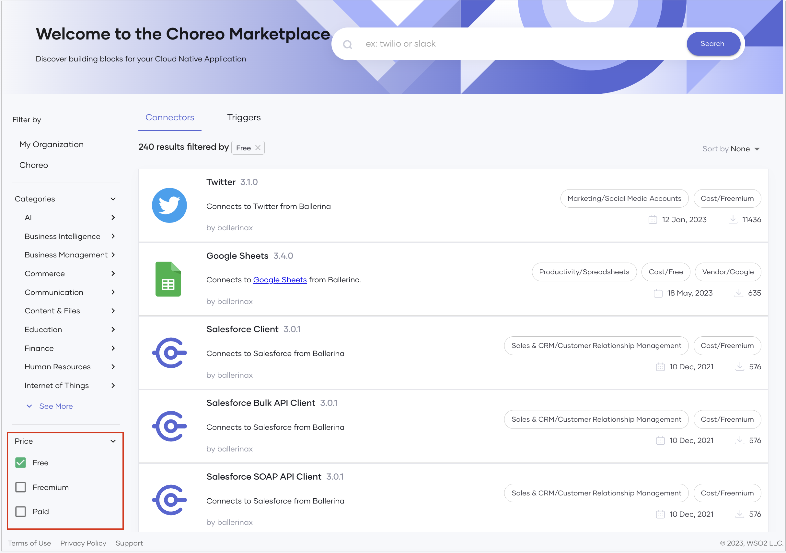

# Choreo Marketplace

Choreo Marketplace provides a comprehensive collection of prebuilt connectors and triggers to design your cloud native applications. It also serves as a platform for API developers to publish their own connectors for Choreo users, either to purchase or to use free of charge.

The Choreo Marketplace promotes API reuse. This empowers modern businesses to focus on developing applications with unique functionality while saving resources that otherwise would be required to create everything from scratch.

When you discover a connector or trigger in the Choreo Marketplace that meets your requirements, you have the flexibility to choose between purchasing it, acquiring it through a Freemium account, or using it for free based on its pricing.

## Access the Choreo Marketplace

To access the Choreo Marketplace, follow the steps given below:

1. Sign in to the [Choreo Console](https://console.choreo.dev/).

2. In the left navigation menu, click **Marketplace**. This opens the Choreo Marketplace with the prebuilt connectors designed and published by Choreo. 

    {.cInlineImage-full}

    If you want to view the triggers published by Choreo, click the **Triggers** tab.

     {.cInlineImage-full}

    If you want to view the connectors and triggers published by your organization, click **My Organization** under **Filter By**.

You can apply various filter criteria to easily find a connector or trigger that meets the requirements of the application you are designing.

## Filter by category

If you want to filter connectors and triggers by a specific domain, click on a required category (for example, Finance) and then click on a required subcategory (for example, Accounting).

This displays the connectors and triggers that meet the filter criteria.

{.cInlineImage-full}

## Filter by price

To filter connectors and triggers on pricing, select one or more checkboxes under **Price** according to your requirement.

{.cInlineImage-full}

## Search for connectors/triggers

You can search for a required connector via the **Search** bar at the top of the page.

## View connector/trigger details

Once you populate the Choreo Marketplace page by filtering or searching for connectors and triggers, you can view the following details for each connector/trigger in the list:

- A brief description of the functionality.
- A label indicating the category.
- A label indicating whether the connector/trigger is free, available via Freemium, or paid.
- The vendor.
- The published date.
- The number of instances the connector/trigger is currently used.

You can also sort the list by the newest or the most used connectors/triggers.

If you want to view more information about a specific connector in the list, click on it. This directs you to an overview page with details about versions, compatibility, and links for reporting issues, accessing API documentation, contacting the vendor, and more.
