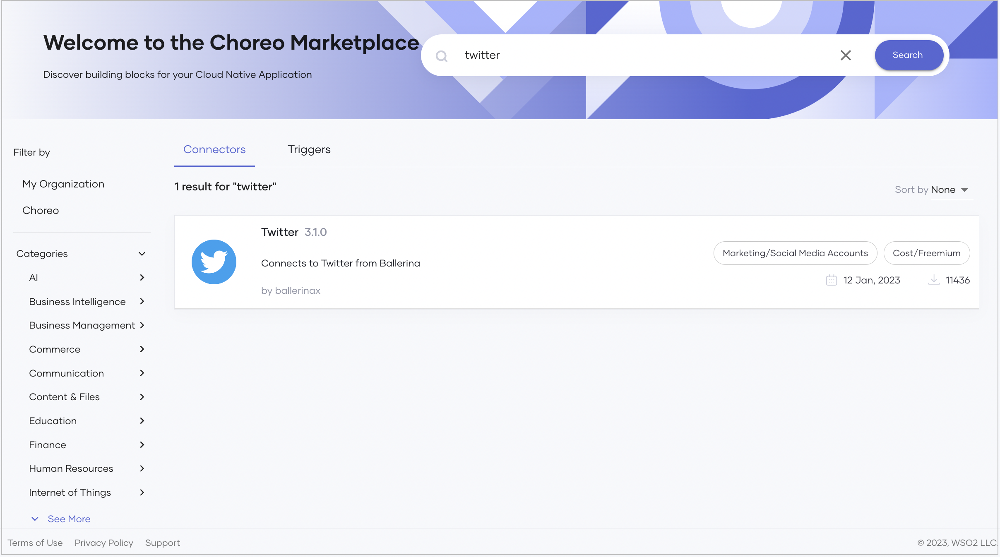

# Choreo Marketplace

The Choreo Marketplace promotes and facilitates API reuse. It offers a comprehensive collection of prebuilt connectors and triggers, which developers can use to design their cloud-native applications. Using the prebuilt connectors and triggers can save significant time and effort that otherwise would be spent on developing functionality from scratch.

The Choreo Marketplace also serves as a platform for API developers to publish their own connectors for Choreo users to access. These connectors can be made available for purchase or offered free of charge.

When you discover a connector or trigger in the Choreo Marketplace that meets your requirements, you can either purchase it, acquire it through a Freemium account or use it for free.

## Access the Choreo Marketplace

To access the Choreo Marketplace, follow the steps given below:

1. Sign in to the [Choreo Console](https://console.choreo.dev/).

2. In the left navigation menu, click **Marketplace**. This opens the Choreo Marketplace with the prebuilt connectors. 

    {.cInlineImage-full}

    If you want to view the triggers published by Choreo, click the **Triggers** tab.

     {.cInlineImage-full}

    If you want to view the connectors and triggers published by your organization, click **My Organization** under **Filter By**.

You can use the search or apply various filter criteria to easily find a connector or trigger that meets the requirements of the application you are designing.

When you filter or search for a connector or trigger, you can view the following details for each connector or trigger in the list:

- A brief description of the functionality.
- A label indicating the category.
- A label indicating whether the connector/trigger is free, available via Freemium, or paid.
- The vendor.
- The published date.
- The number of instances the connector/trigger is currently used.

If you want to view more information about a specific connector, click on it. This directs you to an overview page with details about versions, compatibility, and links for reporting issues, accessing API documentation, contacting the vendor, and more.

## Filter by category

To filter connectors and triggers by a specific category, click on a required category (for example, Finance) and then click on a required subcategory (for example, Accounting).

This displays the connectors and triggers that meet the filter criteria.

{.cInlineImage-full}

## Filter by price

To filter connectors and triggers on pricing, select one or more checkboxes under **Price** according to your requirement.

{.cInlineImage-full}
