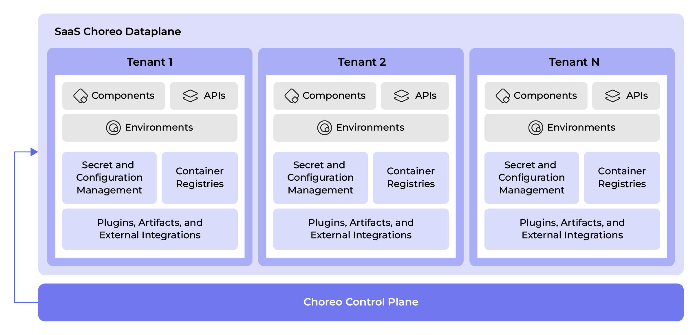
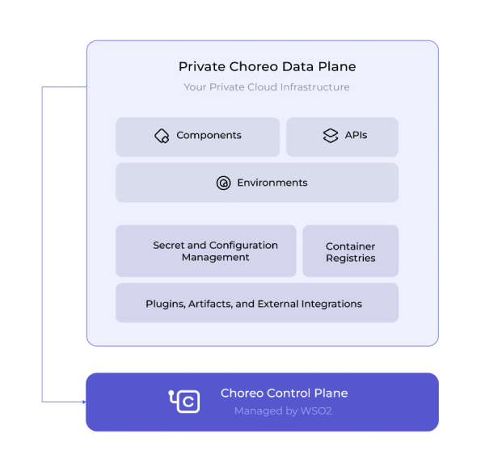

# Data Planes

The Choreo control plane serves as a configuration manager and orchestrator at its core. It comprises various components that assist developers in defining and creating Choreo applications. APIs facilitate communication between consumers and the Choreo control plane.

Similarly, the Choreo data plane is a Kubernetes cluster where applications are deployed and run. The data plane incorporates specific system components that allow user applications to run with the support of the control plane. While the data plane relies on the control plane for assistance, it can operate independently during a disaster scenario. All communication between the control plane and the data plane happens via APIs.

## Types of data planes

Choreo provides two types of data planes for users to run their cloud native applications.

### Cloud data plane

The cloud data plane is the default data plane available on Choreo. It is fully managed by WSO2 and runs on Microsoft Azure. It allows you to create and launch your applications in minutes, eliminating the need to provision infrastructure. 

The cloud data plane is an excellent solution for anyone who wants to develop and distribute applications via Choreo. However, users have limited control over the operations of the data plane since it is a multi-organization system. To enhance security among organizations executing applications in the cluster, several restrictions are implemented. The cloud data plane includes two preconfigured environments, namely development and production, which allow users to build, test, and deploy applications seamlessly using the Choreo Console. However, certain enterprises may require more control and flexibility beyond what is provided by the default cloud data plane. 

{.cInlineImage-full}

### Private data plane

The private data plane caters to users who want to have more privacy and control over their data plane. Private data planes operate alongside a user's current cloud services. As of now, private data planes are supported on Microsoft Azure and AWS. In the future, there will be more cloud providers.

Private data planes focus on satisfying the privacy and control aspect by allowing organizations to create and connect a data plane on their own infrastructure, granting them greater flexibility and control. Since the solution is dedicated to a single client, it becomes easier to establish compliance, data protection, and additional security measures. Private data planes enable the provisioning of multiple environments such as development, test, staging, and production, which are required by most businesses. WSO2 manages the client's data plane, providing better service level agreements (SLAs) and support. This ensures that developers can seamlessly use Choreo for developing and running cloud-native applications, maintaining the ease of use from development to production.

{.cInlineImage-threeQuarter}
