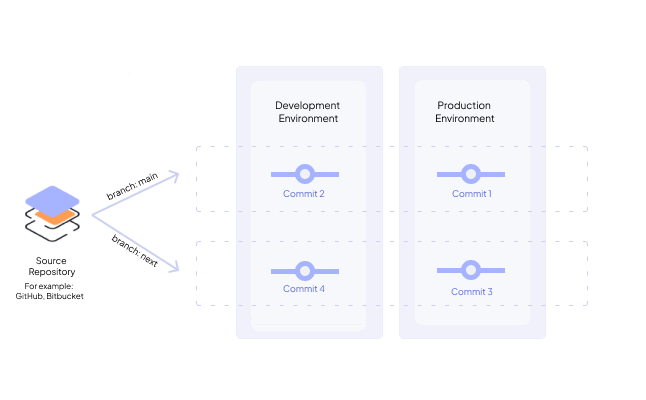

# Deployment Tracks

Deployment Tracks in Choreo are structured pathways for simplified software component deployment. They act like advanced CI/CD pipelines, ensuring your components reach their destinations seamlessly, whether from source code or prebuilt images. They establish an organized and structured approach that minimizes the chances of errors and challenges that are typically associated with deployment workflows.

## The significance of Deployment Tracks

Deployment Tracks offer practical solutions to enhance the API consumer experience by addressing two critical challenges:

- **Streamlined deployment**: Deployment Tracks serve as well-designed routes for your software components, enhancing the organization and reliability of the deployment process, similar to a well-structured express route.

- **Efficient API versioning**: Especially beneficial for managed APIs, Deployment Tracks provide a straightforward method for creating API versions that seamlessly interact with previous iterations. This simplified version management benefits both API creators and consumers alike.

## Streamlined deployments

For streamlined deployments, Choreo dissects two integral approaches that leverage Deployment Tracks: the comprehensive CI/CD integration and the focused CD-Only strategy.

### CI/CD with Deployment Tracks

A deployment track is linked to a particular branch within a GitHub repository. This connection is useful for handling deployments to various environments. On Choreo's Deploy page, you can easily visualize the deployments to specific environments associated with your selected deployment track. Moreover, the deployment track has a functionality that initiates automatic deployments for the linked branch. When activated, merging a pull request (PR) triggers a deployment to the development environment.

{.cInlineImage-half}

### CD-Only strategy with Deployment Tracks

If you're inclined to use your own Continuous Integration (CI) systems and want to harness the deployment track as a Continuous Deployment (CD) pipeline, you can seamlessly link deployment tracks to a container registry repository. This configuration empowers users to effortlessly deploy images sourced directly from the linked container registry repository.

{.cInlineImage-half}

## Efficient API versioning

**This section applies to only service components**. When working with service components in Choreo, it is important to have an effective API versioning mechanism. Choreo follows a versioning mechanism based on Semantic Versioning (SemVer) but only includes the major version and minor version with the prefix `v`. 

For example, `v1.2`. 

You can follow the approach given below when you version APIs in Choreo:

  - Increment the major version when you make incompatible API changes.
  - Increment the minor version when you add functionality in a backward-compatible manner.

!!! info "What is Semantic Versioning?"
    Semantic Versioning (SemVer) is a specification that defines how to assign and increment version numbers for software products, including APIs. For more information, see [Semantic Versioning specification](https://semver.org/#semantic-versioning-specification-semver).

One of the primary concerns when dealing with SaaS APIs is to minimize disruption for API consumers while continuously developing and deploying updates.

In compliance with SemVer, changes that don't introduce breaking or additive modifications to the API are categorized as patch updates. Hover, from the perspective of API consumers, these changes should ideally not disrupt their API clients. Typically, API consumers are most concerned with major API version alterations, but there might be instances where minor version changes are communicated to them.

Therefore, in the context of deployment tracks, API developers only need to specify the major and minor versions being delivered from a particular deployment track. This information is treated as the API version attribute of a deployment track. If the publisher requires versioning for internal tracking purposes, this can be accomplished in Git through the use of Git tags, on GitHub with GitHub releases, and so forth.

{.cInlineImage-half}
