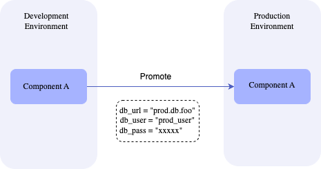

# Environments

Choreo offers developers one or more environments to run their applications within a given data plane. By default, the Choreo cloud data plane provides two environments (i.e., development and production). Each project in Choreo is associated with one or more  environments available in the organization. For example, project A may choose to utilize dev, staging, and production environments, while project B may only use development and production environments.

You can promote components within a project across available environments. When you promote a component, its configuration values can be overridden with environment-specific values.

The following diagram illustrates how a component is promoted across environments.

{.cInlineImage-threeQuarter}
