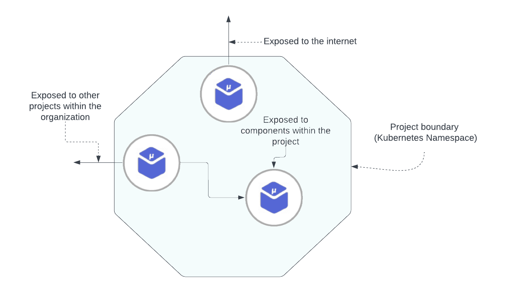

# Project

A project in Choreo is a logical group of related components that typically represent a single cloud native application. A project consists of one or more components. All components within a project can ideally be (but is not restricted to) in a single GitHub repository under different paths. This is also known as the monorepo architecture.

At deployment time, all components within a given project are deployed into a single namespace of the Kubernetes cluster. Components within a project can be exposed to the public internet, internally to the rest of the organization, or privately within the project only. A project in Choreo is represented as a cell with regard to the [Cell-based architecture](https://github.com/wso2/reference-architecture/blob/master/reference-architecture-cell-based.md). The following diagram illustrates a project and how the components within a project are laid out at runtime:

{.cInlineImage-full}

