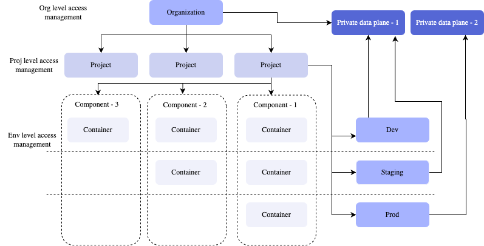
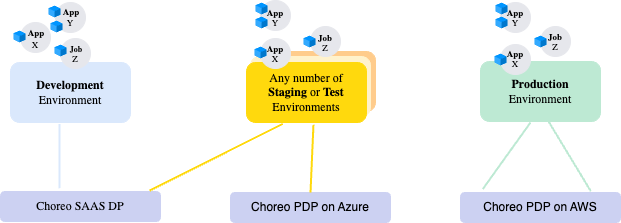

# Resource Hierarchy

The following diagram depicts the high-level resources and their relationships in Choreo.

{.cInlineImage-full}

## Organizations and data planes

Data planes are connected to the organization and are available for all the projects in the organization. When you create an environment in a project, the data plane connected to the organization is linked with an automatically generated Kubernetes namespace.

## Environments and data planes

Choreo allows multiple Kubernetes clusters to be associated with an environment.

This allows you to build highly resilient and resource-efficient solutions that utilize multiple clusters. Choreo handles the synchronization of your applications and workloads between associated clusters in an environment, making multi-cluster deployments possible with a click of a button.

The following diagram depicts how multiple clusters associate with different environments:

{.cInlineImage-full} 

!!! info "Note"
    It is not necessary to use a different cluster per environment. You can create multiple environments on the same cluster. The above diagram is only an example of a specific solution. Your application architecture may require an entirely different configuration than what is depicted in the diagram.

## Components and environments

Components belong to a project in Choreo and environments are provisioned per project as well. When a component is deployed, it is deployed as a container to the specified environment. Once deployed, you can promote the container image across the environments available in the project.

