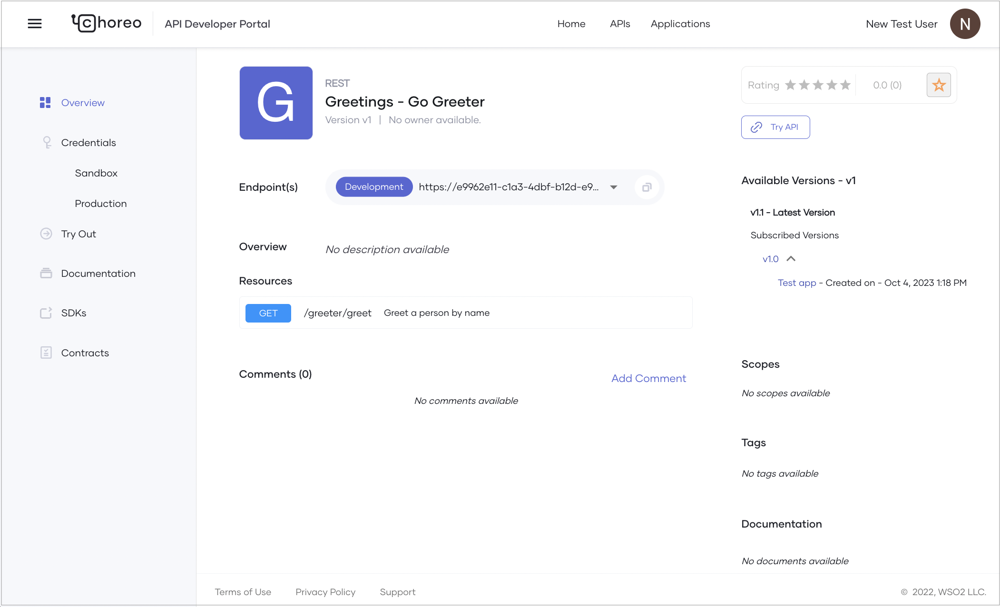

# Consume a Service

Choreo is a platform that allows you to create, deploy, and consume services seamlessly. The Choreo Developer Portal simplifies discovering and using APIs for API consumers. 

Typically, an application developer who may be internal or external to your organization would want to consume the APIs published in the Developer Portal to develop their applications. In this guide, you will learn how to discover, generate credentials, and test the consumption of a service published in the Choreo Developer Portal. You will also learn how to invoke the service via a web application. 

This guide walks you through the following steps:

- Create an application in the Developer Portal and generate credentials for the application. 
- Subscribe the API to the application.
- Consume a published REST API via your web application.

## Prerequisites

Before you try out this guide, if you do not have a published service that you would want to consume via the Developer Portal, follow [Develop a Service](../develop-components/develop-services/develop-a-service.md) documentation to publish and deploy a sample REST API. 

## Discover APIs

In the Choreo Developer Portal, developers can use the search option to find APIs by name. The APIs and services that are created and published through the Choreo Console become visible in the Developer Portal depending on the API's visibility as follows:

 - **Public**: The API is **visible to all** in the developer portal.

 - **Private**: The API is visible to the **users who only sign in to the Developer Portal**.

 - **Restricted**: The API is **visible to only the user that has the roles that you specify**. This option helps developers to enforce fine-grained access control to the API.

To learn more about API visibility, see [Control API Visibility](../api-management/control-api-visibility.md).

The Choreo Developer Portal lists APIs based on their major version. 


The overview page of an API displays the subscribed versions of the API along with the respective subscription details such as the subscribed application and the application creation date.



!!! tip
      If you want to use an API, the recommended approach is to use the latest version of it. You can copy the major version pattern provided as the value of **Endpoints(s)** on the API overview page and use it in your client application. This ensures that your application always invokes the latest API version.

## Create an application



## Subscribe to an API



## Consume the API via your web application

You can invoke the API/service using the credentials you created above. Since Choreo services are secured, you need to invoke the services securely with the help of your IdP. To invoke the API/service you created securely, you need to follow the steps below:

1. Create a web application in Choreo.
2. Create an OAuth application in the IdP. 
3. Configure the web application to authenticate the API/service invocations from the IdP, and securely invoke the service/API in Choreo.
4. Deploy the web application. 

In this guide, you will be using the following products and examples:

-  WSO2 Asgardeo as the IdP
- [choreo-samples/reading-list-app/reading-list-front-end](https://github.com/wso2/choreo-samples/tree/main/reading-list-app/reading-list-front-end) as the web application. This is a React SPA that invokes the service using Axios. This web application is configured to read the
[choreo-samples/reading-list-app/reading-list-service](https://github.com/wso2/choreo-samples/tree/main/reading-list-app/reading-list-service) as the service. You can modify this web application to read your service, or [deploy the choreo-samples/reading-list-app/reading-list-service](../quick-start-guides/deploy-a-web-application-that-consumes-a-backend-service.md#step-12-configure-the-sample-service-and-publish-it-as-a-rest-api) in Choreo and use it. 

### Step 1: Create a web application component

!!! info
    You can use your own web application implementation in place of the sample web application. For this exercise, let's use the [choreo-samples/reading-list-app/reading-list-front-end](https://github.com/wso2/choreo-samples/tree/main/reading-list-app/reading-list-front-end) as the web application.

To host the front-end application in Choreo, you must create a web application component. To create a web application component, follow the steps given below.

1. In the Choreo console, select the project of the reading list application that you created in the previous steps, from the project list located on the header.
2. Click **Create** under the **Component Listing** section to create a new component.
3. On the **Web Application** card, click **Create**.
4. Enter a unique name and a description for the web application. You can enter the name and description given below:

    | **Field**       | **Value**               |
    |-----------------|-------------------------|
    | **Name**        | `Reading List Web App`  |
    | **Description** | `Frontend application for the reading list service` |

5. Click **Next**.
6. To allow Choreo to connect to your GitHub account, click **Authorize with GitHub**.
7. In the **Connect Repository** pane, enter the following information:

    | **Field**             | **Description**                               |
    |-----------------------|-----------------------------------------------|
    | **GitHub Account**    | Your account                                  |
    | **GitHub Repository** | **`choreo-samples`** |
    | **Branch**            | **`main`**                               |
    | **Buildpack**      | Click **React** since the frontend is a React application built with Vite|
    | **Build Context Path**              | **`reading-list-app/reading-list-front-end`** |
    | **Build Command**     | **`npm install && npm run build`**             |
    | **Build Output**      | **`dist`**                                    |
    | **Node Version**      | **`18`**                                      |

9. Click **Create**. This initializes the service with the implementation from your GitHub repository and takes you to the **Overview** page of the component.

Let's consume the service through the web app. Choreo services are by default secured. To consume a service in Choreo you need an access token. Let's configure the web application to connect to an IdP (For this guide, let's use Asgardeo) to generate an access token for a user.

### Step 2: Create an OAuth application in the IdP

To invoke the service/API in Choreo you require a token. To obtain a token you need to create an OAuth application in the IdP. If you use any other IdP other than Asgardeo, create an OAuth application and set the following:

-  **Allowed grant types**:  Code
-  **Public client**: Mark as a public client in an application.
-  **Authorized redirect URLs**: Enter the web app URL you copied earlier.
-  **Allowed origins** field: Add the same URLs that you added as authorized redirect URLs.
-  **Access Token**: Set  JWT as the Token type.

Choreo uses Asgardeo as the default identity provider for Choreo applications. When you create an application in the Choreo Developer Portal, it automatically creates a corresponding application in Asgardeo. You can go to the Asgardeo application to specify the configurations required for end users to sign in to the front-end application. Follow the steps below to configure the Asgardeo OAuth application:

1. Access Asgardeo at [https://console.asgardeo.io/](https://console.asgardeo.io/) and sign in with the same credentials with which you signed in to Choreo.
2. Make sure you are in the same organization that you were when you created the application in the Choreo Developer Portal. You can click the **Organization** list in the Asgardeo Console top menu and ensure you are in the correct organization.
3. In the Asgardeo Console's left navigation, click **Applications**. You will see the **readingListApp** that Choreo automatically created for you.
4. Click on the edit icon to edit the application.
5. Click the **Protocol** tab and apply the following changes:

    1. Under **Allowed grant types**, select **Code**.
    2. Select the **Public client** checkbox.
    3. In the **Authorized redirect URLs** field, enter the web app URL you copied earlier and click the **+** icon to add the entry.
    4. In the **Allowed origins** field, add the same URLs that you added as authorized redirect URLs.
    5. Under **Access Token**, select **JWT** as the **Token type**.
    6. Click **Update**.

### Step 3: Configure the web application to connect to the IdP and invoke the service

In this step, you are adding the configurations needed for the web app to successfully invoke the **Reading List Service** REST API. These configurations need to be updated for each environment you deploy the web app. Here you will be updating the configurations for the development environment.

!!! note
        The web application is reading the environment-specific configurations from the `window` object at runtime. This is done via the `config.js` file in the root of the web application. In this section, you will mount the `config.js` file for the development environment. You will need to do the same for other environments as well when you deploy your web application to multiple environments.

To configure the front-end application, follow the steps given below:

1. While on the web application component page, click **DevOps** in the left navigation menu and then click **Configs and Secrets**.
2. Click **+ Create**.
3. Select the mount configuration options as follows and click **Next**:

    | **Field**             | **Description**                               |
    |-----------------------|-----------------------------------------------|
    | **Config Type**       | **Config Map**                                |
    | **Mount Type**        | **File Mount**                                |

4. Specify values as follows for the mount configuration:

    | **Field**             | **Description**                               |
    |-----------------------|-----------------------------------------------|
    | **Config Name**       | **Web App Config**                            |
    | **Mount Path**        | **/usr/share/nginx/html/config.js**. Every config that needs to be exposed through the web server should be placed inside `/usr/share/nginx/html/`                          |

5. Copy the config details as a JSON file as shown below into the text area. Fill the placeholders with the values you copied from the previous steps as mentioned in the table below:

    ```javascript
    window.config = {
        redirectUrl: "<web-app-url>",
        asgardeoClientId: "<asgardeo-client-id>",
        asgardeoBaseUrl: "https://api.asgardeo.io/t/<your-org-name>",
        choreoApiUrl: "<reading-list-service-url>"
    };
    ```

    | **Field**             | **Description**                               |
    |-----------------------|-----------------------------------------------|
    | **redirectUrl**       | The web app URL you copied earlier. |
    | **asgardeoClientId**  | The **Client ID** of your OAuth application. In Asgardeo, you can find it on the **Protocol** tab of the **readingListApp** application  |
    | **asgardeoBaseUrl**   | Specify the IdP API URL (For example, Asgardeo API URL) with your organization name. i.e., `https://api.asgardeo.io/t/<ORG_NAME>`.      |
    | **choreoApiUrl**      | The reading list service URL. Copy the Public URL of the **Reading List Service** component from the endpoint table in the overview page for the relevant environment |

6. Click **Create**.

Now you can proceed to deploy the web application.

### Step 4: Deploy the web application

To deploy the web application component, follow the steps below:

1. In the left menu, click **Deploy**.
2. In the **Build Area** card, click **Deploy Manually**. The deployment may take a few minutes to complete.
3. Once the web application is deployed, copy the **Web App URL** from the development environment card.
4. Navigate to the web app URL. You can verify that the web app is successfully hosted.

That's it! You can use a user created in your IdP and invoke the service through your web application.
