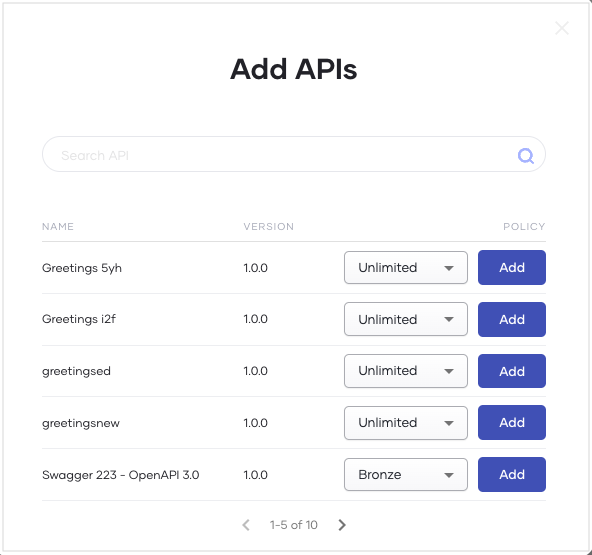

You must subscribe to a published API to use it in your application. New API subscriptions cover all minor versions within the subscribed API’s major version.

The subscription process is designed to ensure the secure authentication of API requests via application keys. Alternatively, you can generate credentials for an API without an explicit subscription to an application. However, this approach limits the capability to control advanced configurations such as access token expiry time, revoke token expiry time, ID token expiry time, and enabling access to the API without a secret. Generating keys in the API is recommended for testing or short-term usage but not for long-term production usage. 

To subscribe to an API via an application, follow the steps given below: 

1. Sign in to the [Choreo Developer Portal](https://devportal.choreo.dev).
2. In the Developer Portal header, click **Applications**.
3. On the **My Applications** page, click on the application with which you want to subscribe to an API.
4. In the left navigation menu, click **Subscriptions**. 
5. In the **Subscription Management** pane that opens, click **+ Add APIs**. 
6. Click **Add** to subscribe to an API. Depending on your requirement, you can subscribe to one or more APIs.

    !!! tip
          When a new minor version of an API is published, the major version-based invocation URL will automatically route to the latest minor version within the subscribed API's major version. This ensures that existing client applications can continue to function without disruption while benefiting from the improvements or additions in the newer minor version.

    

    Once you subscribe to an API, you can invoke the API using the application keys. 
