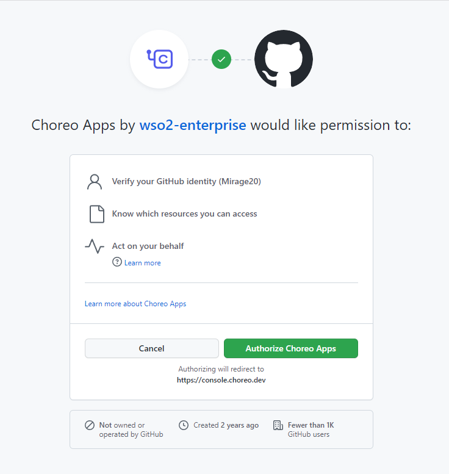

# Deploy a Ballerina Application 

Choreo natively supports deploying Ballerina language based applications with comprehensive set of features build into the Choreo including configuration generation,
easy management of APIs, and powerful application observability features.

Following component types are supported for the Ballerina application deployments:

- Service
- Scheduled Trigger
- Manual Trigger
- REST API
- GraphQL
- Webhook

## Connect your repository to Choreo

### GitHub repository

In order to connect your GitHub repository to Choreo, you need to authorize the [Choreo Apps](https://github.com/marketplace/choreo-apps) GitHub application to be installed to your account or organization. 
You will be prompted to authorize the **Choreo Apps** when you try to connect your GitHub repository via the Component creation page.

* Connect GitHub Repository
    
    {.cInlineImage-threeQuarter}

* Authorize GitHub Application
    
    {.cInlineImage-quarter height="600px"}

* Grant Repository Access

    {.cInlineImage-full height="600px"}


    The **Choreo Apps** requires the following permission:
    
    - Read access to issues and metadata
    - Read and write access to code, pull requests, and repository hooks

!!! note
    You can [revoke access](https://docs.github.com/en/authentication/keeping-your-account-and-data-secure/reviewing-your-authorized-integrations#reviewing-your-authorized-github-apps) if you do not want Choreo to have access to your GitHub account. Choreo needs write access only to send pull requests to a user repository. Choreo does not directly push any changes to a repository.

Once you grant access to the necessary repositories, you can select the repository to connect to the Choreo component with an associated branch to start with.
For the Ballerina application deployments, you should select the **Ballerina** as the **Build Preset** and provide **Project Path** that contains the root of the [Ballerina package](https://ballerina.io/learn/package-references/).

{.cInlineImage-full}

#### Ballerina package directory structure

Following is a minimum sample directory structure of a Ballerina package.
```
.
├── Ballerina.toml
├── Dependencies.toml
└── service.bal
```

!!! note
    In order for you to connect as a Ballerina component, the repository should contain a Ballerina project with a Ballerina.toml file in the root of the selected directory.

!!! info
    We recommend you to commit the Dependencies.toml file in order to make reproducible builds with exact dependencies specified in the file. 

## Deploy the Ballerina component

Depending on the component type you selected, when creating the component, Choreo will pick relevant deployment configurations and settings to apply.
For example, if you selected the **Service** component type, Choreo will deploy it as Kubernetes deployment with relevant scaling configurations.

### Application configurations

Choreo has the built-in support for the Ballerina [configurable variables](https://ballerina.io/learn/configure-ballerina-programs/configure-a-sample-ballerina-service/).
Based on the commit you select to deploy, Choreo will prompt you to provide the necessary values for the configurable variables.


{.cInlineImage-half}

### Deployment configurations

Depending on the component type, Choreo will allow you to configure the deployment configurations such as scaling, resource limits, and health check configurations.

For more information about these configurations, see the [DevOps capabilities](./devops/runtime.md).

The **Service** component will additionally allow you to configure the **Endpoints** to expose your service. See [Service Component](../develop/components/service.md) for more information.


### Build, Deploy and Promote

After adding the application configuration, you can build and deploy it by clicking the **Deploy Manually** button. Choreo will start the build process with the selected commit in the **Build Area**. 

!!! note
    The **Auto Deploy on Commit** option is enabled by default which builds and deploys the application automatically when you push a code change to the repository.
    If you do not want this behavior, you can disable it from the **Build Area**.

During the build and deploy is in progress, you can check the build logs from the right side panel as shown in the below image.
Once the build is successful, the application will be automatically deployed to the Development environment, and you can promote it to the higher environments by clicking the **Promote** button.
Depending on your environment configurations, you may see multiple environment cards in the page.

{.cInlineImage-full}
