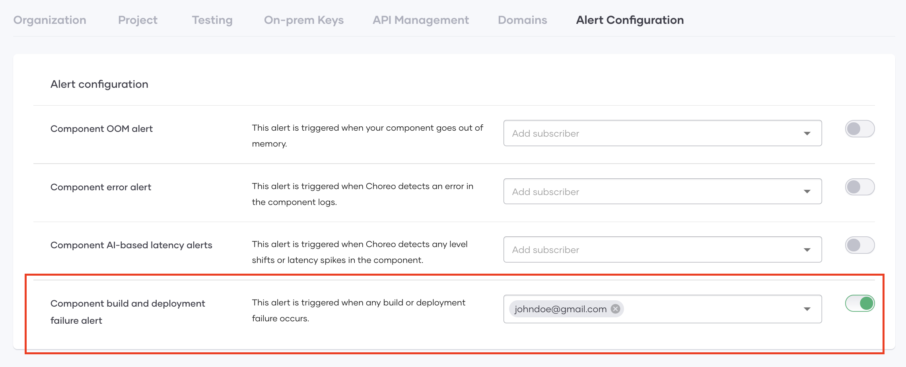
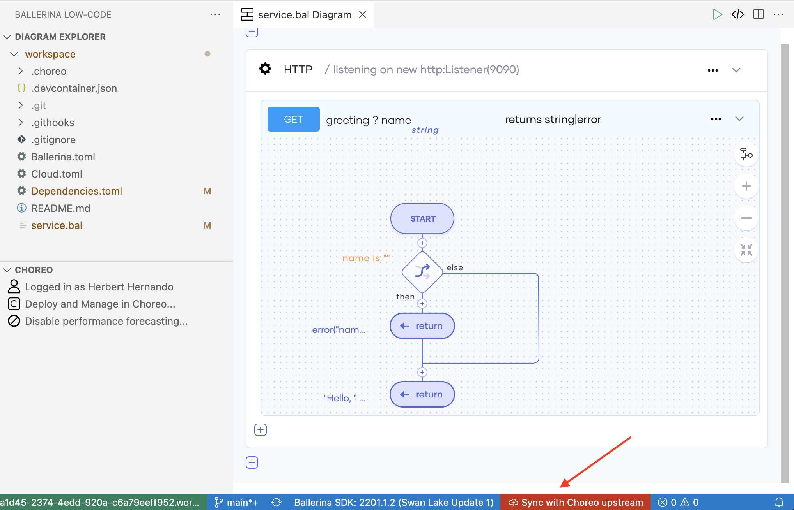
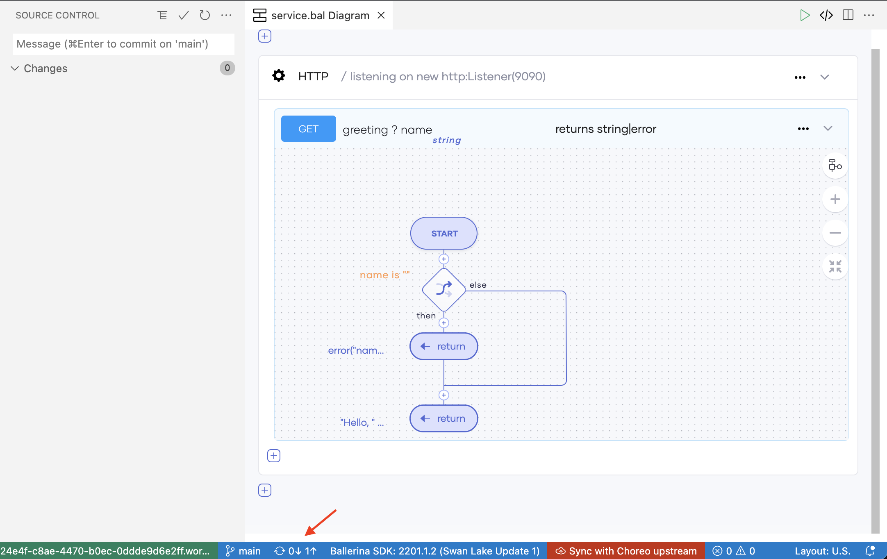
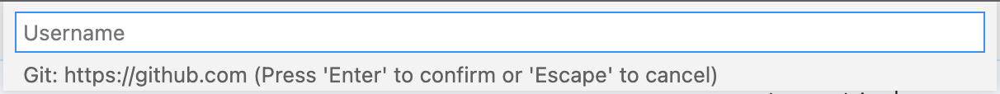
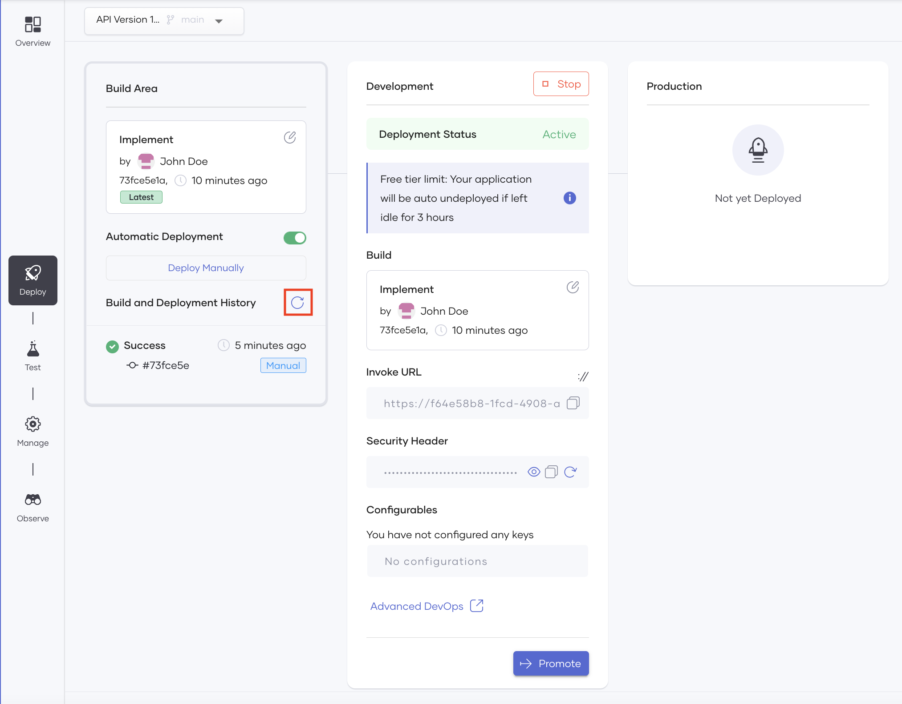
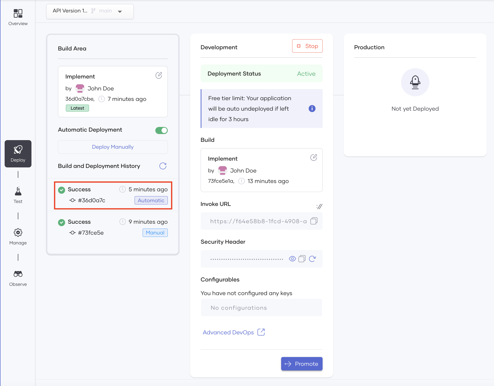

# Configure Automatic Deployment

Automatic deployment allows you to trigger a build every time you edit your component implementation and commit changes. 

When multiple developers collaborate to develop a component, each developer may edit the design many times. In such scenarios, it can be cumbersome to deploy the component manually for each edit. Automatic deployment eliminates this need by automatically running the build for each commit that applies a change to the component design.

!!! note
    Choreo allows you to configure automatic deployment only when you save the component implementation in a GitHub repository that you own and manage because Choreo-managed repositories are not accessible to external users.

This tutorial walks you through the steps to enable automatic deployment for a component. In this tutorial, you will:

- Configure automatic deployment for a REST API.
- Commit updates to the REST API implementation and observe automatic builds.

## Step 1: Connect your own GitHub repository for a REST API

First, let's create a REST API and store the source code in your GitHub repository.

For instructions, see [Connect Your Own GitHub Repository to Choreo](../develop/manage-repository/connect-your-own-github-repository-to-choreo.md)

## Step 2: Enable automatic deployment

To enable automatic deployment for your REST API, follow the steps given below:

1. First, run a manual build. To do this, click **Deploy** in the left pane and then click **Build and Deploy**.

    !!! info
        Choreo requires you to perform the first deployment of each component manually so that you can provide values for any configurable variables that the implementation may include.

2. Click the **Automatic Deployment** toggle to enable automatic deployment.

    !!! info
        You need to verify your GitHub account when you enable automatic deployment for the first time.

3. In the message that appears on the bottom-right of the page , click **Configure Alert*. The **Alert Configuration** tab of the **Settings** page opens.

4. For the **Component build and deployment failure alert**, enter a valid email address and click the toggle to enable the alert.

    {.cInlineImage-threeQuarters}

Now automatic deployment is enabled for your REST API and a build should be automatically triggered every time you commit a change to the REST API implementation. To verify this, move on to Step 3.

## Step 3: Commit changes to trigger the automatic build

To verify whether your REST API implementation gets automatically deployed when you push commits, follow the steps given below:

1. In the Choreo Console, navigate back to the REST API component for which you enabled automatic deployment.

2. To update the implementation, click **Overview** in the left pane and then click **Edit Code**. The Web Editor opens.

3. In the Web Editor, make an edit to the REST API implementation. For example, click the last return statement, replace `Hello` in the statement with `Hi`, and click **Save**.

    !!! info
        To edit this value, double-click it.

4. Click **Sync with Choreo Upstream** in the Git status bar.

    {.cInlineImage-threeQuarters}

    In the message that appears, click **Sync my changes with Choreo**.

5. In the left pane, enter a commit message (e.g., `Implement REST API`) and click the tick.

    {.cInlineImage-threeQuarters}

    You will get a message prompting you to configure your `user.name` and `user.email`. To proceed, follow the steps given below:

    1. In the message, click **Open Git Log**.
   
    2. Click **Terminal** to open the in-built terminal and issue the following commands (with the placeholders replaced with the email and username you use for GitHub):
             
        - `git config --global user.email "<YOUR_GITHUB_EMAIL_ADDRESS>"`
        - `git config --global user.name "<YOUR_GITHUB_USERNAME">`

6. To push the changes to your GitHub repository, click **0↓ 1↑** in the Git Status Bar.

    {.cInlineImage-threeQuarters}

    !!! info
        This icon only appears after the Web Editor completes the committing process.

7. Click **OK** in the message that appears.

8. In the **Username** field that appears, enter your GitHub username and press Enter/Return.

    {.cInlineImage-half}

9. In the **Password** field that appears, enter your personal access token for GitHub and press Enter/Return.

10. Return to the tab in which you are running the Choreo Console.

11. In the left pane, click **Deploy**.

12. Click the refresh icon next to **Build and Deployment History**.

     {.cInlineImage-threeQuarters}

    The **Build and Deployment History** section will display a new record with the **Automatic** label as shown below for the automatic build you triggered with your last commit.

    {.cInlineImage-threeQuarters}

    You can click on this record to open the **Console** panel and view the logs that Choreo generated when it deployed the REST API.

    The commit ID in the record (starting with **#**) is the commit that triggered the automatic deployment. You can click on it to view it in GitHub.

