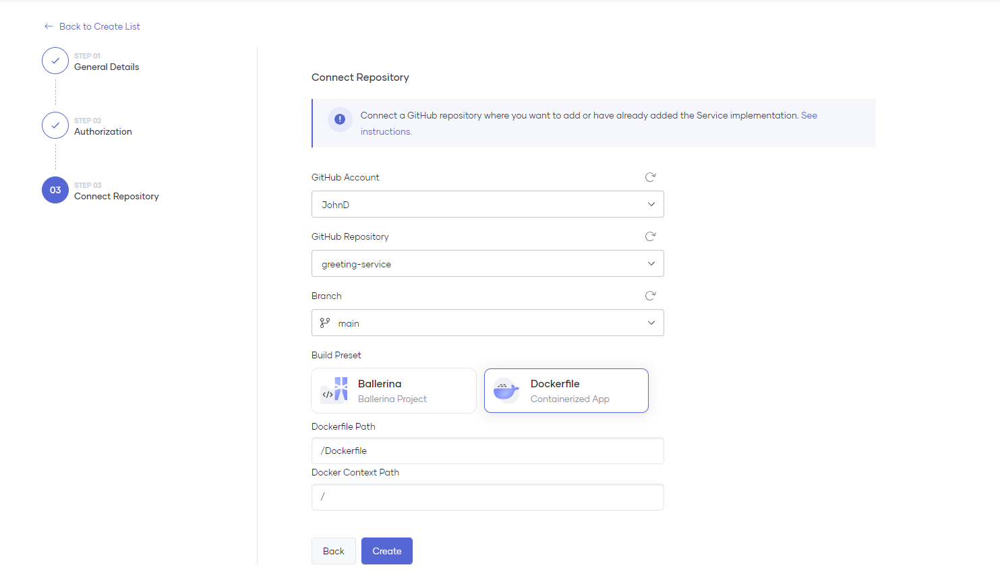

# Deploy a Containerized Application 

Choreo allows you to deploy an application written in a wide range of language frameworks (for example, Java, Go, NodeJs, Python, etc.) on shared or private data planes using containers.

Following component types are supported for the containerized application deployments:

- Service
- Scheduled Trigger
- Manual Trigger
- REST API

## Connect your repository to Choreo

### GitHub repository

In order to connect your GitHub repository to Choreo, you need to authorize the [Choreo Apps](https://github.com/marketplace/choreo-apps) GitHub application to be installed to your account or organization. 
You will be prompted to authorize the **Choreo Apps** when you try to connect your GitHub repository via the Component creation page.

* Connect GitHub Repository
    
    {.cInlineImage-threeQuarter}

* Authorize GitHub Application
    
    {.cInlineImage-quarter height="600px"}

* Grant Repository Access

    {.cInlineImage-full height="600px"}

    The **Choreo Apps** requires the following permission:
    
    - Read access to issues and metadata
    - Read and write access to code, pull requests, and repository hooks

!!! note
    You can [revoke access](https://docs.github.com/en/authentication/keeping-your-account-and-data-secure/reviewing-your-authorized-integrations#reviewing-your-authorized-github-apps) if you do not want Choreo to have access to your GitHub account. Choreo needs write access only to send pull requests to a user repository. Choreo does not directly push any changes to a repository.

Once you grant access to the necessary repositories, you can select the repository to connect to the Choreo component with an associated branch to start with.
For the containerized application deployments, you should select the **Dockerfile** as the **Build Preset** and provide **Dockerfile Path** and [**Docker Context Path**](https://docs.docker.com/build/building/context/#path-context) for the docker build.

{.cInlineImage-full}

The following table describes the individual fields in the **Connect Repository** form.

| **Field**               | **Description**                                                                                                                                                                      |
|-------------------------|--------------------------------------------------------------------------------------------------------------------------------------------------------------------------------------|
| **GitHub Account**      | Your GitHub account or organization. If you want to add another GitHub account, you can expand the list and click **+ Add**.                                                            |
| **GitHub Repository**   | Depending on the repository access you provided, the drop down will show available repositories to be connected.                                                                                  |
| **Branch**              | The branch of the repository.                                                                                                                                                         |
| **Build Preset**        | Determines the implementation of the component: Ballerina or any other language as a Docker container.                                                                                |
| **Dockerfile Path**     | The path to your Dockerfile. This path is defined relative to the repository root. e.g., If the Dockerfile is at the repository root, the value for this field is `/Dockerfile`. |
| **Docker Context Path** | The Docker build context path. To include the repository root, leave the default `/` value.                                                                                          |
| **Port***               | The port at which your service is running.                                                                                                                                           |
| **OpenAPI Filepath***   | The path to an OpenAPI specification (in YAML/JSON) relative to the repository root. If you do not specify a path, the system auto-generates a default `allow-all` specification.    |

!!! note
    Fields marked with **\*** are not visible for all component types.

!!! note
    To successfully build your container with Choreo, it is essential to explicitly define a User ID (`UID`) under the `USER` instruction in your Dockerfile. You can refer the [sample Dockerfile](https://github.com/wso2/choreo-sample-apps/blob/main/go/rest-api/Dockerfile) for guidance.

    To ensure that the defined USER instruction is valid, it must conform to the following conditions:
        
    - A valid User ID is a numeric value between 10000-20000, such as `10001` or `10500`.
    - Usernames are not considered as valid and should not be used, for example, `my-custom-user-12221` or `my-custom-user` are not valid User IDs.

## Deploy the Containerized component

Depending on the component type you selected, when creating the component, Choreo will pick relevant deployment configurations and settings to apply.
For example, if you selected the **Service** component type, Choreo will deploy it as Kubernetes deployment with relevant scaling configurations.

### Application configurations

If there are any configurations that are required for running the application, you need to provide them in the **Configs & Secrets** section of the component **Deploy** page.

Once you click **Create** button, you have the option to select confidentiality of the configuration and the way it should be mounted to the container.

{.cInlineImage-full}

{.cInlineImage-full}

#### Configuration Types

* **ConfigMap**: Stores non-confidential data as key-value pairs.
* **Secret**: Stores and manages sensitive information, such as passwords, OAuth tokens, and ssh keys as key-value pairs.

#### Mount Types

* **Environment Variables**: Mounts the selected ConfigMap or Secret as an environment variable in the container.
* **File Mount**: Mounts the selected ConfigMap or Secret as a file in the container. Here, the key will be the file name and the value will be the file content.

The following image shows adding a **ConfigMap** with **File Mount** mount type to be read by the application.

{.cInlineImage-full}

!!! note
    In the above JSON file, the `${DB_PASS}` is an environment variable that is defined in a Secret. 
    The application will read the JSON file and replace any placeholders with environment variables.

### Deployment configurations

Depending on the component type, Choreo will allow you to configure the deployment configurations such as scaling, resource limits, and health check configurations.

For more information about these configurations, see [DevOps Portal](../devops/devops-portal.md).

The **Service** component will additionally allow you to configure the **Endpoints** to expose your service. See [Service Component](../develop/components/service.md) for more information.

### Build, Deploy and Promote

After adding the application configuration, you can build and deploy it by clicking the **Deploy Manually** button. Choreo will start the build process with the selected commit in the **Build Area**. 

!!! note
    The **Auto Deploy on Commit** option is enabled by default which builds and deploys the application automatically when you push a code change to the repository.
    If you do not want this behavior, you can disable it from the **Build Area**.

During the build phase, Choreo will scan your Dockerfile for any security vulnerabilities and start the build process if there are no vulnerabilities found.
Once the image is built, the final image will be scanned for any security vulnerabilities before deploying it to the environment.
You can check the build logs from the right side panel as shown in the below image.

{.cInlineImage-full}

Once the build is successful, the application will be automatically deployed to the Development environment, and you can promote it to the higher environments by clicking the **Promote** button.
Depending on your environment configurations, you may see multiple environment cards in the page.

{.cInlineImage-full}

