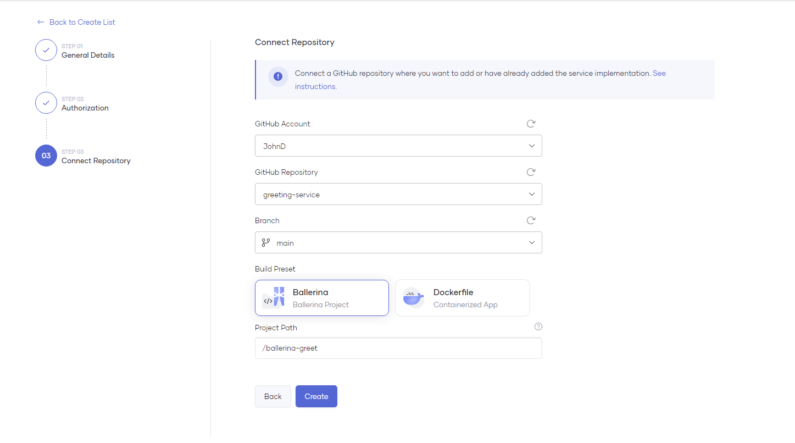

# Deploy a Ballerina Application 

Choreo natively deploys Ballerina applications with a comprehensive set of features. These include configuration generation, API management, and powerful observability features. 

Choreo supports Ballerina application deployment for the following component types:

- Service
- Scheduled Trigger
- Manual Trigger
- REST API
- GraphQL
- Webhook

## Connect your repository to Choreo

To connect your GitHub repository to Choreo, you should authorize the [Choreo Apps](https://github.com/marketplace/choreo-apps) GitHub application to access your account or organization. When you attempt to connect your GitHub repository via the Component creation page, the Choreo Apps authorization prompt will appear.

* Connect GitHub Repository
    
    {.cInlineImage-threeQuarter}

* Authorize GitHub Application
    
    {.cInlineImage-quarter height="600px"}

* Grant Repository Access

    {.cInlineImage-full height="600px"}

    The **Choreo Apps** requires the following permission:

    - Read access to issues and metadata
    - Read and write access to code, pull requests, and repository hooks

!!! note
    You can [revoke access](https://docs.github.com/en/authentication/keeping-your-account-and-data-secure/reviewing-your-authorized-integrations#reviewing-your-authorized-github-apps) if you do not want Choreo to have access to your GitHub account. Choreo needs write access only to send pull requests to a user repository. Choreo does not directly push any changes to a repository.

After granting access to the required repositories, you can choose a repository and an associated branch to connect to the Choreo component.
For the Ballerina application deployments, you should select the **Ballerina** as the **Build Preset** and provide the **Project Path** that contains the root of the [Ballerina package](https://ballerina.io/learn/package-references/).

{.cInlineImage-full}

#### Ballerina package directory structure

Following is a minimum sample directory structure of a Ballerina package.
 
```
.
├── Ballerina.toml
├── Dependencies.toml
└── service.bal
```

!!! note
    - To  connect your repository  under the `Ballerina` preset, you need to ensure that your repository contains a Ballerina project with a Ballerina.toml file located in the root directory of the selected folder.
    - To enable reproducible builds with exact dependencies specified in the file, we recommend you commit the Dependencies.toml file.

## Deploy the Ballerina component

Choreo will automatically apply deployment configurations and settings based on the component type you select during creation.
For example, if you select the Service component type, Choreo will deploy it as a Kubernetes deployment with appropriate scaling configurations.

### Application configurations

Choreo has the built-in support for the Ballerina [configurable variables](https://ballerina.io/learn/configure-ballerina-programs/configure-a-sample-ballerina-service/).
Choreo will prompt you to provide configurable variable values based on the selected commit for deployment.

{.cInlineImage-half}

### Deployment configurations

Choreo lets you configure deployment settings such as scaling, resource limits, and health checks depending on the component type you choose.

For more information about these configurations, see [DevOps Portal](../devops/devops-portal.md).

You can configure the **Endpoints** to expose your service using the **Service** Component in Choreo. See [Service Component](../develop/components/service.md) for more information.

### Build, Deploy, and Promote

After adding the application configuration, you can build and deploy it by clicking the **Deploy Manually** button. Choreo will start the build process with the selected commit in the **Build Area**. 

!!! note
    The **Auto Deploy on Commit** feature, which automatically builds and deploys the application upon pushing a code change to the repository, is enabled by default. To turn off this feature, navigate to the **Build Area**.

While building and deploying the application, you can view the build logs from the right-side panel. Choreo will automatically deploy the application to the Development environment once the build against the application is successful. You can then promote it to a higher environment by clicking the Promote button. The page may display multiple environment cards depending on your environment configurations.

{.cInlineImage-full}
