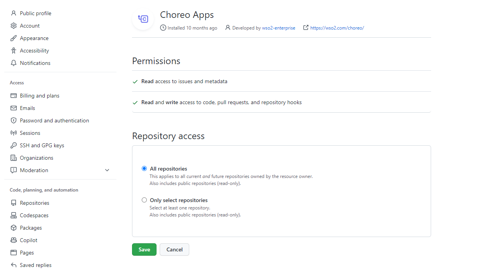
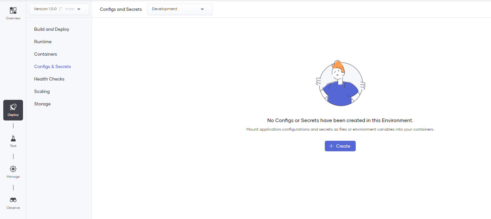
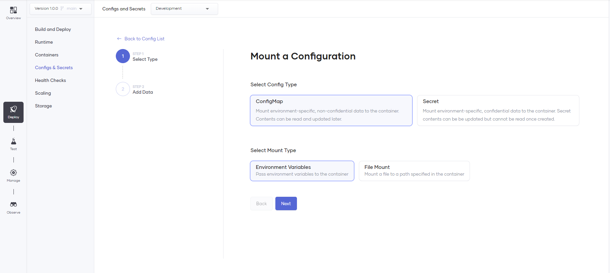
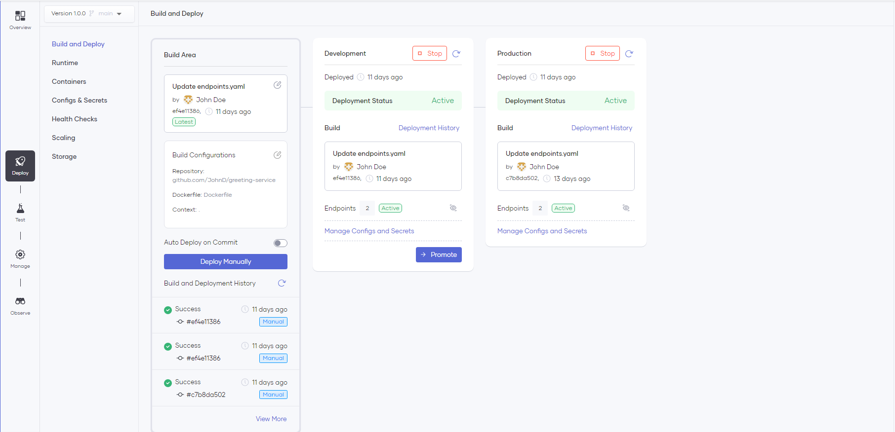

# Deploy a Containerized Application 

Using Choreo, you can easily deploy applications written in different language frameworks (such as Java, Go, NodeJs, Python, etc.) on shared or private data planes using containers.

Choreo supports deploying containerized applications for the following component types:

- Service
- Scheduled Trigger
- Manual Trigger
- REST API

## Connect your repository to Choreo

To connect your GitHub repository to Choreo, you should authorize the [Choreo Apps](https://github.com/marketplace/choreo-apps) GitHub application to access your account or organization. When you attempt to connect your GitHub repository via the Component creation page, the Choreo Apps authorization prompt will appear.

* Connect GitHub Repository
    
    {.cInlineImage-threeQuarter}

* Authorize GitHub Application
    
    {.cInlineImage-quarter height="600px"}

* Grant Repository Access

    {.cInlineImage-full height="600px"}

    The **Choreo Apps** requires the following permission:
    
    - Read access to issues and metadata
    - Read and write access to code, pull requests, and repository hooks

!!! note
    You can [revoke access](https://docs.github.com/en/authentication/keeping-your-account-and-data-secure/reviewing-your-authorized-integrations#reviewing-your-authorized-github-apps) if you do not want Choreo to have access to your GitHub account. Choreo needs write access only to send pull requests to a user repository. Choreo does not directly push any changes to a repository.

After granting access to the required repositories, you can choose a repository and an associated branch to connect to the Choreo component.
For the containerized application deployments, you should select the **Dockerfile** as the **Build Preset** and provide **Dockerfile Path** and [**Docker Context Path**](https://docs.docker.com/build/building/context/#path-context) for the docker build.

{.cInlineImage-full}

The following table describes the individual fields in the **Connect Repository** form.

| **Field**               | **Description**                                                                                                                                                                      |
|-------------------------|--------------------------------------------------------------------------------------------------------------------------------------------------------------------------------------|
| **GitHub Account**      | Your GitHub account or organization. If you want to add another GitHub account, you can expand the list and click **+ Add**.                                                            |
| **GitHub Repository**   | Depending on the repository access you provided, the drop down will show available repositories to be connected.                                                                                  |
| **Branch**              | The branch of the repository.                                                                                                                                                         |
| **Build Preset**        | Determines the implementation of the component: Ballerina or any other language as a Docker container.                                                                                |
| **Dockerfile Path**     | The path to your Dockerfile. This path is defined relative to the repository root. For example, if the Dockerfile is at the repository root, the value for this field is `/Dockerfile`. |
| **Docker Context Path** | The Docker build context path. To include the repository root, leave the default `/` value.                                                                                          |
| **Port***               | The port at which your service is running.                                                                                                                                           |
| **OpenAPI Filepath***   | The path to an OpenAPI specification (in YAML/JSON) relative to the repository root. If you don't provide a path, the system automatically generates a default allow-all specification.    |

!!! note
    Fields marked with **\*** are not visible for all component types.

!!! note
    To successfully build your container with Choreo, it is essential to explicitly define a User ID (`UID`) under the `USER` instruction in your Dockerfile. You can refer the [sample Dockerfile](https://github.com/wso2/choreo-sample-apps/blob/main/go/rest-api/Dockerfile) for guidance.

    To ensure that the defined USER instruction is valid, it must conform to the following conditions:
        
    - A valid User ID is a numeric value between 10000-20000, such as `10001` or `10500`.
    - Usernames are not considered valid and should not be used. For example, `my-custom-user-12221` or `my-custom-user` are  invalid User IDs.

## Deploy the Containerized component

Choreo will automatically apply deployment configurations and settings based on the component type you select during creation.
For example, if you select the **Service** component type, Choreo will deploy it as a Kubernetes deployment with appropriate scaling configurations.

### Application configurations

You must provide any required configurations for running the application in the **Configs & Secrets** section of the component's **Deploy** page.

After clicking the **Create** button, you can select the confidentiality of the configuration and specify how to mount it to the container.

{.cInlineImage-full}

{.cInlineImage-full}

#### Configuration Types

* **ConfigMap**: Stores non-confidential data as key-value pairs.
* **Secret**: Stores and manages sensitive information, such as passwords, OAuth tokens, and ssh keys as key-value pairs.

#### Mount Types

* **Environment Variables**: Mounts the selected ConfigMap or Secret as an environment variable in the container.
* **File Mount**: Mounts the selected ConfigMap or Secret as a file in the container. Here, the key is the file name, and the value is the file content.

The following image shows adding a **ConfigMap** with **File Mount** mount type to be read by the application.

{.cInlineImage-full}

!!! note
    The JSON file includes ${DB_PASS} as an environment variable defined in a Secret. The application reads the JSON file and substitutes the placeholders with the corresponding environment variables.

### Deployment configurations

Choreo lets you configure deployment settings such as scaling, resource limits, and health checks based on your selected component type.

For more information about these configurations, see [DevOps Portal](../devops/devops-portal.md).

You can configure the **Endpoints** to expose your service using the **Service** Component in Choreo. See [Service Component](../develop/components/service.md) for more information. 

### Build, Deploy and Promote

After adding the application configuration, you can build and deploy it by clicking the **Deploy Manually** button. Choreo will start the build process with the selected commit in the **Build Area**. 

!!! note
    The **Auto Deploy on Commit** feature, which automatically builds and deploys the application upon pushing a code change to the repository, is enabled by default. To turn off this feature, navigate to the **Build Area**.

Choreo scans your Dockerfile for security vulnerabilities during the build phase, and if there are no issues found, it proceeds with the build process. After building the image, it scans it again for vulnerabilities before deployment to the environment. You can view the build logs from the right-side panel, as shown in the image below.

{.cInlineImage-full}

Once the build process is complete, Choreo will deploy the application automatically to the Development environment. To promote the build to higher environments, you can click the **Promote** button. The number of environment cards visible on the page may vary depending on your environment configurations.

{.cInlineImage-full}
