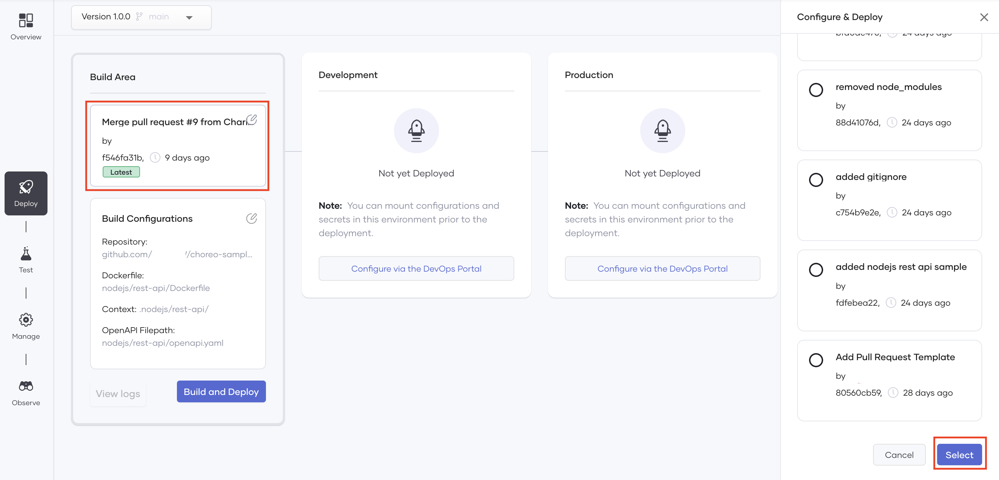
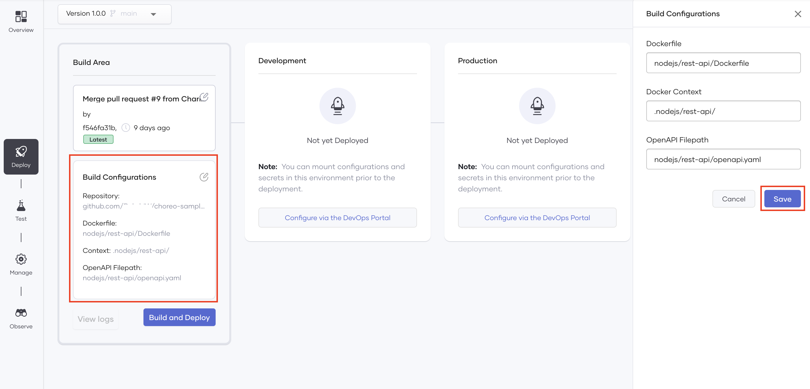

# Deploy a Containerized Choreo Component

Choreo allows you to deploy an application written in a wide range of language frameworks (for example, Java, Go, Nodejs, Python, PHP, etc.) on shared or private data planes when you create any of the following components:

- REST APIs
- Scheduled tasks
- Manual triggers

This guide walks you through the steps to deploy a sample containerized REST API component in Choreo.

## Prerequisites

To deploy a containerized component, you need a GitHub account with a repository that contains a Dockerfile. For this tutorial, you can fork and use the [choreo-sample-apps repository](https://github.com/wso2/choreo-sample-apps).

The **Choreo GitHub App** requires the following permission:

 - Read access to issues and metadata
 - Read and write access to code, pull requests, and repository hooks

You can [revoke access](https://docs.github.com/en/authentication/keeping-your-account-and-data-secure/reviewing-your-authorized-integrations#reviewing-your-authorized-github-apps) if you do not want Choreo to have access to your GitHub account. Choreo needs write access only to send pull requests to a user repository. Choreo does not directly push any changes to a repository.

Let's get started!

## Step 1: Create a component from a Dockerfile

Let's add a containerized REST API component by following these steps:

1. Sign in to the Choreo Console at [https://console.choreo.dev](https://console.choreo.dev).

2. Create a project to add the REST API component. You can follow the instructions under [step 1 in the Connect Your Own GitHub Repository to Choreo](../connect-your-own-github-repository-to-choreo/#step-1-create-a-project-to-add-the-rest-api-component) tutorial.

3. On the **Components** page, click the **REST API** card.

4. Click **Bring Your Dockerfile**.

5. Enter a unique name and a description for the API. For this tutorial, let's enter the following values:

    | **Field**       | **Value**                             |
    |-----------------|---------------------------------------|
    | **Name**        | `Greetings`                       |
    | **Description** | `Sends greetings` |

    !!! Info
        Leave the value for the **Access Mode** field unchanged.  
        This field allows you to select whether you want the REST API to be publicly accessible or to be accessible only within Choreo. By default, the API is publicly accessible.

    Click **Next**.

6. Click **Authorize with GitHub** to allow the REST API to access your GitHub account.

    !!! Tip "Tips"
        You can authorize the REST API to access all the repositories in the selected GitHub account or select one or more repositories that you want to allow the REST API to access. 
        For this tutorial, you can select your fork of the [choreo-sample-apps repository](https://github.com/wso2/choreo-sample-apps).

    Once you perform the authorization, the **GitHub Account** field in the **Connect Repository** dialog box displays the GitHub account you authorized the REST API to access. 

    !!! Tip "Tips"
        - If you want to add another GitHub account, you can expand the list, click **Connect More Repositories**, and repeat step 6. 
        - The repository you select will be validated when you run a build for it.

8. Expand the **GitHub Repository** list and select the **choreo-sample-apps** repository. Then click **Next**.

    !!! Tip "Tips"
        If you want to add another GitHub repository from your account, you can expand the list, click **Add**, and repeat step 6.

9. In the **Build Configuration** dialog, enter the following information:

    | **Field**                     | **Description**                                                                | **Value** |
    |-------------------------------|--------------------------------------------------------------------------------|-----------|
    | **Select Branch**             | The branch of the GitHub repository that has the required Dockerfile.| **main** |
    | **Dockerfile Path**           | The path to your Dockerfile. This path is defined relative to the repository root. e.g., If the Dockerfile is at the repository root, the value for this field for a mono-repo is `service-one/Dockerfile`.  | `nodejs/rest-api/Dockerfile` |
    | **Docker Build Context Path** | The Docker build context path. To include the repository root, leave the default `**.**` value. | `nodejs/rest-api/` |
    | **Port**                      | The port at which your service is running. | `8080` |
    | **OpenAPI Filepath**          | The path to an OpenAPI specification (in yaml/json) relative to the repository root. If you do not specify a path, the system auto-generates a default `allow-all` specification. | `nodejs/rest-api/openapi.yaml` |

     Click **Create**.

    The REST API opens on a separate page.

    !!! Tip "Tips"
        - If you click the **Overview** icon, you will see the default OpenAPI specification instead of the specification you specified in the **OpenAPI Filepath** field. This is because you need to build and deploy the REST API to execute the required commands in the Dockerfile that will generate it.  
        - To select a specific version of the REST API you want to deploy, click the first card in the **Build Area** section, select the required commit in the **Configure & Deploy** pane, and click **Select**.   
          {.cInlineImage-full}  
        - If you want to make changes to the build configurations you previously defined, follow these steps:  1. Click the **Build Configurations** card in the **Build Area** section.  2. Make the required changes in the **Build Configurations** pane.  3. Click **Save**. 
          {.cInlineImage-full}  
        - When you create a Ballerina component, Choreo will allow you to develop it and define variables for which you can provide values when you deploy it. However, when you bring your own non-Ballerina component, the system runs the build via the Dockerfile. If you want to define configurable values before deploying, you can configure them in the DevOps Portal. For more information, see [DevOps Portal - Configurations and secrets](../devops/devops-portal.md#configurations-and-secrets)

You have successfully added a Dockerfile-based REST API component from a Dockerfile. Now let's build and deploy it.

## Step 2: Build and deploy 

To implement the REST API, you need to build and deploy it. When you trigger the build you execute the commands in the selected Dockerfile to apply the required configurations to the REST API.

To build and deploy the REST API, follow these steps:

1. On the **Deploy** page, click **Build and Deploy**.

    !!! note
        Deploying the REST API component may take a while. You can track the progress by observing the logs.

    Once the deployment is complete, the deployment status changes to **Active**. The **Invoke URL** field displays the URL via which you can invoke the REST API.

2. Check the deployment progress by observing the console logs on the right of the page.

    You can access the following scans under **Build**.

     - **The Dockerfile scan**: This scans the Dockerfile for a user ID and fails the build if no user is assigned to the Docker container.
   
     - **Container (Trivy) vulnerability scan**: This detects vulnerabilities in the Dockerfile-based image and in the third-party packages that the source code uses. If you click **Container (Trivy) vulnerability scan**, the details of the vulnerabilities open in a separate pane. If this scan detects critical vulnerabilities, the build will fail.
   
        !!! info
            If you want to bypass these vulnerabilities, you need to run Choreo on a private data plane.

You can test, manage, and observe this REST API you created from a Dockerfile the way you would a Ballerina component.

For detailed instructions, see the following sections of the [Create Your First REST API tutorial](../get-started/tutorials/create-your-first-rest-api.md).

- [Step 3: Test](../get-started/tutorials/create-your-first-rest-api.md#step-3-test)
- [Step 4: Manage](../get-started/tutorials/create-your-first-rest-api.md#step-4-manage)

## Step 3: Manage the deployment

If you want to view Kubernetes-level insights to carry out a more detailed diagnosis of this Dockerfile-based REST API, click **DevOps Portal** in the top menu.

{.cInlineImage-full}

For more information about the information, see [DevOps Portal](../devops/devops-portal.md).
