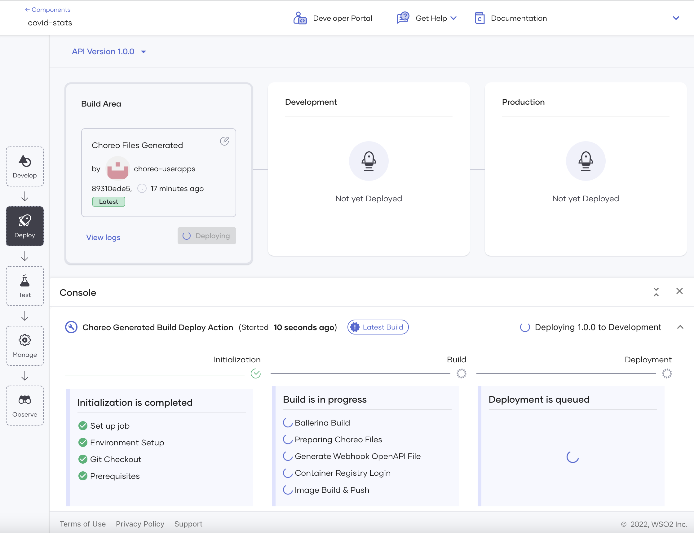

# Deploy Your Component

Deploying your component on Choreo makes it invocable. Once you have designed, tested, and committed the REST API, you can deploy it.

To deploy a component, follow the steps below:

1. Open your component in the Choreo Console, and in the left pane, click **Deploy**.

2. To select a specific version of the component you want to deploy, click the first card in the **Build Area** card, select the required commit in the **Configure & Deploy** pane, and click **Select**.

3. On the **Build Area** card, click either **Configure & Deploy**, **Deploy Manually**, or **Build and Deploy** as relevant.

    !!! info
        Choreo requires you to perform the first deployment of each component manually so that you can provide values for any configurable variables that the implementation may include. Therefore, if you are deploying your component for the first time, you need to click **Deploy Manually** by default unless one or more of the following is true:  - The component is a REST API, REST API proxy, or GraphQL API, you can specify a sandbox endpoint to test the component in a sandbox environment if required. In such a scenario, you need to click **Configure & Deploy**.  - If you have included any [configurable variables]((https://ballerina.io/learn/by-example/configurable-variables/)) in the component implementation, you need to enter values for those variables. In such a scenario, you need to click **Configure & Deploy**.  - If you are deploying the component implementation from a Dockerfile, you would have selected **Docker** as the build preset when creating the component. In such a scenario, you need to click **Build and Deploy**. For more information, see [Deploy a Containerized Component](deploy-a-containerized-choreo-component.md).

4. Enter values in the **Configure & Deploy** pane if required. This is required in the following scenarios:

    - If your component implementation includes [configurable variables](#configure-variables), enter values for them.
    - If your component is a REST API, REST API proxy, or GraphQL API, you can optionally provide a [sandbox endpoint](#enter-sandbox-endpoint) for testing purposes.
    - If your component is a scheduled trigger, you need to enter the time interval at which the trigger should be activated.

6. If you do not want Choreo to automatically deploy the component after each commit that edits its implementation, toggle the **Auto Deploy on Commit** switch to disable automatic deployment,

7. Observe the progress of the deployment from the console.

    {.cInlineImage-full}

Once you deploy the component, the **Development** card indicates that the component is active in the development environment.

{.cInlineImage-full}

Now you can test your deployed component to check if it is working as expected.

## Update an empty GitHub repository

When a component with Ballerina as the build preset does not contain a file with the `.bal` in its GitHub path, the **Build Area** card displays the message shown in the image below.

{.cInlineImage-full}

You cannot deploy the component until you add a `.bal` file with valid Ballerina code in the GitHub directory to which you provided the path when creating the component. However, to successfully deploy the component, you also need to do the following:

- Be sure that the implementation in the `.bal` file matches the component type. For example, if the component is a REST API, the `.bal` file should contain an implementation for a REST API.
- Include other dependencies for the Ballerina code. For more information, see [Ballerina Documentation- Organize Ballerina Code](https://ballerina.io/learn/organize-ballerina-code/)

## Configure variables

A configurable variable is a parameter for which you specify the value when you deploy the component that includes it.

A component implementation may include configurable variables in the following scenarios:

- When a component is accessible by multiple people in an organization, you may want to avoid exposing some of the parameter values (that you consider sensitive information) in the component implementation.

  For example, consider a REST API that returns a password to users whose requests meet specific conditions. In this scenario, you may not want to expose that password to everyone who can access the REST API implementation.

- Each component user needs to provide a different value for a specific parameter.

  For example, each component user may want to provide a unique email address to receive the response.

When deploying a component with configurable variables, you need to click **Configure & Deploy** and then provide values for the configurable variables in the **Configure & Deploy** pane before deploying the component.

If you want to edit the values you entered for the configurable variables after deploying the component, you can click **Configurables** on the **Development** card and make the required changes in the **Configure & Deploy** pane.

{.cInlineImage-full}

To learn how to define configurable variables see [Ballerina Documentation -  Configurable Variables](https://ballerina.io/learn/by-example/configurable-variables/).

## Deploy automatically

Choreo enables automatic deployment for each component by default to automatically deploy it whenever a change is committed to the GitHub repository in which its implementation resides. You can disable it if required. However, Choreo requires you to perform the first deployment manually so that you can provide values for any [configurable variables](#configure-variables) that the component implementation may include.

An automatic deployment can fail due to one or more of the following reasons:

- If the code of the component implementation is invalid after the last change.
- If you added new configurable variables to the component implementation.
- If you deleted/changed one or more package dependencies (for more information, see [Ballerina Documentation- Organize Ballerina Code](https://ballerina.io/learn/organize-ballerina-code/)).

## Enter sandbox endpoint

A sandbox environment is a test environment where you can test a component before pushing it to production.

!!! info
    Choreo currently allows you to deploy only REST APIs, REST API Proxies, and GraphQL APIs to sandbox environments.

To deploy a component to both the sandbox environment and the development environment, enter the sandbox environment URL as the sandbox endpoint and the API backend URL as the endpoint.

{.cInlineImage-small}

Once you publish a component with a sandbox endpoint, its users can access the sandbox endpoint from the [Developer Portal](../administer/customize-the-developer-portal.md) when viewing the component overview and trying it out.

{.cInlineImage-full}

{.cInlineImage-full}
