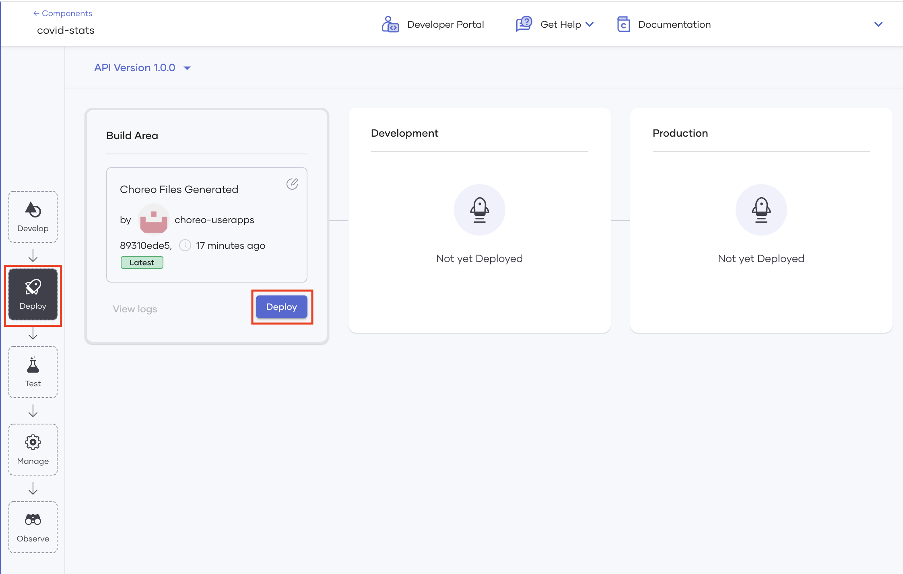

# Deploy Your Component

Deploying your component on Choreo makes it invocable. Once you have designed, tested, and committed the REST API, you can deploy it.

To deploy a component, follow the steps below:

1. Click the **Deploy** icon. 

2. **Automatic Deployment** is enabled by default. You can disable it via the toggle.

3. Then in the **Build Area** card, click **Deploy Manually**.
    
    !!! info
        Choreo requires you to perform the first deployment of each component manually so that you can provide values for any configurable variables that the implementation may include.

    {.cInlineImage-full}

2. You can view the progress of the deployment from the console.

    {.cInlineImage-full}

Once you deploy the component, the **Development** card indicates that it is active.

{.cInlineImage-full}

Now you can test your deployed component to check if it is working as expected.
