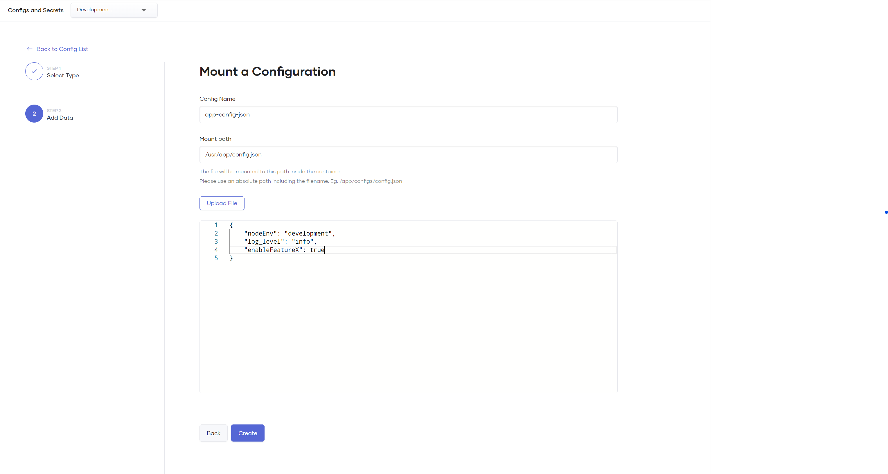

# Managing Application Configurations and Secrets

Choreo provides a seamless mechanism to manage and version your component's configurations and secrets as **file mounts** or **environment variables**.

!!! info "Encrypted at rest and in transit"
    All configurations and secrets applied to a Choreo component are stored in an encrypted secret vault on the Cloud Data Plane - managed by WSO2.
     If you are on a Private Data Plane, these will be stored in the Azure Key Vault or AWS Secret-Manager that's attached to your data plane, in your cloud environment.

## Understanding the difference between Configurations and Secrets

Choreo _considers all configurations and secrets as sensitive contents_ when storing, but gives you the option to choose between a Secret or a Configuration when you create a file mount or a set of environment variables.

- **Secrets** are write-only. Once you create a secret, you will not be able to see or retrieve its contents in the Choreo Console (but you can overwrite the existing contents at any time).
- **Configurations** can be read and updated in the Choreo Console after they are created.
  > It is recommended to **not** use a Configuration when you need to include sensitive data _(Eg. Database passwords, cloud credentials, service accounts, etc)_ - use a Secret instead.

## Apply a File Mount to your Container

1.  Click the **+ Create** button in Configs & Secrets.

2.  **Step 1**:

    - **Select Config Type** - Choose how you want to manage this file - as a Configuration or a Secret.
    - **Select Mount Type** - Select **File Mount** and click **Next**.

3.  **Step 2:** 
    - **Config Name** - Specify a name for this file mount you are about to create.
        > The config name has no effect on the file or its contents, it is provided only for your future reference.
    - **Mount Path** - Specify where you want the file to be mounted inside the container. Please use an **absolute file path <u>including</u> the file name and extension (if applicable)**.
        - The file name on the mount path does not need to match the config name or the name of the file you have uploaded. 
        > Eg. `/usr/app/config.json`
    - **Add file contents** - Upload a file or copy and paste the contents into the editor.
    - Once completed, click **Create**.

    {.cInlineImage-full}

!!! info "Important!"
    Please note that configs and secrets are applied **immediately** to your environment on creation, and your running replicas undergo a rolling restart to ensure that the updated contents are
    picked up by your containers.

## Apply Environment Variables to your Container

1.  Click the **+ Create** button in Configs & Secrets.

2.  **Step 1**:

    - **Select Config Type** - Choose how you want to manage these environment variables - as a Configuration or a Secret.
    - **Select Mount Type** - Select **Environment Variables** and click **Next**.

3.  **Step 2:** - **Config Name** - Specify a name for this set of environment variables you are about to create.
    > The config name has no effect on the environment variable contents, it is provided for your future reference to identify this config or secret.
        - **Set Environment Variables** - Add the variables as key-value pairs. You can include more variables into this config/secret by clicking on **Add Item**.
        - Once completed, click **Create**.

    {.cInlineImage-full}

## Update or delete an existing Secret or Config

Click on the Edit or Delete icons on the configuration listing view.

{.cInlineImage-half}

## Ballerina Configurables

[Ballerina Configurables](https://ballerina.io/learn/by-example/configurable-variables/) are managed by Choreo for Ballerina components.

The configurable values for these components cannot be modified in this section and are managed in the **Build and Deploy** page when you deploy or promote a Ballerina application.

> You can still add file mount(s) to a Ballerina component, but use configurables instead of environment variables.  
Environment variables are primarily provided for components written in other languages.
