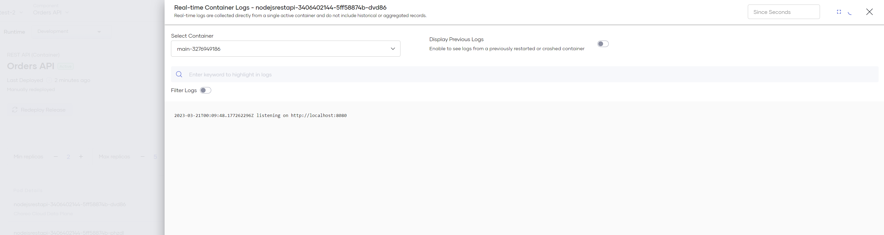

# View Runtime Details

The Runtime view provides insights into your component’s running replicas (instances) in a given environment, with information retrieved from the underlying Choreo data plane. 
The Runtime view is analogous to a *‘zoomed in’* view of a single environment in the **Build and Deploy** section.

{.cInlineImage-full}

## Redeploy Release

Clicking on the "Redploy Release" Button will immediately re-deploy all resources (including any changes to configs and secrets) into the selected environment. This will trigger a rolling update *(new instances are created before older instances are shut down)* and sync all the latest changes to the data plane. 

This also provides a quick way to restart all your component's running replicas in an environment.

!!! note "What is a Release?"
    A Release in Choreo uniquely identifies an underlying deployment of a component in an environment, for a given version. 
    *Eg.* If you have deployed to two environments across two versions, your component will have four active releases.

## Running Instances

This table provides insights into active replicas of your component in the selected environment.

Each row represents an active replica and its associated CPU and memory usage (real-time), status and other information.
You can click on the menu icon to see the real-time container logs as well as information on the container's conditions and events. These options provide useful insights that you can use to quickly diagnose issues with your deployments. 

{.cInlineImage-full}

!!! info
    All metrics (total and replica-level CPU and memory usage) in the Runtime view are calculated in real-time and are instantaneous representations of a component's current state. 
    Check the Observability views for historical metrics and usage trends.

### Real-time Container Logs

Unlike the logs available in the Observability sections, these logs are fetched in real-time from the data plane. These logs are not historical, meaning you will only be able to see logs of active containers (or logs from the last shutdown container). 

- **Display Previous Logs:** Retrieves logs from the last restarted/shutdown/crashed container of this instance (if available).
- **Since Seconds**: Fetch logs only for the last specified number of seconds.  
- **Filter Logs**: Filters and displays only matching log lines (this is a fuzzy string search).

{.cInlineImage-full}

### Container Conditions and Events

Conditions and Events provide useful information for troubleshooting failing deployments. 

If your component is not behaving as excepted and if you cannot see any issues in the application logs, these events may provide useful debugging information. 

- Failing Health Checks (Liveness and Readiness Probes).
- Missing or invalid configuration/secret mounts.
- Missing or invalid storage volume mounts.
- Scheduling issues on the underlying data plane.

{.cInlineImage-full}
